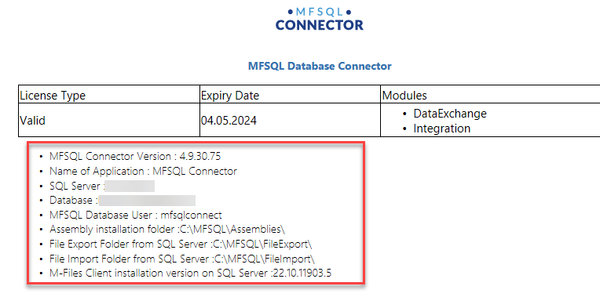
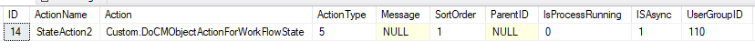
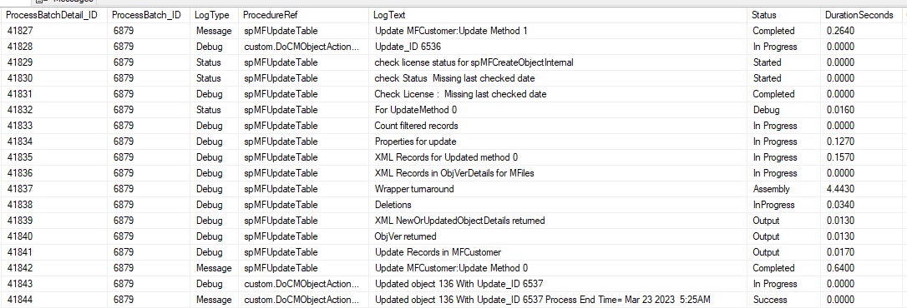
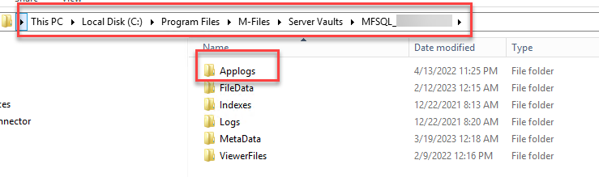
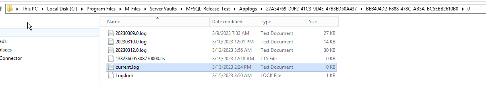

Perform a background operation in SQL on workflow change
========================================================

MFSQL Connector allows for performing a SQL procedure in the background triggered by a change in workflow.  This blog explain step by step how this is achieved.

Examples of a workflow action

 -  Check conditions for approval - Evaluating if all the conditions for approval has been met; if any related actions have been completed; the value complies with approval limits
 -  Conditionally assign a workflow state of another object, based on the property values of the current object
 -  Set the archiving flag on all the objects related to current object based on specific criteria
 -  Set or reset properties on the current object or any related objects
 -  Update a third party system when the state is reached (create Vendor in ERP when Vendor is approved in M-Files)
 
When to use it
 -  When the workflow action is conditional on other objects
 -  When the workflow action involves another system such as ERP or other inhouse system
 -  When the fullfillment of the properties on the object has complex logic or conditions to it
 -  When the workflow state triggers another operation 

There are many benefits for using this method:
 -  There is no need for development in VBScript or DOTNET to accomplish the task.
 -  The power of SQL can be used.
 -  When the object reaches the workflow step it can check the status of other objects and perform an update if needed, update properties on the existing object, create an assignment or send an email.
 -  The operation takes place in the background
 -  The processing activity takes place in SQL, moving the load away from M-Files.
 

Required components.
Some key component need to be in place to make it all fit together. These steps will be expanded in the following sections.

 -  Install and provision MFSQL Connector
 -  The custom procedure
 -  The Context Menu has an action
 -  Action script in workflow state
 -  Making use of logging and debugging
 -  Testing
 
Install and provision MFSQL Connector
-------------------------------------

Follow the guidance in :doc:`/getting-started/index` to install and provision MFSQL Connector.
As a minimum the following should be in place:

 -  A class table for each class of object that will be used in processing
 -  Confirm that Context Menu is working.  If one can see the contents of the MFSettings table in M-Files Configurations, then the system is ready to proceed.
 
|image1|

The custom procedure
--------------------

The customer procedure will perform the task or tasks associated with the workflow action. In general terms, this procedure is the gateway into calling any of the other Connector procedures, interact with other third party systems or perform any other process.

To serve as a template, and also provide some guidance for creating custom procedures, an example is available in the installation folders as 90.104.custom.DoCMObjectActionForWorkFlowState.sql.  

This example is specifically geared towards actions that is called as part of a script in M-Files.  These scripts are usually found in workflow state actions and Event Handler scripts.  When the action is called from M-Files it will pass through the underlying object details.  These details can then be applied in the procedure.

Context Menu Action
-------------------

Before the procedure can be called from a workflow state action, the context menu must be setup.

The :doc:`/tables/tbMFContextMenu/` table must have a row to link the action in M-Files with the procedure.

This row can be added or modified using :doc:`/procedures/spMFContextMenuActionItem/` to add the record.

.. code:: sql

    EXEC [dbo].[spMFContextMenuActionItem]
         @ActionName = 'Perform the update' ,
         @ProcedureName = 'Custom.DoMe',
         @Description = 'Procedure to action the update',
         @RelatedMenu = null,
         @IsRemove = 0,
         @IsObjectContext = 1,
         @IsWeblink = 0,
         @IsAsynchronous = 1,
         @IsStateAction = 1,
         @PriorAction = 'Name of action',
         @UserGroup = 'User Group',
         @Debug = 0

Note the following for the paramaters:

 -  The ActionName is used in the script to link M-Files with the specific procedure
 -  The ProcedureName is the schema.procedure for the custom procedure highlighted above
 -  RelatedMenu must be null
 -  IsObjectContext must be 1 if the data of the underlying object is used, else it can be 0
 -  IsAsynchronous is always 1
 -  IsStateAction must be 1 to call an action using a script in a workflow state or event handler
 
The entry in the table should appears as follows

|image2|

Action script in workflow state
-------------------------------

The next step is to add the script to the workflow state.  The following script can be copied to the workflow. The script is ready to go, except for changing the action name in the sample below to match the row in the MFContextMenu table.

.. code:: SQL

     Option Explicit

     Dim ClassID
     ClassID= Vault.ObjectPropertyoperations.GetProperty(ObjVer, 100).value.GetLookupID

     Dim strInput
     strInput = "{""ObjectID""  : "&ObjVer.ID &", ""ObjectType""  : "&ObjVer.Type &", ""Objectver""  : "&ObjVer.Version&",""ClassID""  : "&ClassID&", ""ActionName""  : ""StateAction2"", ""ActionTypeID"": ""5""}"

     Dim strOutput
     strOutput = Vault.ExtensionMethodOperations.ExecuteVaultExtensionMethod("PerformActionMethod", strInput)

Making use of logging and debugging
-----------------------------------

The following happens when a state action script is triggered:
 -  When the object reaches the workflow state, the action is executed
 -  The name of the action plus object id, class, version, and object type of the underlying object is past through the Vault Application framework.  The VAF will get the connection string to the SQL server from the Connector Configurations.
 -  The VAF will check the MFContextMenu for the action name and get the procedure name
 -  It will then get a processbatch_id from the Connector and write logging entries to MFProcessBatch and MFProcessBatchDetail tables.
 -  The VAF places the call into the VAF Task Manager Queue. M-Files manages queue for the execution of the procedure in the SQL Server
 -  Next, the logging entries generated by the custom procedure will appear in the MFProcessBatch and MFProcessBatchDetail tables
 -  On completion of the task, the VAF will again write logging entries to MFProcessBatch and MFProcessBatchDetail tables.

M-Files provides logging of the VAF operations to allow for debugging of the VAF operations. This logging can be activated and configurated in the Configurator by :doc:`/getting-started/configuration-and-setup/enabling-vaf-logging/index`

To use the logging in SQL for debugging and tracking, entries should be generated in the custom procedure to the MFProcessBatch and MFProcessBatchDetail tables. :doc:`/mfsql-integration-connector/using-and-managing-logs/index` provide further information on how to apply logging code in the custom procedure to all for tracking of operations and results.
 
Testing
-------

When the setup is complete, the operation can be tested.

Start off by simply testing the custom procedure using SSMS.  Pass the parameters into the procedure and execute to test the desired outcome.

Following is a test script for testing the sample custom procedure

.. code:: sql

     declare @MFLastUpdateDate smalldatetime
      , @Update_IDOut     int
      declare @output          nvarchar(1000)
      , @ProcessBatch_ID int
      ,@ObjectType int
      ,@ClassID int
      ,@ObjectID int
      ,@ObjectVer int

     exec dbo.spMFUpdateMFilesToMFSQL @MFTableName = 'MFCustomer'
                               , @MFLastUpdateDate = @MFLastUpdateDate output
                               , @UpdateTypeID = 1                              
                               , @WithStats = 1
                               , @Update_IDOut = @Update_IDOut output
                               , @ProcessBatch_ID = @ProcessBatch_ID output
                               , @debug = 0

     select @ClassID= mc.mfid , @ObjectType= mot.mfid from dbo.MFClass as mc
     inner join dbo.MFObjectType as mot
     on mot.ID = mc.MFObjectType_ID
     where mc.TableName = 'MFCustomer'

     select top 1 @objectID = objid, @obj   ectVer = mfversion from mfcustomer where id > 1

     exec custom.DoCMObjectActionForWorkFlowState @ID = 1
                                           , @output = @output output
                                           , @ProcessBatch_ID = @ProcessBatch_ID output
                                           , @ObjectID = @ObjectID
                                           , @ObjectType = @ObjectType
                                           , @ObjectVer = @ObjectID
                                           , @ClassID = @classID
                                           , @debug = 1

     select * from dbo.MFProcessBatchDetail as mpbd
     inner join dbo.MFProcessBatch as mpb
     on mpb.ProcessBatch_ID = mpbd.ProcessBatch_ID
    where mpb.ProcessBatch_ID = @ProcessBatch_ID

The following listing show an extract of the ProcessBatchDetail listing some of the logs for both the standard Connector procedure logging and the custom logging from the custom procedure

|image3|

When the custom procedure is debugged and working as expected, then test the action on the workflow step. In M-Files desktop, select an object and change the workflow state to the state with the script.

Then check the VAF logging to see if it has gone through or check for any errors. Depending on the configuration of the logs, it is likely to be on the Application server in the AppLogs folder of the vault

|image4|

Within these folders and in on of the VAF application logs the log file will be. The name is dependent on the configuration but by default it is current.log

|image5|

Check the log for the outcome of the VAF processes.  The level of logging is again set in the logging configuration.

|image6|

