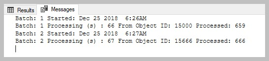
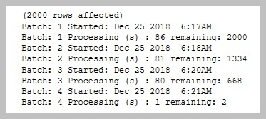
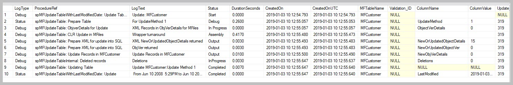
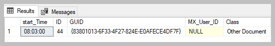
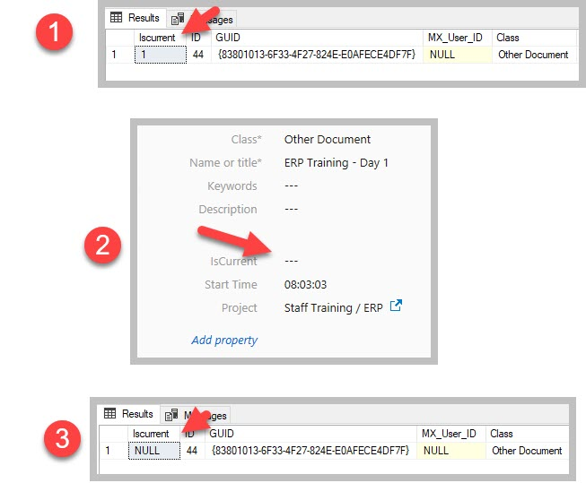

Demonstration of Rel 4.2.8.46 new functionality
===============================================

This blog highlights the new or improved functionality in release
4.2.8.64. The scripts are all based on the standard DMS vault. In some
cases edits is required to the vault to illustrate the functionality.

Auto setup reporting
~~~~~~~~~~~~~~~~~~~~

This functionality is illustrated in a\ `separate
blog. <https://lamininsolutions.atlassian.net/wiki/spaces/MFSQL/blog/2018/11/25/610893867/Reporting+using+setup+Reporting>`__

Explore all the objects in the vault
~~~~~~~~~~~~~~~~~~~~~~~~~~~~~~~~~~~~

A new procedure spMFObjectTypeUpdateClassClassIndex extracts
objectVersion data for all objects in the vault and update the
MFObjectTypeToClassObject table. The results of this process can be used
in a variety of different ways, the most obvious to assess to total
number of objects in the vault.

.. code:: sql

    --how to get the max id's in a vault
    EXEC [dbo].[spMFObjectTypeUpdateClassIndex] @IsAllTables = 1 -- setting to 0 will only include includedinapp class tables
                                               ,@Debug = 0       -- smallint

    SELECT mc.[TableName], mc.[IncludeInApp], COUNT(*), MAX([mottco].[Object_MFID]) FROM [dbo].[MFObjectTypeToClassObject] AS [mottco] 
    INNER JOIN MFClass mc
    ON mc.mfid = mottco.[Class_ID]
    GROUP BY mc.[TableName],mc.[IncludeInApp]

    --or
    SELECT * FROM [dbo].[MFvwObjectTypeSummary] AS [mfots]

|image0|

Update large tables using batch mode
~~~~~~~~~~~~~~~~~~~~~~~~~~~~~~~~~~~~

Updating tables using batch mode is introduced to improve working with
large volumes of data. The aim is to perform updates in smaller batches
to improve throughput and reduce the impact of failures.

Why use it:
a) when taking on the records from M-Files into SQL with a large
volume. It can also be used for mass updating of records from SQL into
M-files.
b) there is nothing that prevents the use of this procedure for low
volumes, but it is certainly advisable to use it for record sets in
excess of 10 000
c) This procedure will update records in sets. If the procedure is
stopped, or fail the records already updated will be in tact.
d) It is easier to monitor progress through a large data set
e) batch sizes are calculated automatically based on the maxobjid. it
should be between 500-700
e) It is normal to experience approx 16 updates per second (or approx
40 per batch) and for update method 1 and 8 updates per second (approx
80 per batch)
f) in the case of update method = 1 the processing takes place
sequencially based on the MinObjid. If no objid's exist for the class
within the range, then no records will be processed for the batch. The
processing will still take place.
g) only one class within an object type can be processed at a time.
h) in the case of update method 0 the series of ids to be updated will
be determined from all objects set to process\_id = 1. This set will be
batched and processed.
i) when updating with updatemethod = 0 and something goes wrong, it is
likely that all the outstanding records will show process\_id as 99. It
is not necessary to reset the process\_id. Just rerun the procedure to
continue the update.

Parameters:
@maxobjid : get the largest M-Files ID in the object type: The range,
rather than the exact number is important. for instance 100000 for any
id up to 199999. If in doubt select a higher number.

@BatchesToRun: only applies to updatemethod = 1; M-Files need to catch
up with indexing. in the case of really large volumes (100 0000 plus),
it is recommended to limit each run to approx 200 batches and then first
allow M-Files background processes to catch up before running the next
update.

@MinObjid: only applies to updatemethod = 1; this allows for the
process to restart at a specific objid

@WithStats: setting this param to 0 will allow this procedure run
without showing the progress.

Update from M-Files to SQL
^^^^^^^^^^^^^^^^^^^^^^^^^^

.. code:: sql

    EXEC [dbo].[spMFUpdateTableinBatches] @MFTableName = 'MFLarge_Volume'  -- nvarchar(100)
                                         ,@UpdateMethod = 1 -- MF to SQL
                                         ,@maxObjid = 60000     -- int
                                         ,@BatchestoRun = 2 -- int
                                         ,@MinObjid = 15000     -- default is 1
                                         ,@WithStats = 1    -- default is 1
                                         ,@Debug = 0        -- default is 0
                                  

|image1|

Interpreting the results.
Processing (s) 47: show the number of seconds to process the batch
From Object ID: the start id of the batch
Processed : 0 no objects where found within the range
Processed : 40 as the batch size is say 560 it means only 40 records
was in the range for the class

Why there is no records to process:
records deleted in M-Files
the objid is unique within the object type. if there are many classes
in an object type, then it is likely that some of the id's refer to
other classes in the object type.

Updating from SQL to M-Files
^^^^^^^^^^^^^^^^^^^^^^^^^^^^

.. code:: sql

    EXEC [dbo].[spMFUpdateTableinBatches] @MFTableName = 'MFLarge_Volume'  -- nvarchar(100)
                                         ,@UpdateMethod = 0 -- MF to SQL
                                         ,@maxObjid = 60000     -- int
                                         --,@BatchestoRun = 2 -- int
                                         --,@MinObjid = 100     -- default is 1
                                         ,@WithStats = 1    -- default is 1
                                         ,@Debug = 0        -- default is 0

|image2|

Interpreting the result
(2000 rows affected) the run will show the total number of records to
be updated
remaining: 1500 this show the number of records still to be processed.

Getting the object version of single record
~~~~~~~~~~~~~~~~~~~~~~~~~~~~~~~~~~~~~~~~~~~

The procedure spMFGetObjectVers is improved to allow for getting the
object version for specific records. This could be used in applications
to determine if an object has changed in M-Files or if the record exist.

.. code:: sql

    --Get object version of single record

    --as xml record
    DECLARE @NewObjectXML NVARCHAR(MAX)

            EXEC [dbo].[spMFGetObjectvers] @TableName = 'MFOtherDocument',         -- nvarchar(max)
                                           @dtModifiedDate = null, -- datetime
                                           @MFIDs = '493',         -- nvarchar(max)
                                           @outPutXML = @NewObjectXml OUTPUT; -- nvarchar(max)

    SELECT CAST(@NewObjectXML AS XML)
    GO
    --from MFaudithistory

    DECLARE @SessionIDOut    INT
           ,@NewObjectXml    NVARCHAR(MAX)
           ,@DeletedInSQL    INT
           ,@UpdateRequired  BIT
           ,@OutofSync       INT
           ,@ProcessErrors   INT
           ,@ProcessBatch_ID INT
        ,@Objids NVARCHAR(4000) = '492,493';

    EXEC [dbo].[spMFTableAudit] @MFTableName = 'MFOtherDocument'    -- nvarchar(128)
                            --   ,@MFModifiedDate = ? -- datetime
                               ,@ObjIDs = @Objids         -- nvarchar(4000)
                               ,@SessionIDOut = @SessionIDOut OUTPUT                    -- int
                               ,@NewObjectXml = @NewObjectXml OUTPUT                    -- nvarchar(max)
                               ,@DeletedInSQL = @DeletedInSQL OUTPUT                    -- int
                               ,@UpdateRequired = @UpdateRequired OUTPUT                -- bit
                               ,@OutofSync = @OutofSync OUTPUT                          -- int
                               ,@ProcessErrors = @ProcessErrors OUTPUT                  -- int
                               ,@ProcessBatch_ID = @ProcessBatch_ID OUTPUT              -- int
                               ,@Debug = 0          -- smallint

    SELECT * FROM [dbo].[MFAuditHistory] AS [mah] WHERE mah.[ObjID] IN (SELECT ListItem FROM [dbo].[fnMFParseDelimitedString](@objids,','))

    GO

Improved logging
~~~~~~~~~~~~~~~~

The logging in MFProcessBatch and MFProcessBatchDetail are improved to
show progress and results of sub processes. Although the logging is
mainly used for debugging and deep dive related to processing, it is
also increasingly applied for output messages to the user in different
formats.

Script to produce an outcome for these two tables.

.. code:: sql

    DECLARE @Return_LastModified DATETIME
           ,@Update_IDOut        INT
           ,@ProcessBatch_ID     INT;

    EXEC [dbo].[spMFUpdateTableWithLastModifiedDate] @UpdateMethod = 1 -- int
                                                    ,@Return_LastModified = @Return_LastModified OUTPUT    -- datetime
                                                    ,@TableName = 'MFCustomer'    -- sysname
                                                    ,@Update_IDOut = @Update_IDOut OUTPUT                  -- int
                                                    ,@ProcessBatch_ID = @ProcessBatch_ID OUTPUT            -- int
                                                    ,@debug = 0        -- smallint

    SELECT * FROM [dbo].[MFProcessBatch] AS [mpbd] WHERE [mpbd].[ProcessBatch_ID] = @ProcessBatch_ID

    SELECT * FROM [dbo].[MFProcessBatchDetail] AS [mpbd] WHERE [mpbd].[ProcessBatch_ID] = @ProcessBatch_ID

The output below illustrate the features of these tables:

-  The duration is for each sub process

-  The number of objects updated is in the columnValue where the
   columnName is NewOrUpdatedObjectDetails

-  The related table is listed in the MFTableName column

-  The listing starts with the opening procedure (in this case the
   UpdatetablewithlastModifiedDate, and list subprocesses for any
   procedures called by the operation and then ends in the main process
   again with a completed statement.

-  The items shown in the log is triggered by inserting updates for
   specific sub processes in the script.

|image3|

Display of time in column
~~~~~~~~~~~~~~~~~~~~~~~~~

Previously, time was shown as ‘8 am’. This is changes to show time as
hh:mm:ss.

To illustrate this improvement: Add a property to the Other Document
class with a ‘time’ datatype. Update the metadata structure and update
the class table.

.. code:: sql

    SELECT start_Time, * FROM [dbo].[MFOtherDocument] AS [mod] WHERE start_Time IS NOT NULL

|image4|

Display Boolean as Null
~~~~~~~~~~~~~~~~~~~~~~~

Previously, a Boolean column would show '0' even if the property is
empty in M-Files.

To illustrate this improvement: Add a property to the Other Document
Class with a Boolean datatype. Change the value to ‘Yes’ in M-Files.
Update the metadata structure and refresh the table in SQL. Then change
to value to blank in M-Files and refresh again.

.. code:: sql

    EXEC spmfupdatetable 'MFOtherDocument',1

    SELECT [mod].[Iscurrent], * FROM [dbo].[MFOtherDocument] AS [mod] WHERE start_Time IS NOT NULL

|image5|

.. |image0| image:: img_1.jpg

