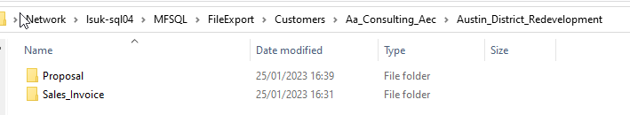

============================
Exporting files from a vault
============================

The Connector allows for exporting files to a folder system from the vault.

The key benefits of using the Connector for exporting include:

 -  exports are done by class of object.
 -  determine the file sizes without having to download the files
 -  exporting with a flexible hierarchy of folders and related files
 -  export the files of non document objects with files to move these files to a standard document type
 -  control over what is being exported
 -  export large volumes of files
 -  index or catelogue of exported files with associated metadata
 -  export directly to another system
 -  create a scheduled export (e.g. for regular archiving)
 -  removing exported files from the vault
 -  error logging for back tracking
 
 In essence the following process is followed

 -  Install MFSQL Connector and populate the class tables for the objects to be exported.
 -  Select the objects to be exported
 -  Determine the hierarchy for the specific export
 -  Run the export
 -  Delete the objects from the vault
 
Determining the export hierarchy
--------------------------------

The target folder system hierarchy has various nodes:

The root is the base folder for the export.  By default the root is set the c:/MFSQL/FileExport/. The root can be changed to another location accessible from the SQL Server using the SQL Server authentication credentials.  Update the table MFSettings for the name 'RootFolder'

.. code:: sql

    select value,* from mfSettings where name = 'RootFolder'

    exec dbo.spMFSettingsForDBUpdate  @RootFolder = 'D:/new root folder/'

The first level is defined by the class in the MFClass table in the column FileExportFolder. By default this is set to null. This will ignore the first level.  If the same folder is set for multiple classes then all the exports for these classes will all have the same first level.  For instance, if it is set to Customers, then all the classes with customer documents will be groups together in this folder.  Set the value in MFClass with an update statement.
 
.. code:: sql

    update dbo.MFClass
    set FileExportFolder = 'Customers' 
    where tablename in ('MFSalesInvoice', 'MFProposal')

The next three levels are determined by properties (columns) on the class. For instance, if the sales invoices and proposal for customers are being exported, then it would make sense to set the first property to Customer Name, the second to Project and the third to the class . The result will be files in Customers/customername/Project/Class.  Another option for the third level would be document type if the classes all have a document type.  These three levels are set as part of the export parameters 
 
.. code:: sql

     exec dbo.spMFExportFiles @TableName = 'MFSalesInvoice'
                       , @PathProperty_L1 = 'Customer'
                       , @PathProperty_L2 = 'Project'
                       , @PathProperty_L3 = 'Class'
                       , @IsDownload = 1
                       , @IncludeDocID = 0
                       , @Process_id = 0

    exec dbo.spMFExportFiles @TableName = 'MFproposal'
                       , @PathProperty_L1 = 'Customer'
                       , @PathProperty_L2 = 'Project'
                       , @PathProperty_L3 = 'Class'
                       , @IsDownload = 1
                       , @IncludeDocID = 0
                       , @Process_id = 0

Following is an example of the result after the export of both Sales invoices and Proposals

|image01|

Export options
--------------------

Other options can be set by the export parameters

 -  if IsDownload parameter is set to 0 then no file will be exported, but information about the file will be saved in the logging table :doc:`/tables/tbMFExportFileHistory/`  the table definition shows all the available columns in the log.  Of particular interest is the file size, name and extension which could be hard to obtain from the M-Files user interface.
 -  If IncludeDocID is set to 1, then the exported name of the file will include the objid of the of the object.  The objid is also available in the log file 
 -  When the process_id is set to 0 for the export then all the files in the class table will be exported.  To export only selected records in the class table, set the process_id in class table to for a number above 5 and then set the process_id paramater on export to 5 to only export the files for the selected records.
 
Export files accross multiple classes
-------------------------------------

On occasion, the task at hand is to export files across multiple classes.  This is particularly relevant when all or a large part of the files in a vault must be exported to a folder system or other third party system.

Using the spMFExportFiles procedure would be cumbersome to use in such a scenario.However, using the MFFileExportControl table with spMFExportFilesMultiClasses will allow for defining a collection of classes and performing the export accross all the classes in the setup table.

Start off by executing :doc:`/procedures/spMFExportFilesMultiClasses/` with @isSetup = 1.  This will create stubs in the control table and produce three listing:
 -  the advisory comments listing provides guidance on the setup and configuration for the export
 -  the suggested folder listing shows the current setup data for each class and a proposed columns for inclusion in the control table
 -  the listing show the contents of the control table.  

The control table :doc:`/tables/tbMFFileExportControl/` defines the collection of classes and requires the following related to each class to be included: Class MFID, Class Object Type MFID and then the Columnname for each of the three levels of folders that is class specific.  

Executing :doc:`/procedures/spMFExportFilesMultiClasses/` will run through all the tables where the control table is set to Active = 1 and export all the files for objects where the filecount > 0 based on the folder hierarchy where the base folder and class folder is defined as outlined above, and the individual class table folders are determined by the control table

This procedure provides for several options:
 -  For a specific class table based on the settings in the control table.  if null it would export all active classes.
 -  To only export the file data, and not the actual file, set Isdownload to 0. 
 -  To include the object ID in the file name, set the InCludeDocID to 1
 -  To produce an output, without exporting the files of the proposed folders set isSetup = 1
 -  To include updating the class table as part of the routine set WithTableUpdate to 1
 
On completion of the export the procedure will update the following results in the control table:  Total objects in class, Total Files in class, total file size in the class and the lastmodified date of the export.

The results and history of each object export is in the MFExportFileHistory table

Delete objects after export from the vault
------------------------------------------

Sometimes it is necessary to remove the exported files from the vault.  In this case the objects in the class to be deleted must first be identified.  This can be done by join the MFExportFileHistory table with the class table to get all the object where the file was exported.  Note to join on both objid and class.

.. code:: sql

     update miv 
     set miv.Process_ID = 6
     from MFSalesInvoice miv
     inner join dbo.MFExportFileHistory as mefh
     on miv.objid = mefh.objid and miv.Class_ID = mefh.ClassID

After the objects have been marked, :doc:`/procedures/spMFDeleteObjectList/` can be used to either delete or destroy the records in the vault

.. code:: sql
     
	 exec dbo.spMFDeleteObjectList @TableName = 'MFSalesInvoice'
                            , @Process_id = 6
                            , @DeleteWithDestroy = 1
                            , @RetainDeletions = 0

Alternatively the objects to be removed can be set to marked for archiving and be removed using M-Files Replication and Archiving routines.

Summary of procedures and tables
--------------------------------

The following procedures and tables are involved in the process
 
Get ready
-------------

To create the class table

.. code:: sql

     exec spmfcreatetable 'Proposal'

To update metadata for the class table

.. code:: sql

    exec dbo.spMFUpdateMFilesToMFSQL @MFTableName = 'MFProposal'
                               , @UpdateTypeID = 0                           
                               , @WithStats = 1

Setup export defaults
---------------------
 
 -  :doc:`/tables/tbMFSettings/` for Root folder
 -  :doc:`/tables/tbMFClass/` for first level folder

Perform the export
------------------

Use :doc:`/procedures/spMFExportFiles/` 

Setup control table for multi class export
------------------------------------------

 -  execute :doc:`/procedures/spMFExportFilesMultiClasses/` with @isSetup = 1.  This will create stubs for all classes in the :doc:`/tables/tbMFFileExportControl/` It will also show a proposed listing as an output of potential columns that can be used for the folders of level 1 to 3
 
 - use update statement to set the columns for each class and to reset Active flag for each class.
 - then rerun :doc:`/procedures/spMFExportFilesMultiClasses/` to export the files based on the options set in the parameters.
 
Remove the objects in the vault
-------------------------------

 -  :doc:`/tables/tbMFExportFileHistory/` to join the class table to identify the objects to delete
 -  :doc:`/procedures/spMFDeleteObjectList/` to remove the objects
 
Logging and error checking
--------------------------

 -  :doc:`/tables/tbMFExportFileHistory/` logs the data for the export routine.
 

