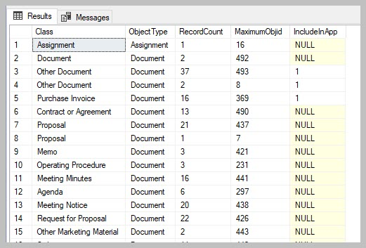

Explore all the objects in the vault
====================================

A new procedure spMFObjectTypeUpdateClassClassIndex extracts
objectVersion data for all objects in the vault and update the
MFAuditHistory table. The results of this process can be used
in a variety of different ways, the most obvious is to assess the total
number of objects in the vault.

.. code:: sql

    --how to get the max id's in a vault
    EXEC [dbo].[spMFObjectTypeUpdateClassIndex] @IsAllTables = 1 -- setting to 0 will only include includedinapp class tables

    SELECT * FROM [dbo].[MFvwObjectTypeSummary] AS [mfots]

|image0|

