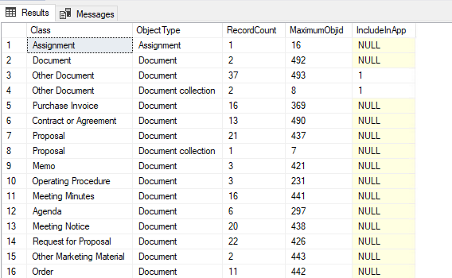

Get number of records in Class
==============================

Sometimes it is necessary to know the number of records in a particular
class or object type.

Using the procedure spMFObjectTypeUpdateClassIndex and then inspecting
the result will do just that.

First, process the update of the index. This can either be done only for
classes included in MFSQL Connector, or for all classes.

.. code:: sql

    --how to get the max id's in a vault
    EXEC [dbo].[spMFObjectTypeUpdateClassIndex] @IsAllTables = 0 -- setting to 0 will only include includedinapp class tables
                                               ,@Debug = 0       -- smallint

The result is updated in the table MFobjectTypeToClassObject. The
illustration below show the number of records and maximum id for the
records in the specific class.

.. code:: sql

    SELECT COUNT(*), MAX([mottco].[Object_MFID]) FROM [dbo].[MFObjectTypeToClassObject] AS [mottco] 
    INNER JOIN MFClass mc
    ON mc.mfid = mottco.[Class_ID]
    WHERE mc.[TableName] = 'MFLarge_Volume'

The view MFvwObjectTypeSummary will produce a stats table on the data in
the MFObjectTypeToClassObject table to show all the classes by Object
Type with the record count, maximum object id and if it has a class
table or not.

|image0|

