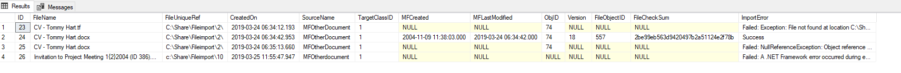

Import files into M-Files from explorer
=======================================

Version 4.3.8.48 introduced the capability to import files to an object
in the class table from a explorer folder.

The main use of this feature is create or update a record in the class
table and associate a file or files from explorer at the same time.

Prerequisites for the spMFUpdateExplorerFiletoMFiles routine are:

#. New or existing record in Class table - @SQLID parameter refers to
   the id of the record. The record must pre-exist in the class table.
   There is no need to pre-update M-Files with a new record. This
   routine will automatically create the object in M-Files if it does
   not exist.

#. Filename of the file to be imported - @fileName

#. folder path of the file - @Filelocation. This location must be
   accessible from the SQL server.

#. Class table name - @TableName

SpMFUpdateExplorerFiletoMFiles processes one file for one record To
process a series of files and records one would create a loop to run
through all the records and related file references. This can be
accomplished in different ways, the choice of which will depend on the
source of the files and data to be imported.

-  A Powershell utility (FolderExport) is available on request to create
   a table in SQL from the folder and file data in explorer. This method
   can come into play if the relationship between the file and its
   metadata is based on the file name or the folder path.

-  Sometimes the third party system have a reference to the file and
   location of the file. this data, combined with the record in the
   class table will setup the loop for calling the importing routine.

The following importing scenarios apply:

-  If the file already exist for the object then the existing file in
   M-Files will be overwritten. M-Files version control will record the
   prior version of the record.

-  If the object is new in the class table (does not yet have a objid
   and guid) then the object will first be created in M-Files and then
   the file will be added.

-  If the object in M-Files is a multifile document with no files, then
   the object will be converted to a single file object.

-  if the object in M-files already have a file or files, then it would
   convert to a multifile object and the additional file will be added

-  If the filename or location of the file cannot be found, then a error
   will be added in the filerror column in the MFFileImport Table.

-  If the parameter option @IsFileDelete is set to 1, then the
   originating file will be deleted. The default is to not delete.

-  The MFFileImport table keeps track of all the file importing
   activity.

--------------

The following example illustrates importing a single file to an object.

.. code:: sql

    DECLARE @ProcessBatch_id INT;
    DECLARE @FileLocation NVARCHAR(256) = 'C:\Share\Fileimport\2\'
    DECLARE @FileName NVARCHAR(100) = 'CV - Tommy Hart.docx'
    DECLARE @TableName NVARCHAR(256) = 'MFOtherDocument'
    DECLARE @SQLID INT = 1

     EXEC [dbo].[spMFUpdateExplorerFileToMFiles] 
     @FileName = @FileName
     ,@FileLocation = @FileLocation 
     ,@MFTableName = @TableName  
     ,@SQLID = @SQLID                     
     ,@ProcessBatch_id = @ProcessBatch_id OUTPUT          
     ,@Debug = 0        
     ,@IsFileDelete = 0

Result is recorded in MFFileImport

.. code:: sql

    SELECT * from [dbo].[MFFileImport] AS [mfi]   

|image0|

