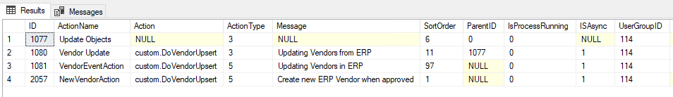
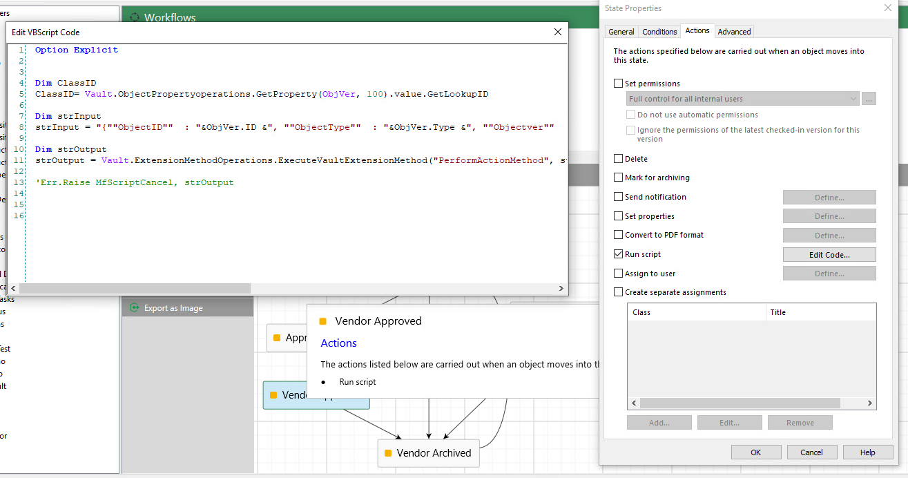
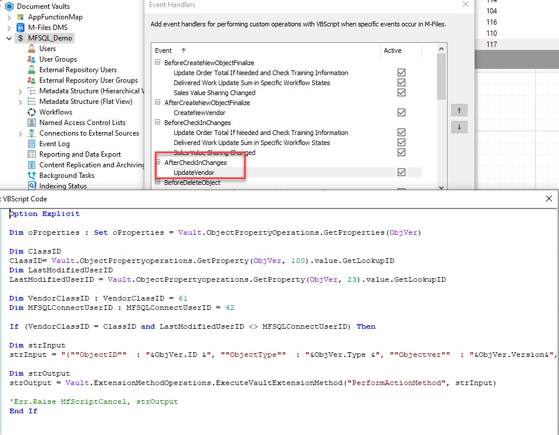
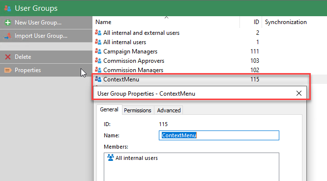
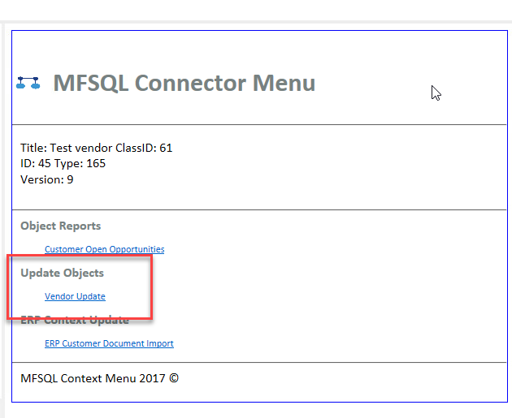
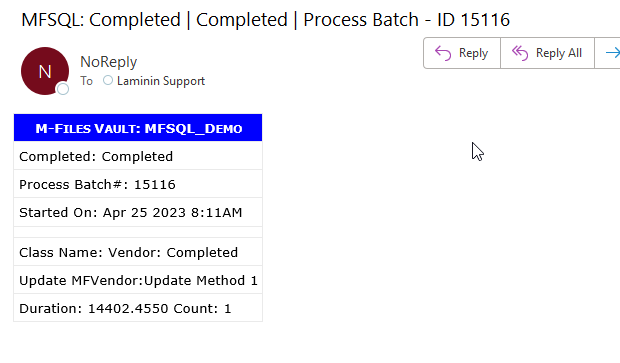

Integration for vendor approval
================================

.. toctree::
   :maxdepth: 1

   custom-dovendorupsert/index
   custom-do-new-erp-vendor/index
   custom-update-erp-vendor/index
   
In this blog we will demonstrate building the integration between M-Files and ERP for creation, update and approval of vendors.

The integration will allow for
a) creating a new vendor in M-Files or ERP
b) allowing for a vendor in M-Files to be reviewed and submitted for approval, and only create the vendor in ERP when approved
c) allow for updates to the vendor in both M-Files and ERP

In this illustration we will use different triggers to perform the operations. Each trigger will have its own custom store procedures to handle related vendor operations.   The example procedures is :doc:`/blogs/integration-vendor-approval/custom-dovendorupsert/index` , :doc:`/blogs/integration-vendor-approval/custom-dovendorupsert/index` and :doc:`/blogs/integration-vendor-approval/custom-update-erp-vendor/index`

a) A change to the vendor in M-Files will be triggered by an *after checkin changes* event handler and update the changes in M-Files to ERP.
b) Updating a change in ERP is triggered by an context sensitive action button in M-Files and will update from ERP to M-Files
c) A new vendor in ERP is created when a vendor is approved in M-Files and reach the workflow state of approved. This is triggered by an action on the state.

Several features and capabilities of MFSQL Connector are applied for these operations including
a) Using various action types of the context menu functionality
b) Updating in both directions between M-Files and SQL
c) Using the logging, tracking and debugging utilities to control the process

MFContextMenu
-------------

Configuring and deploying the context menu is discussed in more detail in :doc:`/mfsql-data-exchange-and-reporting-connector/using-the-context-menu/index`. 

Ensure that the security context for the Context Menu is in place.
Check that only users requiring access to this functionality is included in the ContextMenu usergroup. Replace all users with either another group or individual users.

|image4|

For this application separate entries need to be in MFContextMenu table:
a) Action type 5 for action to be called by event handler. The custom.UpdateERPVendor is referenced.
b) Action type 5 for action to be called by a workflow state  The custom.DoNewERPVendor is referenced
c) Action type 3 for action to be called in context sensitive MFSQL Context Menu. The custom.DoVenderUpsert is referenced.
d) Action type 0 for a heading in the context sensitive MFSQL Context Menu

The procedures :doc:`/procedures/spMFContextMenuHeadingItem` and :doc:`/procedures/spMFContextMenuActionItem` are used to add these entries into MFContextMenu
 
Ensure the user or usergroup who should have access to the individual actions are correctly shown in the entries in the UserGroupID column in table.

|image1|

Triggers
--------

The following triggers must be added to the M-Files configuration
a) Workflow state trigger.
Add the following script to the state action of the approved workflow state for the vendor approval workflow.  This script will trigger when the workflow state is reached.  The action NewVendorAction will be called, which will execute the procedure custom.DoVendorUpsert using the context of the specific vendor object. The lines of code referencing this particular action will be executed to insert a new vendor in the ERP database.

Note the reference to the NewVendorAction as the action name in the VB script below.

.. code:: text

    Option Explicit
    Dim ClassID
    ClassID= Vault.ObjectPropertyoperations.GetProperty(ObjVer, 100).value.GetLookupID
    Dim strInput
    strInput = "{""ObjectID""  : "&ObjVer.ID &", ""ObjectType""  : "&ObjVer.Type &", ""Objectver""  : "&ObjVer.Version&",""ClassID""  : "&ClassID&", ""ActionName""  : ""NewVendorAction"", ""ActionTypeID"": ""5""}"
    Dim strOutput
    strOutput = Vault.ExtensionMethodOperations.ExecuteVaultExtensionMethod("PerformActionMethod", strInput)

|image2|

b) Event Handler trigger
Create a new After Check in changes event handler and add the following script.  Update the ids for the class and user for your vault. This script will trigger for every change of a vendor except when the change is made by the integration itself.  It will call the VendorEvenAction, to execute the same custom.DoVendorUpsert procedure but this time for the code related to the VendorEventAction.  This will update any changes made in M-Files to ERP.  M-Files will take precedence and any changes for this vendor in ERP will be ignored.

Note the reference to the VendorEventAction as the action name in the VB script below.  This script also include a condition to only excecute for the specific class, and exclude any changes made by die MFSQLConnect user.

 .. code:: text

    Option Explicit
    Dim oProperties : Set oProperties = Vault.ObjectPropertyOperations.GetProperties(ObjVer)
    Dim ClassID
    ClassID= Vault.ObjectPropertyoperations.GetProperty(ObjVer, 100).value.GetLookupID
    Dim LastModifiedUserID
    LastModifiedUserID = Vault.ObjectPropertyoperations.GetProperty(ObjVer, 23).value.GetLookupID
    Dim VendorClassID : VendorClassID = 61
    Dim MFSQLConnectUserID : MFSQLConnectUserID = 42
    If (VendorClassID = ClassID and LastModifiedUserID <> MFSQLConnectUserID) Then
    Dim strInput
    strInput = "{""ObjectID""  : "&ObjVer.ID &", ""ObjectType""  : "&ObjVer.Type &", ""Objectver""  : "&ObjVer.Version&",""ClassID""  : "&ClassID&", ""ActionName""  : ""VendorEventAction"", ""ActionTypeID"": ""5""}"
    Dim strOutput
    strOutput = Vault.ExtensionMethodOperations.ExecuteVaultExtensionMethod("PerformActionMethod", strInput)
    End If

|image3|

c) Context sensitive action
To validate the context sensitive action, select a vendor and right click. Then select the MFSQL Connector option at the bottom of the menu.

Selecting this option will show the Context Menu and the options available.  This table should display the action items for action type 3.  Selecting the action will call the row in MFContextmenu for the id referenced in the item - in this case Vendor Update. Vendor update will execute the custom.DoVendorUpsert procedure with context of the specific vendor to update the Vendor from ERP.  In this case any changes in M-Files will be ignored and replaced with the changes made in ERP.

|image5|

Custom Procedure
----------------
The custom procedures used in this case study is available with the above links
Some best practices and approaches used in these procedures include

Standard parameters
~~~~~~~~~~~~~~~~~~~

The following parameters in the same sequence must always be used for action 3 and 5 procedures.

.. code:: sql

      @ID int = null
    , @OutPut varchar(1000) output
    , @ProcessBatch_ID int = null output
    , @ObjectID int = null
    , @ObjectType int = null
    , @ObjectVer int = null
    , @ClassID int = null
    , @Debug smallint = 0 

Begin try catch block
~~~~~~~~~~~~~~~~~~~~~

Include the code in a begin try catch code block to trigger errors and log it to MFLog. The sample code demonstrates using this method.  Check out how the catch blog routes the error to the MFLog table. When an entry hits the MFLog table an email will automatically be generated to report the error.

Use logging for improved tracking
~~~~~~~~~~~~~~~~~~~~~~~~~~~~~~~~~

By default using key standard procedures will log the processing of standard processes to MFProcessBatch and MFProcessBatchDetail.  :doc:`/mfsql-integration-connector/using-and-managing-logs/logging-execution-of-process-and-procedure-steps/index` elaborates on how to achieve this.  Check out the sample procedure for starting and ending the logging

The following snippet can be applied to log also key steps that is not part of the standard procedures to further highlight processing progress and completion.

.. code:: sql

    SET @ProcedureStep = '';
    SET @LogTypeDetail = 'Status';
    SET @LogStatusDetail = '';
    SET @LogTextDetail = ''
    SET @LogColumnName = '';
    SET @LogColumnValue = '';

    EXECUTE @return_value = [dbo].[spMFProcessBatchDetail_Insert]
    @ProcessBatch_ID = @ProcessBatch_ID
    , @LogType = @LogTypeDetail
    , @LogText = @LogTextDetail
    , @LogStatus = @LogStatusDetail
    , @StartTime = @StartTime
    , @MFTableName = @MFTableName
    , @Validation_ID = @Validation_ID
    , @ColumnName = @LogColumnName
    , @ColumnValue = @LogColumnValue
    , @Update_ID = @Update_ID
    , @LogProcedureName = @ProcedureName
    , @LogProcedureStep = @ProcedureStep
    , @debug = @debug

Refresh data from M-Files
~~~~~~~~~~~~~~~~~~~~~~~~~

It is important to refresh data for all the underlying objects before commencing with processing.  If possible, only refresh the specific object rather than all other objects to improve processing time and prevent interfering with other processes.  Use the @objids paramter in spMFUpdateTable to update only the underlying object.

.. code:: sql

     if @ObjectID is not null
     begin

    set @Objids = cast(@ObjectID as varchar(100));

    exec dbo.spMFUpdateTable @MFTableName = @MFClassTable
    , @UpdateMethod = 1
    , @ObjIDs = @Objids
    , @Update_IDOut = @Update_IDOut output
    , @ProcessBatch_ID = @ProcessBatch_ID
    , @Debug = 0;

    end;

Use :doc:`/procedures/spMFUpdateMFilesToMFSQL` instead of spMFUpdateTable to update incremental or full class tables

Write result back to object
~~~~~~~~~~~~~~~~~~~~~~~~~~~

One way of communicating with the user that the process was completed is to write the result back using the properties MFSQL_Message and MFSQL_Batch_Process.

Main process
~~~~~~~~~~~~

The main process of each custom procedure has some common parts, such as updating the object from M-Files, and other sub routines that is unique to the specific objective.

Look out for ensuring when validating if a change record has taken place, the procedure will only update process_id = 1 if an actual change has occured. A common error is to update process_id unnessary which will result in repetitive updates and multiple versions of the object.

Final update to M-Files
~~~~~~~~~~~~~~~~~~~~~~~

Always check the need to call spMFUpdateTable with updatemethod 0.  When many users potentially could update different objects at the same time, then use @objids to only update the object within context to prevent clashes with other user processes.

Send result mail to user
~~~~~~~~~~~~~~~~~~~~~~~~

Use :doc:`/procedures/spMFProcessBatch_mail` to send a result mail to the user if desired.

|image6|

.. code:: sql

        declare @RecipientEmail nvarchar(100);
        declare @RecipientFromMFSettingName nvarchar(100);

        select @RecipientFromMFSettingName = cast(Value as nvarchar(100)) from mfSettings where name = 'SupportEmailRecipient'

        select @RecipientEmail = mla.EmailAddress
        from dbo.MFContextMenu            as mcm
            inner join dbo.MFLoginAccount as mla
                on mcm.Last_Executed_By = mla.MFID;

                if @RecipientEmail is not null
                Begin
        exec dbo.spMFProcessBatch_EMail @ProcessBatch_ID = @ProcessBatch_ID
                                      , @RecipientEmail = @RecipientEmail
                                      , @RecipientFromMFSettingName = @RecipientFromMFSettingName
                                      , @ContextMenu_ID = @ID
                                      , @DetailLevel = 0
                                      , @LogTypes = 'Message'
                                      , @Debug = 0;
                end

Debugging and error management
------------------------------

Monitoring progress
~~~~~~~~~~~~~~~~~~~

Monitor progress with processing with the MFProcessBatch and MFProcessBatchDetail tables.

.. code:: sql

    select top 5 * from dbo.MFProcessBatch as mpb order by mpb.ProcessBatch_ID desc
    select top 1000 * from dbo.MFProcessBatchDetail as mpbd order by mpbd.ProcessBatch_ID desc

VAF processing feedback
~~~~~~~~~~~~~~~~~~~~~~~

Use the VAF logging and debugging outlined in :doc:`/getting-started/configuration-and-setup/enabling-vaf-logging/index` to do debugging if the context menu triggers does not seen to work.

Use debugging snippets
~~~~~~~~~~~~~~~~~~~~~~

Using debugging snippets at key points during the processing could improve overall efficiency of trapping errors and monitoring outcomes during development and debugging.

.. code:: sql

    set @DebugText = N'Object id %i';
    set @DebugText = @DefaultDebugText + @DebugText;
    set @ProcedureStep = N'Get Object: ';

    if @Debug > 0
    begin
      raiserror(@DebugText, 10, 1, @procedureName, @ProcedureStep, @ObjectID);
    end;

