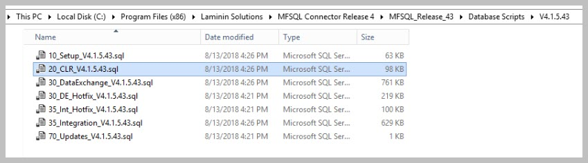

M-Files Upgrade
================

M-Files automatically upgrades to keep the M-Files software up to date. 

MFSQL Connector must response to the upgrade of M-Files on the SQL Server. MFSQL Connector requires M-Files Desktop on the SQL Server where MFSQL Connector is deployed. When M-Files upgrades on the SQL Server it moves the location of the MFilesAPI to the new installed version. MFSQL Connector must therefore be updated to repoint the MFileAPI in the CLR Assemblies to the new location.

Methods to update MFSQL Connector
---------------------------------

  #. Automatic Update
  
The Connector checks to validate if M-Files has upgraded by running the procedure `spMFCheckAndUpdateAssemblyVersion <https://doc.lamininsolutions.com/mfsql-connector/procedures/spMFCheckAndUpdateAssemblyVersion>`_.  This procedure can be run manually using `spMFUpdateAssemblies <https://doc.lamininsolutions.com/mfsql-connector/procedures/spMFUpdateAssemblies>`_, using a `SQL agent <https://doc.lamininsolutions.com/mfsql-connector/getting-started/first-time-installation/using-agent-for-automated-updates/index.html>`_ , or using a `powershell utility <https://doc.lamininsolutions.com/mfsql-connector/getting-started/first-time-installation/setup-powershell-utilities/>`_.  Use the powershell utility for SQL Express installations.

Refer to the blog
around setting up MFSQL Connector to detect changes in the M-Files
Version.

Sometimes it is necessary to intervene. It is likely to be triggered by
an error or email notification with an error referring to an issue with
the Interop.MFilesAPI assembly similar to

    A .NET Framework error occurred during execution of user-defined
    routine or aggregate "spMFGetMetadataStructureVersionIDInternal":
    System.IO.FileLoadException: Could not load file or assembly
    'Interop.MFilesAPI, Version=7.0.0.0, Culture=neutral,
    PublicKeyToken=f1b4733f444f7ad0' or one of its dependencies.
    Assembly in host store has a different signature than assembly in
    GAC. (Exception from HRESULT: 0x80131050) See Microsoft Knowledge
    Base article 949080 for more information.
    System.IO.FileLoadException: at
    LSConnect.MFiles.MFilesAccess..ctor(String VaultSettings) at
    MFilesWrapper.GetMFilesAccessNew(String VaultSettings) at
    MFilesWrapper.GetMetadataStructureVersionID(String VaultSettings,
    String& Result) .

To fix, follow these steps:

#. Check the M-Files Desktop version on the SQL Server.

#. Check the version in MFSettings

#. Update MFSettings to the version on the SQL Server if the installed
   version is different from MFSettings

#. Update the Assemblies

.. code:: sql

    DECLARE @MFVersion NVARCHAR(100) = '' -- example '19.9.8028.5'
    BEGIN

    UPDATE ms
    SET value = @MFVersion
    FROM mfSettings ms WHERE name = 'MFVersion'

    EXEC [dbo].[spMFUpdateAssemblies]

    END

    GO

Version 4.3.9.48 and later
--------------------------

From Version 4.3.9.48 the Connector can automatically detect a change of
the M-Files version and perform an update of the assemblies. This
routine will only work if the M-Files Server and SQL server is on the
same version.

Several procedures and processes related to the updating of the CLR
Assemblies changed from this version:

#. When M-Files Server and SQL Server is on the same server or if the
   M-Files version on the M-Files Server and SQL Server is kept the
   same.

   #. spMFCheckandUpdateAssembly can be executed on its own to perform
      an upgrade. This procedure calls spMFUpdateAssemblies which is is
      compiled for each MFSQL Connector Database when the installation
      is performed. This procedure is therefore not transferable from
      one Database to another. Note this procedure gets the version of
      M-Files from the M-Files Server and assumes the M-Files version of
      the M-Files Server and the SQL Server is the same.

   #. On installation an agent will automatically be created to enable
      scheduling of the validation check. The agent is set to run
      automatically daily at 6h30.

   #. SQL Agent is not available in the case of SQL Express. Contact us
      to obtain a copy of a powershell application that can be used to
      include a Windows Scheduler to perform the same type of scheduled
      update.

#. When M-Files Version on SQL Server potentially could be different
   from the M-Files Server.

   #. In this scenario spMFCheckandUpdateAssembly could give a false
      result as this procedure obtain the latest M-Files version from
      the server.

   #. To update the M-Files Version on into MFSettings on the local
      server use the powershell utility, combined with
      spMFUpdateAssemblies to automatically check for and update the
      assemblies.

Avoid running other MFSQL connector update other scheduled routines
during the same time as as the agent.

Version 4.2.8.47 and prior
--------------------------

NOTE: It is the change of the M-Files version on the SQL Server that
would require and update to the Connector.

MFSQL Connector will fail to connect to M-Files after the upgrade of
M-Files on the SQL server with the following error message:

.. code:: text

    A .NET Framework error occurred during execution of user-defined
    routine or aggregate "spMFGetUserAccounts":
    System.IO.FileLoadException: Could not load file or assembly
    'Interop.MFilesAPI, Version=7.0.0.0, Culture=neutral,
    PublicKeyToken=f1b4733f444f7ad0' or one of its dependencies.
    Assembly in host store has a different signature than assembly in
    GAC. (Exception from HRESULT: 0x80131050) See Microsoft Knowledge
    Base article 949080 for more information.
    ystem.IO.FileLoadException:
    at MFilesWrapper.GetUserAccounts(String VaultSettings, String&
    userAccountsXml)

When MFSQL Connector fail to connect, a email will be send to the MFSQL
support desk defined in MFSettings. Emails are not sent when
DatabaseMail have not been activated. The errors are logged in MFLog
table.

This routine must be following for each instance of MFSQL Connector on
the SQL server.

Follow the steps below to update MFSQL Connector

Step 1:

Update MFSettings with the latest version

.. code:: sql

    UPDATE [dbo].[MFSettings]
    SET value = '18.11.7072.11'
    WHERE name = 'MFVersion'

Step 2:

Access script to update CLR’s

On installation of MFSQL Connector a script is configured and saved in
the installation folder for the specific database. Note that the script
for one database is not compatible for another database. If the script
file cannot be found then first re-install the MFSQL Connector to the
targeted vault and database.

Example of location:

The installation files can be accessed from any computer where the MFSQL
Connector was installed for the specific vault and database (M-Files
Server/SQL Server or Workstation). Note that the folder is set during
the installation. The example below reference the default path.

Note that the installation files is specific to the Database (e.g.
MFSQL\_Release\_43) and Version (V4.1.5.43)

Use the script file ‘20\_CLR\_xxxx’

|image0|

Step 3.

Execute the script file in SSMS.

