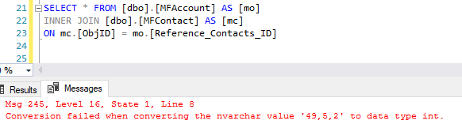
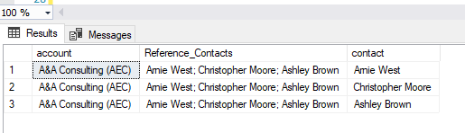

MultiSelectLookups
==================

Multi Select lookups adds a special dimension to be considered. M-Files
allows for any lookup to be either multi select or single select. By
default the system will create a property as a multi select lookup when
a new object type, class or valuelist is created.

When a multi lookup is used in M-Files and the property contains more
than one item, the Connector will list the id's of all the items with a
comma (“,”) delimited string as the IDs of the column. The labels will
be delimited by a semi colon (“;”).

|image0|

To find all the multi select lookup properties in SQL:

.. code:: sql

    SELECT Property, valuelist, Class
    FROM [dbo].[MFvwMetadataStructure] AS [mfms]
    WHERE MFDataType = 'MFDatatypeMultiSelectLookup'

When the class is null in the above list, the property has not been used
on any class.

Joining on multi select columns
-------------------------------

It is common in M-Files to find metadata designs where multi lookups are
used as single lookups. Normally only one item is found in these
properties. However, nothing prevents adding another item to the
property.

Sometimes it is necessary to join two tables based on a multi select
column for reporting or processing purposes. A straight join may have an
error if any record in the class have multiple items. Consider the
following:

|image1|

When you see this error or expect to have multiple values using a multi
select column in a join, the Connector function fnMFParseDelimitedString
can be used to split these strings. Use the following construct:

.. code:: sql

    SELECT mo.[name_or_title] AS account, [mo].[reference_contacts], mc.[name_or_title] AS contact
    FROM   [dbo].[mfaccount] AS [mo]
           CROSS apply [dbo].[Fnmfparsedelimitedstring]([mo].[reference_contact  s_id], ',') AS [fmpds]
           INNER JOIN [dbo].[mfcontact] AS [mc] ON mc.[objid] = [fmpds].[listitem]

The result will show each contact on a separate line.

|image2|

