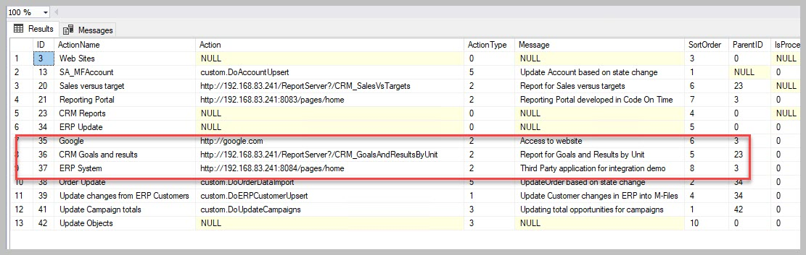
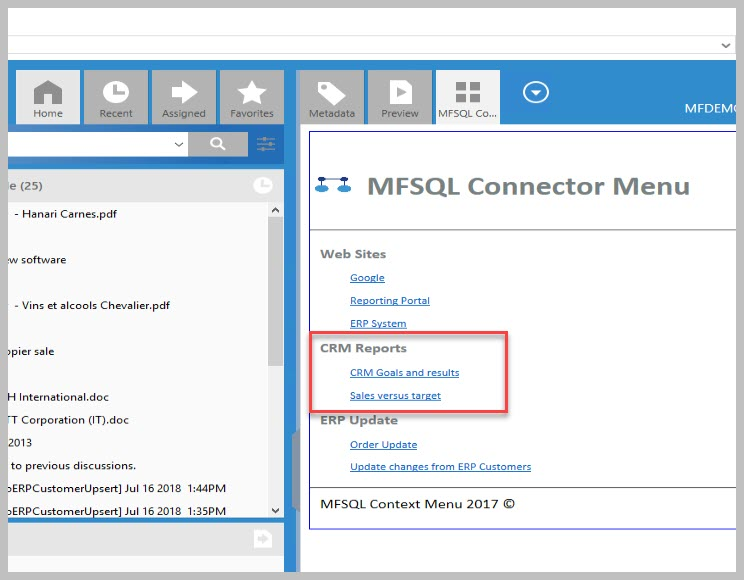

Near real time reporting
========================

This use case highlight how to setup a report with near real time data
in M-Files. This is particularly relevant where the data from M-Files
objects are used for ongoing performance management or monitoring of
progress.

The illustration use the following: M-Files is used for case management
in a high performance environment. Many new cases are reported every day
and requires management of progress based on key performance areas and
strict rules for excessive waiting time.

One of the key requirements is to have have the status of cases in the
system and allocation of cases to workstreams available to team managers
to allow them to identify bottlenecks and re-allocate work where
necessary. M-Files has been fine tuned to optimise the recording of the
cases and to control the different steps of work through workflow and
routing the cases to different teams based on the type of case.

What is left, is to get a nice report on demand for the team managers to
show the results. With some 200 000 cases in the system and several 100
cases open at any point of time, it is not feasible to use the standard
reporting module.

--------------

MFSQL Connector has come into play because:

#. Only changed data can be downloaded instead of all data

#. Updating of data can be triggered on demand, or automatically using
   an event handler

#. A SQL view prepare the data for the report to the team managers.

#. Security allows only the team managers to access the report from
   within M-Files

The following parts of MFSQL Connector is deployed

#. Install and setup SSRS (SQL Reporting Services) to serve as the
   report server

#. Create class tables for the cases, employees, and work orders
   (:doc:`/procedures/spMFCreateTable`)

#. Build the update from M-Files to SQL into a store procedure using the
   Context Menu special parameters to pass through the objid of the
   record to be updated. (:doc:`/procedures/spMFUpdateTable`)

#. Add a task record in the Context Menu table to allow for a event
   handler action to be passed through to SQL (:doc:`/tables/tbMFContextMenu`,
   :doc:`/procedures/spMFContextMenuActionItem`)

#. Add a task and menu record in the Context Menu table to allow for
   linking to a report (:doc:`/tables/tbMFContextMenu`, :doc:`/procedures/spMFContextMenuActionItem`,
   :doc:`/procedures/spMFContextMenuHeadingItem`)

#. Add after check in changes event handler, add VB snippet in the event
   handler script.

#. Pull data for class tables to get base data (:doc:`/procedures/spMFUpdateTable`)

#. Create a SQL view for reporting the case statistics (open cases by
   state by team)

#. Use Visual Studio Report Designing to create a static report based on
   the view and publish to SSRS

The end result should be the ability to make a change in M-Files on
cases. this will auto update in SQL. The team manager can use the
Context Menu in M-Files to access the report.

Note that there are alternative methods also for the updating of the
records into SQL, depending on the volume of changes.

--------------

Store procedure snippets for using the Context Menu special parameters
for a asynchronous action triggered by a event handler

The sample script CMDoObjectActionForWorkflowState can be used as a
starting point to build the event handler update procedure. The call
from the event handler will pass through all the details of the object
that has been checked in.

.. code:: sql

    Alter PROCEDURE [Custom].[CMDoObjectActionForWorkFlowState]
          @ObjectID INT
        , @ObjectType INT
        , @ObjectVer INT
        , @ID INT
        , @OutPut VARCHAR(1000) OUTPUT
     , @ClassID int
    AS
          BEGIN

All that is remaining is to update the object from M-Files to SQL
asynchronously. Note that a single objid is passed through to the update
statement.

.. code:: sql

     EXEC [dbo].[spMFUpdateTable]
        @MFTableName = @MFClassTable ,
        @UpdateMethod = 1,
        @ObjIDs = @ObjectID ,
        @Update_IDOut = @Update_ID OUTPUT ,
        @ProcessBatch_ID = @ProcessBatch_ID  ,
        @Debug = 0 -- smallint

Refer to the section on setting up the context menu for the script to be
added in the event handler :doc:`/mfsql-data-exchange-and-reporting-connector/using-the-context-menu/index`.
Use the action type 5 VB script.

Below is the sample script for adding the action in the context menu for
the event handler action

.. code:: sql

    EXEC [dbo].[spMFContextMenuActionItem]
    @ActionName = 'CaseUpdate_EventHandler' ,
    @ProcedureName = 'Custom.DoCaseUpdate',
    @Description = 'Update cases using event handler',
    @RelatedMenu = 'Asynchronous Actions',
    @IsRemove = 0,
    @IsObjectContext = 1,
    @IsWeblink = 0,
    @IsAsynchronous = 1,
    @IsStateAction = 1,
    @PriorAction = null,
    @UserGroup = 'Team Managers',
    @Debug = 0

Example of the Context Menu entries for a SSRS report

|image0|

Example of the action menu item on context menu to open the report

|image1|

