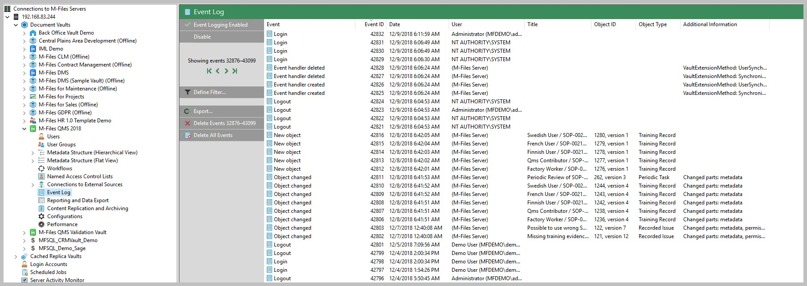
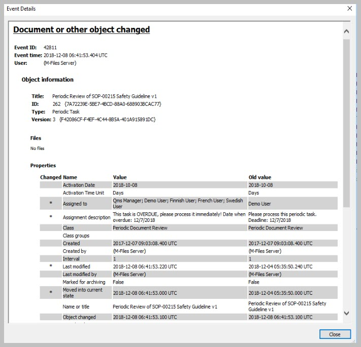
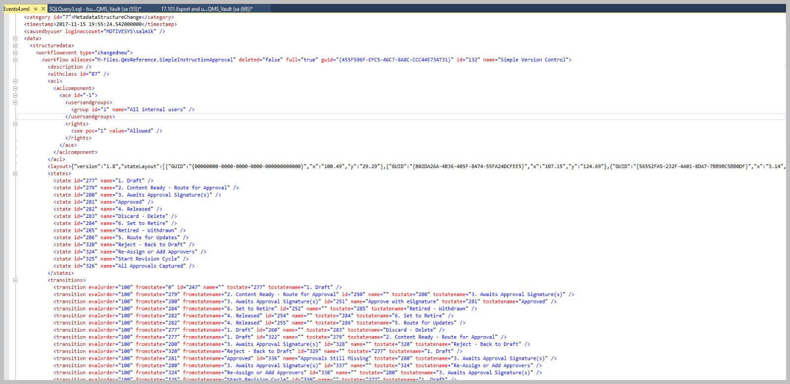

Reports from the extended Event log
===================================

One of the hidden features of the Connector is to get the M-Files Event
log and produce reports from it. This works with both standard and
extended event log in M-Files. This illustration will focus on the
extended event log.

M-Files event log reports many different types of events. Each type of
event will include a distinct set of properties recorded for the event.
The properties are a rich set of information about what has happened in
the vault, depending on the type of the event that took place. Any
export of the event log must allow for exploring the events by type.

To make the most of the Connector’s capability one need to explore the
event types and target the types that may provide the information
required in the report.

A couple of steps are necessary to make it happen:

-  Set the object of exploring or reporting from the event log

-  Update the event log table

-  Explore the events to identify the type of events to be report on

-  Prepare the view

-  Access the view with excel or any other report designer.

There is a handy example script in the installation files :
17.101.Export and use M-Files event log.

The video provides and overview

--------------

Exploring the objective
-----------------------

A good place to start is with M-Files Admin. Identify the events to be
explored further.

|image0|

|image1|

Double click an event to explore the available data further.

This is mainly to allow the developer to isolate the properties and the
types of data associated with the event.

The properties would differ from one type of event to another.

You would also be able to explore this in SQL when you start to put the
view together.

Update the event log table in SQL
---------------------------------

Using SSMS and the Connector the procedure: spMFGetMfilesLog the M-Files
Event Log can be pulled into a SQL Table.

Using the parameter IsClearMfilesLog will allow you to automatically
clear the log in M-Files.

If this procedure is run as an agent on a regular basis it would
cumulatively load all of the events into the SQL table.

.. code:: sql

    EXEC [dbo].[spMFGetMfilesLog] @IsClearMfilesLog = 0, -- bit  select 1 to delete the log in M-Files
                                  @Debug = 0            -- small

The extract of the events are saved in a table MFEventlog\_OpenXML. The
table only includes the latest export. However, on each export another
table is updated MFilesEvents. This table can be explored and used for
the views. The columns consist of standard columns that is the same for
all event and an XML record for the variable data.

|image2|

Explore the events
------------------

Double click on the XML column for an event of your choice. This will
display the properties in XML format for the next step.

Identify the properties be included in the report.

|image3|

Prepare the view
----------------

The sample scripts below can be used as a guide to access the correct
elements and attributes in the XML data.

.. code:: sql

    --show object that is not system objects

    SELECT [me].[ID],
           [me].[Category],
           [me].[CausedByUser],
           [me].[TimeStamp],
           [me].[Events].[value]('(/event/data/objectversion/title)[1]', 'varchar(100)') AS [NameOrTitle],
           [me].[Events].[value]('(/event/data/objectversion/objver/objtype/@id)[1]', 'varchar(100)') AS [ObjectType_ID],
           [me].[Events].[value]('(/event/data/objectversion/objver/objtype)[1]', 'varchar(100)') AS [ObjectType],
           [me].[Events].[value]('(/event/data/objectversion/objver/objid)[1]', 'varchar(100)') AS [Objid]
    FROM [dbo].[MFilesEvents] [me]
    WHERE [me].[Category] <> 'System';

    --show files downloaded

      Select id 
     ,me.[Category]
     ,me.[CausedByUser]
     ,me.[TimeStamp]                                                               
    , Events.value('(/event/data/objectversion/title)[1]','varchar(100)') as NameOrTitle
    , Events.value('(/event/data/filename)[1]','varchar(100)') as [FileName]
    , Events.value('(/event/data/objectversion/objver/objtype/@id)[1]','varchar(100)') as ObjectType_ID
    , Events.value('(/event/data/objectversion/objver/objtype)[1]','varchar(100)') as ObjectType
    , Events.value('(/event/data/objectversion/objver/objid)[1]','varchar(100)') as [Objid]
    From [dbo].[MFilesEvents] me
    WHERE me.Category = 'FileAccess'

    -- show public files downloaded
    SELECT [me].[ID],
           CAST([me].[TimeStamp] AS DATETIME) AS [Timestamp],
           [me].[Events].[value]('(/event/data/objectversion/title)[1]', 'varchar(100)') AS [NameOrTitle],
           [me].[Events].[value]('(/event/data/filename)[1]', 'varchar(100)') AS [FileName],
           [me].[Events].[value]('(/event/data/ipaddress)[1]', 'varchar(100)') AS [IPAddress],
           [me].[Events].[value]('(/event/data/objectversion/objver/objtype)[1]', 'varchar(100)') AS [ObjectType],
           [me].[Events].[value]('(/event/data/objectversion/objver/objid)[1]', 'varchar(100)') AS [Objid],
           [me].[Events].[value]('(/event/data/objectversion/objver/version)[1]', 'varchar(100)') AS [Version],
           [me].[Events]
    FROM [dbo].[MFilesEvents] [me]
    WHERE [me].[Type] = 'File downloaded via public link';

    --show items from pre-and post update types

    SELECT [me].[ID],
           [me].[Category],
           [me].[CausedByUser],
           [me].[TimeStamp],
           [me].[Events].[value]('(/event/data/structuredata/valuelistitem/@type)[1]', 'varchar(100)') AS ChangeType1,
           [me].[Events].[value]('(/event/data/structuredata/valuelistitem/vlitem/@value)[1]', 'varchar(100)') AS ItemValue1,
     [me].[Events].[value]('(/event/data/structuredata/valuelistitem/@type)[2]', 'varchar(100)') AS ChangeType2,
           [me].[Events].[value]('(/event/data/structuredata/valuelistitem/vlitem/@value)[2]', 'varchar(100)') AS ItemValue2
    FROM [dbo].[MFilesEvents] [me]
    WHERE [me].[Events].[value]('(/event/type/@id)[1]','varchar(100)')  ='ValueListItemChanged';

Access the view with the report
-------------------------------

The final step is to use the target script to create a view and to
access the view using any report designer, or by setting up a ODBC data
connection to the view in excel. Demonstrating this is beyond the scope
of this blog.

.. |image2| image:: img_3.jpg

