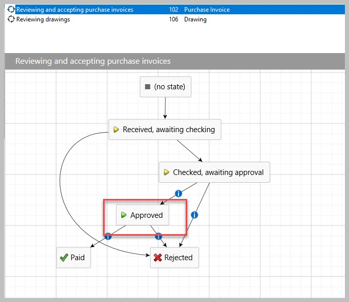
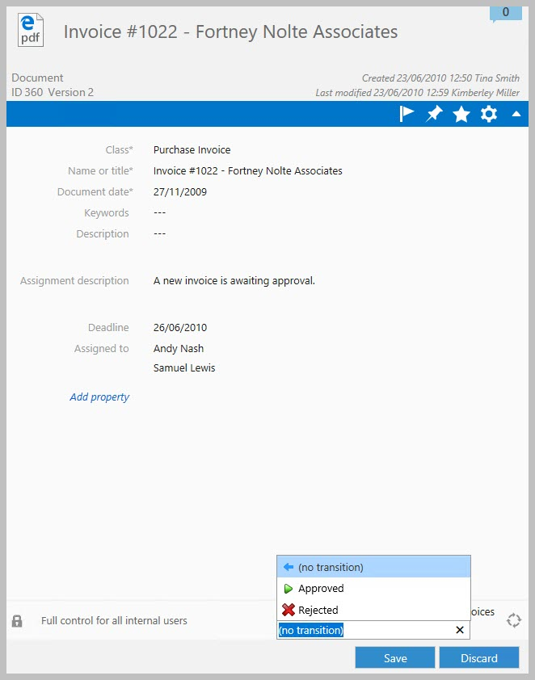
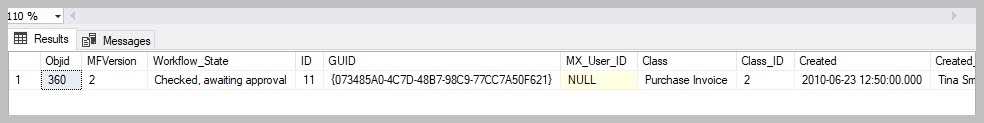
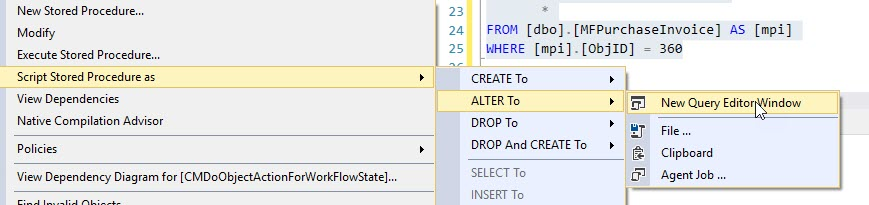
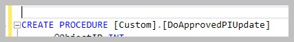

Setting up a workflow state change
==================================

This use case will illustrate how to setup an action to take place in
SQL based on a workflow state change.

    When the purchase invoice is approved, SQL must be updated with the
    latest status of the object. It this use case only the specific
    object must be updated.

    An alternative method would be to update all changes in the class
    for all objects. This is a different method requiring a slightly
    different approach.

This operation is part of the Context Menu functionality of the
Connector and depends on the installation of the Context Menu in the
Vault. Note that this functionality is not available for deployments
where the M-Files server and the SQL Server is not in the same domain.

This is method is particularly useful when a workflow event in M-Files
must trigger a background operation such as:

-  updating M-Files records into SQL for reporting or further processing

-  triggering an operation into or from a third party application

-  performing a complex operation on the object being changed or any
   other object that can be derived from the user action.

This use case will illustrate settings up an update to a class table for
a specific object when the state is changed.

Different parts of the connector are being used in this use case and
familiarity with the following is required:

-  :doc:`/procedures/spMFDropAndUpdateMetadata` (to update the configuration changes in
   M-Files)

-  :doc:`/procedures/spMFCreateTable` (to create the class table)

-  MFPurchaseInvoice (the class table)

-  :doc:`/tables/tbMFContextMenu` (the rules table for context menu operations)

-  :doc:`/procedures/spMFContextMenuHeadingItem` (to add heading)

-  :doc:`/procedures/spMFContextMenuActionItem` (to add action)

-  custom.CMDoObjectActionForWorkflowState (serves as template for
   setting up procedure)

-  :doc:`/procedures/spMFUpdateTable` (to update object into SQL)

-  VB script of state change actions (template to be used)

--------------

Step 1: M-Files vault updates

Determine the class of object that will be used for the workflow state
action. In the use case it is Purchase Invoices.

|image0|

Assign a workflow to the class. Determine the workflow state that will
be used to action a SQL procedure.

In our example the workflow for the class is Release and accepting
purchase invoices and the state is Approved

|image1|

When the user update the workflow state to approved, the expectation is
the object will be updated SQL to show the latest data of the object.

Step 2:

Update the metadata structure in SQL if any changes where made to the
structure.

.. code:: sql

    EXEC [dbo].[spMFDropAndUpdateMetadata]

Step 3:

Create the class table in SQL and update the table from M-Files to SQL

.. code:: sql

    EXEC [dbo].[spMFCreateTable] @ClassName = 'Purchase invoice'

    EXEC [dbo].[spMFUpdateTable] @MFTableName = 'MFPurchaseInvoice',    -- nvarchar(200)
                                 @UpdateMethod = 1

Step 4:

Create the custom procedure to for the action to be performed. In this
case the object should pull and update from M-Files to SQL for the
specific object.

It is good practice to first create and debug to code snippet that will
perform the action, and then to build it into the framework.

We will use the additional parameters in the spmfupdatetable procedure
to achieve the objective. When executed the procedure must update for
the specific object.

We will also introduce to use of error trapping and logging for messages
and back tracking when setting up the procedure.

First setup a select statement to review the object to be updated

.. code:: sql

    SELECT [mpi].[ObjID],
           [mpi].[MFVersion],
           [mpi].[Workflow_State],
           *
    FROM [dbo].[MFPurchaseInvoice] AS [mpi]
    WHERE [mpi].[ObjID] = 360

The result - before the update:

|image2|

Make the change in M-Files. Then run the update statement.

Note the following:

-  We will be passing in the objid when this snippet is connected to the
   action. We therefore setup an input parameter for the objid as an
   integer.

-  spMFupdatetable allows for a comma delimited string of objid’s to be
   passed to M-Files. It will only perform the update operation for the
   list of objid’s. In the example we will pass a single objid to the
   procedure but it need to be converted to a string.

-  Using the @Update\_IDOut and @ProcessBatch\_ID allows for viewing the
   logging results of the process which is taking place in the
   background. This is helpful for backtracking and debugging.

.. code:: sql

    DECLARE @Update_IDOut INT, @ProcessBatch_ID INT
    DECLARE @Objid INT, @Objids_string NVARCHAR(4000)

    SET @objid = 360
    SET @objids_string = CAST(@objid AS NVARCHAR(10))

    EXEC [dbo].[spMFUpdateTable] @MFTableName = 'MFPurchaseInvoice',
                                 @UpdateMethod = 1,
                                 @ObjIDs = @Objids_string,
                                 @Update_IDOut = @Update_IDOut OUTPUT,
                                 @ProcessBatch_ID = @ProcessBatch_ID OUTPUT

    EXEC [dbo].[spMFUpdateHistoryShow] @Update_ID = @Update_IDOut,
                                       @IsSummary = 0,
                                       @UpdateColumn = 3

    SELECT * FROM [dbo].[MFProcessBatchDetail] AS [mpbd] WHERE [mpbd].[ProcessBatch_ID] = @ProcessBatch_ID

After the update has been performed and the operation to be actions has
been tested the result can be reviews. The expectation is to see an
increase in the object version with the new workflow state showing.

|image3|

Step 5:

The targeted operation can now be built into the framework to allow for
the operation to be triggered when the state change takes place.

The installation include a number of sample procedures that can be used
as a starting point for this step.

Select the procedure: custom.CMDoObjectActionForWorkflowState from ssms
object explorer.

|image4|

right click on the object and then select the options to create a new
query from existing

|image5|

Rename the new procedure to be created, and save the script for later
reuse. Good practice is to:

-  use the custom schema for all custom procedures and tables.

-  Start with an action word (do)

-  Add the subject of the action (ApprovedPI)

-  Add the action (update)

Don't forget to also update the value of the parameter @procedurename =
‘Your new procedure name’

|image6|

We can now start to include the operation developed above into the
example script.

The sample procedure include three operations for the object. The
following comment lines is shown at the start of each of the operations:

-  --get object from M-Files

-  --Perform action on/with object

-  --process update of object into M-Files

The first operation - get object from M-Files is similar to the result
in step 4. In this case the only operation to be performed is to get the
new object. You can therefore delete the next two operations as they are
not required.

The next update is to review and change the user message. This can be
achieved by changing the set value of the @Output parameter in the
section – set custom message to user.

.. code:: sql

    -- set custom message to user

                      SET @OutPut = @OutPut + ' Object updated ' + CAST(@ObjectID AS VARCHAR(50))

Execute the procedure to save it in the database.

    Note the following special features and operations that is included
    in the example and is now part of your procedure:

    The input parameters for the procedure (@objectID, @ObjectType,
    @ObjectVer, @ClassID) are all passed into this procedure by M-Files
    when the action is called

    The input parameter @ID reference the id of the action item in the
    MFContextMenu. (more about this later)

    The output parameter @output is the message that will be included in
    the MFUserMessage table by default. (other alternatives are also
    available)

    The procedure will log operations to the MFprocessBatch and
    MFProcessBatchDetail tables. This can be modified.

    The WAITFOR DELAY statement must not be removed. This allows for the
    object to be checked in before the update to SQL takes place. Note
    that the timeframe (in seconds) can be modified to suite the
    specific requirements.

    The spMFResultMessageForUI controls the nature and content of the
    user message. There are various options for this. The default is a
    update message in the MFUserMessage table which is visible in
    M-Files.

Step 6:

Next step is to setup context menu to enable to procedure to be called
from M-Files. It has two parts:

#. Add entries to MFContextMenu

#. Add VB script to workflow state action.

We recommend to use the example script 07.101 Updating the Context Menu.
This script is included in the installation and can be found in
installation folder: C:\\Program Files (x86)\\Laminin Solutions\\MFSQL
Connector Release 4\\[Your database]\\Example Scripts

Using this script you will add a context menu action item with the
following parameters:

.. code:: sql

    EXEC [dbo].[spMFContextMenuActionItem]
    @ActionName = 'Approved state update for PI' ,
    @ProcedureName = 'Custom.DoApprovedPIUpdate',
    @Description = 'Procedure for state action to update object',
    @RelatedMenu = 'Asynchronous Actions',
    @IsRemove = 0,
    @IsObjectContext = 1,
    @IsWeblink = 0,
    @IsAsynchronous = 1,
    @IsStateAction = 1,
    @PriorAction = null,
    @UserGroup = 'All Internal users',
    @Debug = 0

The result is in the MFContextMenu

The final step is to add the VB script into the workflow state. This is
done in M-Files Admin

Use the following VB script (also available in the :doc:`/mfsql-data-exchange-and-reporting-connector/using-the-context-menu/index`

.. code:: vbscript

    Option Explicit

    Dim ClassID
    ClassID= Vault.ObjectPropertyoperations.GetProperty(ObjVer, 100).value.GetLookupID

    Dim strInput
    strInput = "{""ObjectID""  : "&ObjVer.ID &", ""ObjectType""  : "&ObjVer.Type &", ""Objectver""  : "&ObjVer.Version&",""ClassID""  : "&ClassID&", ""ActionName""  : ""StateAction2"", ""ActionTypeID"": ""5""}"

    Dim strOutput
    strOutput = Vault.ExtensionMethodOperations.ExecuteVaultExtensionMethod("PerformActionMethod", strInput)

    'Err.Raise MfScriptCancel, strOutput

Copy and past the script to the workflow state (Approved) / option
Actions/ Run Script. The only change to make is to set the procedure
that will be updated. Navigate the right and change the default to the
action name in MFContextMenu

|image7|

Step 7:

The next step is to test the entire procedure that would be called by
the action script.

Change the workflow to the desired state in M-Files. Note that the
update will take approx. 1 minute (the time set in the WAITFOR DELAY).
then check SQL to see if the update took place.

Step 8:

Debugging tips:

Check the MFContextMenu to see if the process was triggered by M-Files.

-  If IsProcessRunning = 1 and Last\_Executed\_Date = when to action was
   performed then the trigger is working fine, but the procedure failed.

   -  Else the trigger has failed.

.. code:: sql

    SELECT [mcm].[ID],
           [mcm].[ActionName],
           [mcm].[IsProcessRunning],
           [mcm].[Last_Executed_By],
           [mcm].[Last_Executed_Date],
           [mcm].[ActionUser_ID]
    FROM [dbo].[MFContextMenu] AS [mcm]

Possible causes for trigger that is failing:

-  Context menu is not correctly installed, or cannot connect

.. |image3| image:: img_4.jpg
.. |image4| image:: img_5.jpg

.. |image7| image:: img_8.jpg
