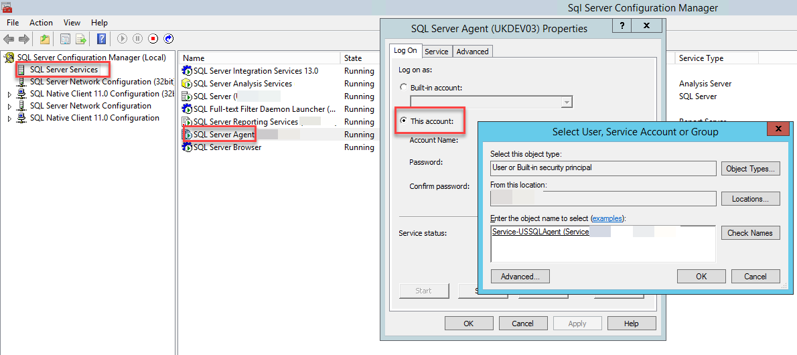

Setup Agent Proxy for MFSQLConnect
==================================

It is possible to call a SQL procedure that in turns triggers as agent with the Context Menu in M-Files.  This provides many different types of opportunities for automation and flexibility.  The Context Menu use the SQL authentication login account MFSQLConnect which is preconfigured to execute the standard MFSQL Connector procedures.  See the security section  :doc:`/the-connector-framework/security/index` for the configuration of this login.

In some cases additional configuration is required to allow for the context menu to be used to trigger a SQL process. Calling an SSIS (SQL Server Integration System) package is one example as SSIS requires elevated. Other examples would be file operations or powershell operations. 

Consult your DBA and Domain Security expects before configuring the SQL Server security. The guidelines in this section for additional configuration of access security is provided as an input to be considered by your organisations security advisors and the actual configuration may differ from organisation to organisation. 

When using the context menu to trigger an agent it would be necessary to setup an Agent Proxy account and assign MFSQLConnect to this proxy.  There are several steps to follow for configuring an agent with a proxy account.

Service account
---------------

The first step is to review the security for the SQL Server Agent security. It is important to set up SQL Server Agent Security on the principles of 'executing with minimum privileges', and ensure that errors are properly logged and alerts are set up for a comprehensive range of errors. SQL Server Agent allows fine-grained control of every job step that should allow tasks to be run entirely safely even if they occasionally need special privileges.

You may choose to use the agent service account originally setup with the installation of SQL, or may have to setup an additional service account specifically for excecuting the SSIS package. It really depends on what security will be required by the underlying operation.

Related `link <https://www.red-gate.com/simple-talk/sql/database-administration/setting-up-your-sql-server-agent-correctly/>`__ 

Setup the agent security to use the service account by accessing the SQL Configuratiion Manager and assigning the service account the the SQL Agent 

|Image4|

Credential
----------

The next step is to setup a credential.  The credential will expose the service account to proxy.  From SSMS Explorer, select the Credentials tab and add a new credential.  Add a name to identify the associated security that will go with the credential and allocate the service account to the credential.

|Image1|
 
Setup the proxy
---------------

Use SSMS to expand the SQL Agent node to get to proxies and add a new proxy.  Create a new proxy and link it to the credential.  Then select the appropropriate operation such sucn SSIS. 

|Image2|

|Image3|

 Use the principles tab to assign MFSQLConnect to the proxy.

Link proxy with agent
---------------------

The final step is to set the permissions on the agent to point to proxy.

Using SSMS, open the properties of the agent and the SSIS package step. Select the proxy in the run as drop down.

|Image5|

.. |image2| image:: img_2.png
.. |image3| image:: img_3.png

.. |image5| image:: img_5.png
