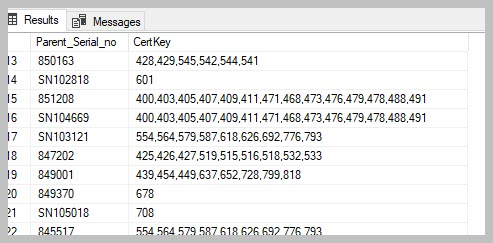

Updating a multi lookup property on an object
=============================================

In the use case we would like to illustrate a procedure that will create
all the id’s for multi lookup column on a class table.

In this example the inventory object references multiple specifications.
The detail of the specifications is contained in a separate object. The
related specifications to the inventory is based on the allocation of
the specification system in the source system.

The comma delimited list of ID’s is created using the STUFF function
combined with FOR XML PATH

.. code:: sql

    SELECT [i].[Parent_Serial_no],
           STUFF(
           (
               SELECT ',' + CAST([mc2].[ObjID] AS VARCHAR(10))
               FROM [dbo].[MFCertkey] AS [mc2]
               WHERE [mc2].[Specification_Group] = [i].[Specification_Group]
               ORDER BY [mc2].[Certkey_Name]
               FOR XML PATH('')
           ),
           1,
           1,
           ''
                ) AS [CertKey]
    FROM [#Inventory] AS [i]
        INNER JOIN [dbo].[MFInventoryCons] AS [mic]
            ON [i].[Parent_Serial_no] = [mic].[Parent_Serial_nr]
        INNER JOIN [dbo].[MFCertkey] AS [mc]
            ON [i].[Specification_Group] = [mc].[Specification_Group]
    WHERE [mic].[Certkeys] IS NULL
    GROUP BY [i].[Parent_Serial_no],
             [i].[Specification_Group];
             

The result of the above is:

|image0|

The CertKey’s can now be updated as the values of the property for the
Specifications on the Inventory. This is achieved by wrapping the above
code snippet into a WITH CTE procedure

.. code:: sql

    WITH cte AS
    (
    SELECT [i].[Parent_Serial_no],
           STUFF(
           (
               SELECT ',' + CAST([mc2].[ObjID] AS VARCHAR(10))
               FROM [dbo].[MFCertkey] AS [mc2]
               WHERE [mc2].[Specification_Group] = [i].[Specification_Group]
               ORDER BY [mc2].[Certkey_Name]
               FOR XML PATH('')
           ),
           1,
           1,
           ''
                ) AS [CertKey]
    FROM [#Inventory] AS [i]
        INNER JOIN [dbo].[MFInventoryCons] AS [mic]
            ON [i].[Parent_Serial_no] = [mic].[Parent_Serial_nr]
        INNER JOIN [dbo].[MFCertkey] AS [mc]
            ON [i].[Specification_Group] = [mc].[Specification_Group]
    WHERE [mic].[Certkeys] IS NULL
    GROUP BY [i].[Parent_Serial_no],
             [i].[Specification_Group]
       )
       UPDATE mic2 
       SET [mic2].[Certkeys_ID] = cte.[CertKey]
              ,[mic2].[Process_ID] = 1
       FROM [dbo].[MFInventoryCons] AS [mic2]
       INNER JOIN [cte]
       ON mic2.[Parent_Serial_nr] = cte.[Parent_Serial_no]

