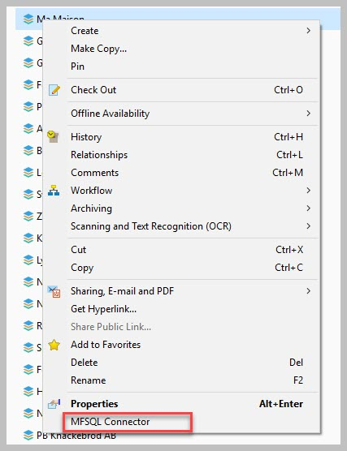

Using event handler for SQL action
==================================

In this use case we would like to illustrate how an event handler can be
used to trigger an SQL procedure using the Context Menu functionality.

Refer to :doc:`/mfsql-data-exchange-and-reporting-connector/using-the-context-menu/index`
for more detail on using and setting up context menu related functionality:

The actions to start an SQL procedure from M-Files can be called via
menu items, or workflow states or event handlers. This case highlights
the event handler method.

Event handlers is useful when a SQL operation must be initiated based on
the event handler trigger. For instance, if a new object must
automatically be created in the 3rd party system following the creation
of a new object in M-Files then the ‘AfterCreateNewObjectFinalize’ event
handler can be used to trigger the SQL procedure. When the action should
be performed after the object in M-Files was changed, then the
‘AfterCheckInChanges’ can be used.

Using event handlers should be considered carefully. Some of the risks
associated include:

-  Negative impact on performance - The use of event handlers put
   additional load on M-Files processing.

-  Clashes with other event handlers - compliance kit, Vault
   applications and other event handlers could clash with each other.

-  Table locking - table or record locking could take place in the
   thirdparty database, in MFSQL Connector database and M-Files.
   Avoiding table locking, and corrective action when table locking has
   taken place should be considered when designing the processes
   triggered by the event handler.

-  Creating an infinite loop - If multiple event handlers are used in
   MFSQL connector, and the one event handler automatically triggers
   another event handler, which in turn triggers the originating event
   handler then an infinite loop arose.

-  Update Precedence - when updates are automatically triggered from
   both third party system and M-Files, special care should be taken to
   isolate changes in both systems. This is likely to use staging tables
   to broker the direction of update.

In this use case we will demonstrate setting up the event handler and
context menu for creating a new object in the third party system on
finalising the creation of the object in M-Files. The use case will also
demonstrate the setup how to setup the event handler to update the third
party system from M-Files and get pull updates from the third party
system without causing and infinite loop.

--------------

The configuration and custom work for building this case involve the
following key elements

#. Prepare custom procedure(s) to process updates. In our case we used a
   single procedure for all four updates.

   #. Third party insert

   #. Third party update

   #. M-Files insert

   #. M-Files update

#. Add Context menu actions

#. Configure event handler scripts

Note the following:

#. Stop the event handler from re-processing updates by the third party
   system by filtering out any updates by the MFSQL Connector user.

#. The custom procedure

   #. Copy and use the custom.CMDoObjectActionForWorkFlowState procedure
      as the framework for the new custom.DoVendorUpsert procedure

   #. Update MF to SQL for the object before processing

   #. Give precedence for the direction of update by using the action
      type of the Context Menu to set the direction in the procedure

   #. Use ‘Select’ statements with ‘Except’ to isolate only the changed
      or new records.

#. There is no need for a wait state in the procedure as the checkin of
   the object will take place before the action is called

#.

Create vendor in M-Files, auto create in third party
~~~~~~~~~~~~~~~~~~~~~~~~~~~~~~~~~~~~~~~~~~~~~~~~~~~~

Use AfterCreateNewObjectFinalize Event Handler with filter on the class
and the MFSQL Connector user.

Note that the following must be updated for your scenario:
VendorClassID; MFSQLConnectorUserID; ActionName

.. code:: vbscript

    Option Explicit

    Dim oProperties : Set oProperties = Vault.ObjectPropertyOperations.GetProperties(ObjVer)

    Dim ClassID
    ClassID= Vault.ObjectPropertyoperations.GetProperty(ObjVer, 100).value.GetLookupID
    Dim LastModifiedUserID
    LastModifiedUserID = Vault.ObjectPropertyoperations.GetProperty(ObjVer, 23).value.GetLookupID

    Dim VendorClassID : VendorClassID = 61
    Dim MFSQLConnectUserID : MFSQLConnectUserID = 41

    If (VendorClassID = ClassID and LastModifiedUserID <> MFSQLConnectUserID) Then

    Dim strInput
    strInput = "{""ObjectID""  : "&ObjVer.ID &", ""ObjectType""  : "&ObjVer.Type &", ""Objectver""  : "&ObjVer.Version&",""ClassID""  : "&ClassID&", ""ActionName""  : ""VendorEventAction"", ""ActionTypeID"": ""5""}"

    Dim strOutput
    strOutput = Vault.ExtensionMethodOperations.ExecuteVaultExtensionMethod("PerformActionMethod", strInput)

    'Err.Raise MfScriptCancel, strOutput
    End If

Create action record in the Context menu

Note ‘IsStateAction’ = 1; IsAsynchronous = 1

.. code:: sql

    EXEC [dbo].[spMFContextMenuActionItem] @ActionName = 'VendorEventAction',      -- nvarchar(100)
                                           @ProcedureName = 'custom.DoVendorUpsert',   -- nvarchar(100)
                                           @Description = 'Updating Vendors in ERP ',     -- nvarchar(200)
                                           @RelatedMenu = null,     -- nvarchar(100)
                                           @IsRemove = 0,        -- bit
                                           @IsObjectContext = 1, -- bit
                                           @IsWeblink = 0,       -- bit
                                           @IsAsynchronous = 1,  -- bit
                                           @IsStateAction = 1,   -- bit
                                           @PriorAction = null,     -- nvarchar(100)
                                           @UserGroup = 'All Internal Users',       -- nvarchar(100)
                                           @Debug = 0            -- int

Snippets from the custom.DoVendorUpsert procedure

Creating new vendor in ERP

.. code:: sql

            IF NOT EXISTS
            (
                SELECT 1
                FROM [NORTHWND].[dbo].[Suppliers]
                    INNER JOIN [dbo].[MFVendor] AS [mv]
                        ON [SupplierID] = [mv].[ExternalID]
                           AND [mv].[ObjID] = @ObjectID AND [mv].[Deleted] = 0
            )
            BEGIN
                SET @ProcedureStep = 'Insert into ERP';

                IF @Debug > 0
                BEGIN
                    RAISERROR(@DebugText, 10, 1, @procedureName, @ProcedureStep);
                END;

                -------------------------------------------------------------
                -- Create new in ERP: will only create new item for the context object
                -------------------------------------------------------------

             INSERT INTO [NORTHWND].[dbo].[Suppliers]
                (
                    [CompanyName]
                   ,[Address]
                   ,[City]
                   ,[PostalCode]

                )
                SELECT
                    SUBSTRING([ma].[Name_Or_Title], 1, 40)                                   AS [Company Name]
                   ,SUBSTRING(([ma].[Address_Line_1] + ', ' + [ma].[Address_Line_2]), 1, 60) AS [Address]
                   ,SUBSTRING([ma].[City], 1, 15)                                            AS [City]
                   ,SUBSTRING([ma].[Postal_Code], 1, 15)                                     AS [Postal]

                FROM [dbo].[MFVendor] AS [ma]
                WHERE [ma].[ObjID] = @ObjectID AND [ma].[Deleted] = 0;

                SET @ExternalID =
                (   SELECT MAX([T].[SupplierID])
                    FROM [NORTHWND].[dbo].[Suppliers] AS [T]
                );

                UPDATE [dbo].[MFVendor]
                SET [Process_ID] = 1
                   ,[ExternalID] = @ExternalID
                WHERE [ObjID] = @ObjectID;
            END;

Update Vendor in M-Files auto update in third party
~~~~~~~~~~~~~~~~~~~~~~~~~~~~~~~~~~~~~~~~~~~~~~~~~~~

Use ‘AfterCheckinChanges’ event handler. Use the same script as above.

In our example only one procedure is used for all the update scenarios.
The same context menu record is therefore used for the action.

Add the following to the custom.DoVendorUpsert procedure

to get the Actiontype

.. code:: sql

    SELECT @ActionType = [ActionType] FROM MFContextMenu WHERE id = @ID

The update code will only apply when the action is called from the event
handler

.. code:: sql

      -------------------------------------------------------------
            -- Update ERP
            -------------------------------------------------------------
            IF @ActionType = 5
      BEGIN
            ;
      WITH [cte]
            AS (SELECT [mv].[Name_Or_Title]
                      ,[mv].[Address_Line_1]
                      ,[mv].[City]
                      ,[mv].[Postal_Code]
                      ,[mv].[ExternalID]
                FROM [dbo].[MFVendor] AS [mv] where [mv].[Deleted] = 0
                EXCEPT
                SELECT [s].[CompanyName]
                      ,[s].[Address]
                      ,[s].[City]
                      ,[s].[PostalCode]
                      ,[s].[SupplierID]
                FROM [NORTHWND].[dbo].[Suppliers] AS [s])
            UPDATE [T]
            SET
      [T].[CompanyName] = [s].[Company Name]
               ,[T].[Address] = [s].[Address]
               ,[T].[City] = [s].[City]
               ,[T].[PostalCode] = [s].[Postal]
     --    SELECT *
            FROM  [cte]
     INNER JOIN [NORTHWND].[dbo].[Suppliers] AS [T]
      ON [cte].[ExternalID] = [t].[SupplierID]
                INNER JOIN
                (
                    SELECT CAST([ma].[ExternalID] AS VARCHAR(5))                                    AS [CompanyID]
                          ,SUBSTRING([ma].[Name_Or_Title], 1, 40)                                   AS [Company Name]
                          --NULL,
                          --NULL,
                          ,SUBSTRING(([ma].[Address_Line_1] + ', ' + [ma].[Address_Line_2]), 1, 60) AS [Address]
                          ,SUBSTRING([ma].[City], 1, 15)                                            AS [City]
                          --                       SUBSTRING([ma].[Account_State], 1, 15)                                   AS [region],
                          ,SUBSTRING([ma].[Postal_Code], 1, 15)                                     AS [Postal]
                          ,SUBSTRING([ma].[Country], 1, 15)                                         AS [country]
                    --                       SUBSTRING([ma].[Phone], 1, 24)                                           AS [Phone],
                    --                       SUBSTRING([ma].[Fax], 1, 24)                                             AS [Fax],
                    FROM [dbo].[MFVendor] AS [ma]
        WHERE [ma].[Deleted] = 0
                )                             AS [s]
                    ON [T].[SupplierID] = [s].[CompanyID];

            -------------------------------------------------------------
            -- Update changes into ERP
            -------------------------------------------------------------
            WITH [cte]
            AS (SELECT [s].[CompanyName]
                      ,[s].[Address]
                      ,[s].[City]
                      ,[s].[PostalCode]
                      ,[s].[SupplierID]
                FROM [NORTHWND].[dbo].[Suppliers] AS [s]
                EXCEPT
                SELECT [mv].[Name_Or_Title]
                      ,[mv].[Address_Line_1]
                      ,[mv].[City]
                      ,[mv].[Postal_Code]
                      ,[mv].[ExternalID]
                FROM [dbo].[MFVendor]  AS [mv] WHERE [mv].[Deleted] = 0)
            UPDATE [dbo].[MFVendor]
            SET [Process_ID] = 1
               ,[Name_Or_Title] = [cte].[CompanyName]
               ,[Address_Line_1] = [cte].[Address]
               ,[City] = [cte].[City]
               ,[Postal_Code] = [cte].[PostalCode]
            FROM [dbo].[MFVendor] AS [mv]
                INNER JOIN [cte]
                    ON [cte].[SupplierID] = [mv].[ExternalID]
        WHERE [mv].[Deleted] = 0;
     END

Update M-Files following an update in third party application.
~~~~~~~~~~~~~~~~~~~~~~~~~~~~~~~~~~~~~~~~~~~~~~~~~~~~~~~~~~~~~~

An insert or update in the third party application can be triggered in
various ways

-  Trigger on the third party table calling the MFSQL procedure

-  Action Menu in M-Files to pull updates by calling the MFSQL procedure
   from M-Files

-  Scheduled agent in SQL to call the MFSQL procedure every so often.

Our example is based on having an action Menu in M-Files. We will be
using a context sensitive menu. The action will use the same procedure
as above.

Create the menu heading and menu item.

.. code:: sql

    EXEC [dbo].[spMFContextMenuHeadingItem] @MenuName = 'ERP Context Update',            -- nvarchar(100)
                                            @PriorMenu = null,           -- nvarchar(100)
                                            @IsObjectContextMenu = 1, -- bit
                                            @IsRemove = 0,            -- bit
                                            @UserGroup = 'All Internal Users',          -- nvarchar(100)
                                            @Debug = 0                -- int

    EXEC [dbo].[spMFContextMenuActionItem] @ActionName = 'Vendor Update',      -- nvarchar(100)
                                           @ProcedureName = 'custom.DoVendorUpsert',   -- nvarchar(100)
                                           @Description = 'Updating Vendors from ERP ',     -- nvarchar(200)
                                           @RelatedMenu = 'ERP Context Update',     -- nvarchar(100)
                                           @IsRemove = 0,        -- bit
                                           @IsObjectContext = 1, -- bit
                                           @IsWeblink = 0,       -- bit
                                           @IsAsynchronous = 1,  -- bit
                                           @IsStateAction = 0,   -- bit
                                           @PriorAction = null,     -- nvarchar(100)
                                           @UserGroup = 'All Internal Users',       -- nvarchar(100)
                                           @Debug = 0            -- int

The menu is exposed when right click on the object in M-Files.

|image0|\ |image1|

Add the following snippet to the custom.DoVendorUpsert procedure

Note that this code will only operate when the action is called from the
menu. This is important to ensure that the previous code for updating
M-Files changes to ERP does not overwrite the changes from ERP to
M-Files.

.. code:: sql

          -------------------------------------------------------------
            -- insert ERP to MF
            -------------------------------------------------------------

       IF @ActionType = 3
            BEGIN
                SET @ProcedureStep = 'Insert into MF';

                IF @Debug > 0
                BEGIN
                    RAISERROR(@DebugText, 10, 1, @procedureName, @ProcedureStep);
                END;

                WITH [cte]
                AS (SELECT [s].[SupplierID]
                    FROM [NORTHWND].[dbo].[Suppliers] AS [s]
                    EXCEPT
                    SELECT [ExternalID]
                    FROM [dbo].[MFVendor] mv
        WHERE [mv].[Deleted] = 0)
                INSERT INTO [dbo].[MFVendor]
                (
                    [Address_Line_1]
                   ,[Address_Line_2]
                   ,[City]
                   ,[Country_ID]
                   ,[Name_Or_Title]
                   ,[Postal_Code]
                   ,[Process_ID]
                   ,[ExternalID]
                )
                SELECT [s].[Address]
                      ,NULL
                      ,[s].[City]
                      ,NULL
                      ,[s].[CompanyName]
                      --     ,[s].[ContactName]
                      --     ,[s].[ContactTitle]
                      --     ,[s].[Region]
                      --      ,[s].[Country]
                      ,[s].[PostalCode]
                      --     ,[s].[Phone]
                      --     ,[s].[Fax]
                      --     ,[s].[HomePage]
                      ,1
                      ,[cte].[SupplierID]
                FROM [NORTHWND].[dbo].[Suppliers] AS [s]
                    INNER JOIN [cte]
                        ON [cte].[SupplierID] = [s].[SupplierID];

                -------------------------------------------------------------
                -- changes from ERP to SQL
                -------------------------------------------------------------
                WITH [cte]
                AS (SELECT [s].[CompanyName]
                          ,[s].[Address]
                          ,[s].[City]
                          ,[s].[PostalCode]
                          ,[s].[SupplierID]
                    FROM [NORTHWND].[dbo].[Suppliers] AS [s]
                    EXCEPT
                    SELECT [mv].[Name_Or_Title]
                          ,[mv].[Address_Line_1]
                          ,[mv].[City]
                          ,[mv].[Postal_Code]
                          ,[mv].[ExternalID]
                    FROM [dbo].[MFVendor] AS [mv] WHERE [mv].[Deleted] = 0)
                UPDATE [dbo].[MFVendor]
                SET [Process_ID] = 1
                   ,[Name_Or_Title] = [cte].[CompanyName]
                   ,[Address_Line_1] = [cte].[Address]
                   ,[City] = [cte].[City]
                   ,[Postal_Code] = [cte].[PostalCode]
                FROM [dbo].[MFVendor] AS [mv]
                    INNER JOIN [cte]
                        ON [cte].[SupplierID] = [mv].[ExternalID];
            END;

Finalise the process by updating the changes into M-Files

.. code:: sql

            EXEC [dbo].[spMFUpdateTable] @MFTableName = @MFClassTable
                                        -- nvarchar(128)
                                        ,@UpdateMethod = 0
                                        -- int
                                        ,@Update_IDOut = @Update_ID OUTPUT
                                        -- int
                                        ,@ProcessBatch_ID = @ProcessBatch_ID
                                        -- int
                                        ,@Debug = 0;

.. |image1| image:: img_2.jpg
