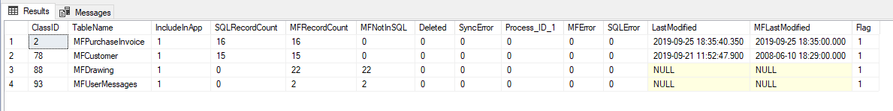
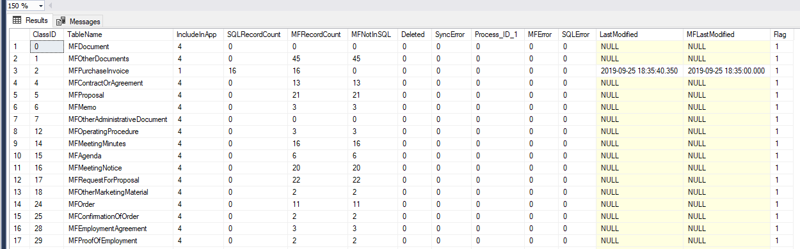
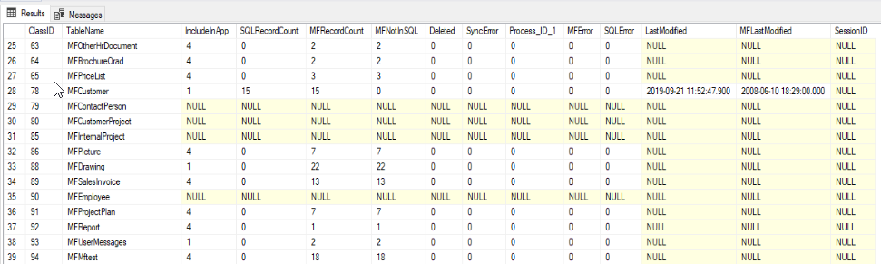

=========================
Using spMFClassTableStats
=========================

This procedure is useful to the SQL developer for
-  getting information about a class table or class tables
-  using the result in other procedures such as error trapping or class table stats

This procedure will perform a table audit on all the tables included in the filter. The procedure will update the object versions of the class table in the MFAuditHistory table. This could take a considerable time to run through if M-Files have a large number of objects.  The view vwMFAuditSummary will provide a summary result of the MFAuditHistory table. 

The Columns
-----------

- ClassID = MFID of the class
- TableName = Name of class table
- IncludedInApp = show value from MFClass table
- SQLRecordCount = Count of records of the specific class table
- MFRecordCount = Count of records for the class from the MFAuditHistory table.  
- MFNotInSQL = Count of difference between class table and audit. Use vwMFAuditSummary and MFAuditHistory to track the difference.
- Deleted = count of deleted column in class table - Deleted in M-files, not yet removed.
- SyncError = count of process_id = 2 in class table - records where a synchronisation error was prodcued in the last run
- Process_ID_1 = count of process_id = 1 in class table - records not yet updated into M-Files
- MFError = count of process_id = 3 in class table - records where a M-Files error was produced during the last run
- SQLError = count of process_id = 4 in class table - records where a SQL error was produced during the last run
- LastModified = maximum date in the lastmodified column in class table - the last time of an update in the class table
- MFLastModified = maximum date in the MF_last_modified column in class table - the last date of a modification in M-Files

Understanding and working with the result
-----------------------------------------

The significance of the result for a table include:
- When last was the table updated?
- Is the table out of line with M-Files?
- Has the last updated record in M-Files been processed?
- Did the update produce any errors to take note of?
- How many records are there in M-Files
- Are there any records in M-Files which has not been processed.

If MFNotInSQL is not null it may signal one or more of the following
- the class include templates.  Template objects are not included in SQL
- the class include document collections. document collections are not included in SQL
- the class table is out of date and requires an update. use spMFUpdateTable to update the class table.
- the object version exist without a record. Incomplete object in M-Files.

Producing the result
--------------------

#. Listing for a specific table

Specifying the class table when the procedure is executed will process the result for a single table.

.. code:: sql

    EXEC [dbo].[spMFClassTableStats] 'MFCustomer'
    
--------------------

#. Simple list

As a simple executable without any parameters it will produce a table with for all class tables where IncludedInApp is not null.

.. code:: sql

    EXEC [dbo].[spMFClassTableStats]
    
--------------------

|image0|

#. Extending to include more tables

Add additional tables to be included in the stats, but not included in the processing of class table updates. Set the includedInApp column to any integer above 2.  In this example it is set to 4 for all classes in the object type 'Document'

Then execute spMFCreateAllMFTables with @IncludedInApp = 4 and finally execute the stats.

.. code:: sql
    
     UPDATE mc
     SET [mc].[IncludeInApp] = 4
     FROM MFclass mc
     INNER JOIN MFObjectType mo
     ON [mo].[ID] = [mc].[MFObjectType_ID]
     WHERE mo.name = 'Document' AND [mc].[IncludeInApp] IS null
     
    EXEC [dbo].[spMFCreateAllMFTables] 4 
    
    EXEC [dbo].[spMFClassTableStats]
     
---------------------

|image1|
 
#. Using result in another procedure

The result of the procedure can be included in global temporary table ##spMFClassTableStats. Each time the procedure is run the temporary table will be reset.  Set the parameter @IncludeOutput  = 1 to produce the result into the table

.. code:: sql

    EXEC [dbo].[spMFClassTableStats] @ClassTableName = 'MFCustomer', @IncludeOutput = 1
    
    Select * from ##spMFClassTableStats
    
--------------------

#. Producing a result for all classes 

When running the procedure with an output for all tables in will show the classes that is not includedInApp also. However, it will not get the number of records in M-Files for these classes.

 |image2|
 

