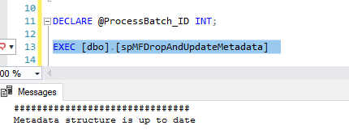
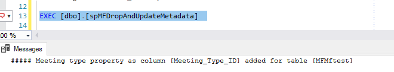

spMFDropAndUpdateMetadata
-------------------------

Returns
    1 = success
Inputs
    @IsResetAll
        0=Keep custom values (default)
        1=Reset to default values
    @WithClassTableReset (default = 0)
        set to 1 to reset all class tables included in App
    @WithColumnReset (dafault = 0)
        set 1 to automatically reset column datatypes where datatypes changed
    @IsStructureOnly (default = 1)
        set to include updating of all valuelist items or only main structure elements
    @ProcessBatchID output
        returns the processbatch id for the processing log
    @Debug:
        1 = Debug Mode
        0 = No Debug (default)

_*Note*_

    It is highly likely that the developer will go through multiple
    iterations of metadata and table changes during development.

We recommend to use SPMFDropAndUpdateMetadata instead of
spMFSynchronizemetadata during the design process.

This procedure will only run if metadata structure changes were
made. It is therefore useful to add this procedure as a scheduled
agent, or as part of key procedures to keep the structure aligned.

    Do no run other procedures (such as spmfupdatetable) while any
    syncrhonisation of metadata is in progress.

When  IsStructureOnly = 1 the updating of valuelist items and workflow
states are excluded.  We recommend the use of
spMFSyncrhronizeSpecificMetadata for updating valuelistitems for
operations.  Running the procedure with structure only reduces the
running time significantly.

To force an update, set IsStructureOnly = 0.

To include changes to valuelist items in the update, set the
IsStructureOnly = 0.  alternatively use the
smMFSynchonizeSpecificMetadata to update valuelistitems only as a
separate routine

When IsResetAll = 0 the procedure will update the metadata structure
from M-Files but retain the custom class TableNames and Property
ColumnNames.

When IsResetAll = 1 then all the metadata structure tables will be reset
to align with the structure in M-Files.

    *@IsReset available starting with version 3.1.1.36*

WithClassTableReset = 1 will drop, recreate, and refresh all class
tables included in App.  This is handy when doing prototyping and you
want to just start over again and remove all custom settings.

WithcolumnReset = 1 will validate the datatypes for text based columns
and reset the datatypes where text  or multi lookup properties changed
datatypes.  WithColumnReset = 0 will validate any properties added in
the metadata card and automatically add it to the columns of the class
table. 

The runtime of this procedure has increased, especially for large
complex vaults. This is due to the extended validation checks performed
during the procedure.

**Execute Procedure**

.. code:: sql

     
    DECLARE @ProcessBatch_ID INT;

    EXEC [dbo].[spMFDropAndUpdateMetadata] @IsResetAll = 0          -- smallint
                                          ,@WithClassTableReset = 0 -- smallint
                                          ,@WithColumnReset = 0     -- smallint
                                          ,@IsStructureOnly = 1     -- smallint
                                          ,@ProcessBatch_ID = @ProcessBatch_ID OUTPUT                  -- int
                                          ,@Debug = 0               -- smallint

Running the procedure with default settings and no structure metadata
change has taken place will exit very rapidly.

| 

Not all metadata changes increases the GetMetadataStructureVersionID in
M-Files.  Changes to valuelist items are not incluced.

The default options is not appropriate when valuelist items must be
included in the update There are several other methods to achieve the
update of valuelist items rapidly.

| 

|image0|

To force an update of metadata when only valuelist items have changed,
set the @IsStructureOnly = 0 

.. code:: sql

    EXEC [dbo].[spMFDropAndUpdateMetadata] 
    @IsStructureOnly = 0    

Running the procedure with default settings will automatically add any
missing columns on the class tables.

| 

sample message after adding a new property to a class in M-Files

|image1|

The parameter @IsResetAll will remove all custom settings in SQL and
reset the metadata structure to the vault.  This include removing all
the class tables.

This should only be used as a tool during prototyping and testing use
cases.

.. code:: sql

    EXEC [dbo].[spMFDropAndUpdateMetadata] 
    @IsResetAll = 1      

To reset columns when data types have changed, set the @WithColumnReset
= 1

.. code:: sql

    DECLARE @ProcessBatch_ID INT;

    EXEC [dbo].[spMFDropAndUpdateMetadata] 
    @IsResetAll = 0       
    ,@WithClassTableReset = 0 
    ,@WithColumnReset = 1    
    ,@IsStructureOnly = 0    
    ,@ProcessBatch_ID = @ProcessBatch_ID OUTPUT  
     ,@Debug = 0 

Use `spMFClassTableColumns <page615186461.html#Bookmark134>`__ to review
the application and status of properties and columns on class tables.

