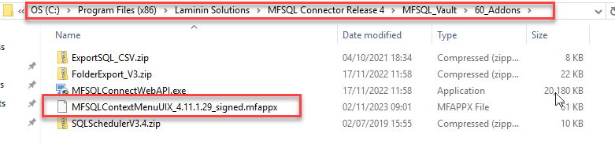
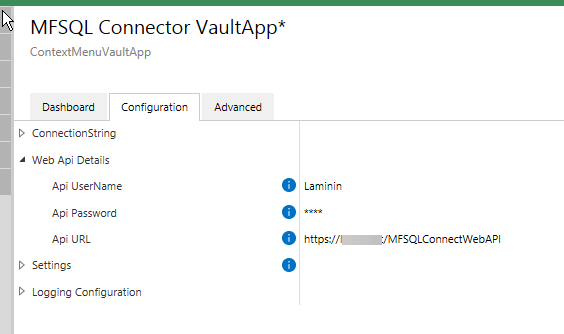

============================================
M-Files Cloud and other hosted installations
============================================

.. toctree::
   :maxdepth: 1

   install-webapi/index

MFSQL Connector requires a part of the installation in the vault, and therefore would impact on a cloud vault.  Lately, M-Files also require all vault applications to be certified for installation in the cloud.

The MFSQL Connector vault application is certified and has a special edition that is signed for usage in a cloud vault.  This edition of the VAF is available in the installation folder 60-Addons.

|image5|

The vault application has several import functions.  Configuration of the vault application will depend how MFSQL is used.
 -  The VAF is always required and must be licensed to be able to use the tool.
 -  The Web API installation and associated configuration is only required if context menu functionality is applied in the deployment
 -  The logging configuration is only applicable for debugging and monitoring of the context menu functionality

Installing MFSQL Connector for an M-Files Cloud vault has a number of specific steps to follow as a part of the installation.  Some of the steps may have to be done by M-Files Cloud Support.  

The following steps must be followed:

**1. Pre-installation.**

Ensure that the MFSQL Connector user is created in the target vault.
Ensure that M-Files Desktop is installed on the SQL Server and that M-Files on the SQL Server has access to M-Files through the MFSQL Connector user on the M-Files Desktop.
Provision a Web Server with access to the SQL Server.  This is only required if MFSQL Context Menu functions will be used in the deployment.

**2. Run package.**
Run the MFSQL Connector installation package on the SQL Server using :doc:`/getting-started/on-premise-installation/index` with the following considerations

 -   Select cloud option in the location of M-Files Vault window.
 -   Note that the installation package will skip the window to log into the M-Files Server

|image1|

 **3. Complete M-Files login details.**

Enter the following data in the installation window for the credentials
- Vault Name
- MFSQL user name and Password
- change the protocol to https or gRPC depending on New cloud or old cloud vault
- Set the endpoint to required port (e.g. 4466, 7766 or 443)
- update the M-Files version on the SQL Server
- add the M-Files Server full URL for the cloud vault

 |image4|

**4. Complete installation.**

Complete the installation of the package as outlined in the on-premise installation procedure.

**5. Enable Context Menu functionality.**

 The Web API is required when M-Files will be used to action SQL procedures. The Web API allows for calling the SQL server from the M-Files Cloud vault.

Follow the :doc:`/getting-started/cloud-and-hosted-installation/install-webapi/index` instructions for installing this functionality.
Ensure to note down the username and password, as this will have to be added later to the VAF configuration.  The API URL will also be required in the next step.

**6. Install the VAF on the cloud vault.**

New Cloud installation allows for the administrator to perform the majority of the VAF installation.

In classis cloud installation, create a M-Files support ticket to install MFSQL Connector VAF in the vault.  Pass through the signed installation package to support for installation.

Text for email. (to be added when approved)

M-Files will install the VAF, add the API URL and run the content package to update the vault.

**7. Finalize the Web API setup.**

Provide the API URL to M-Files support to be added to the settings.  This setting is only available for system administrators.

|image6|

On confirmation that the VAF is installed, update the MFSQL Connector VaultAPP in M-Files Admin by adding the username and password

|image2|

**8. License and check.**

Add the license for the MFSQL Connector VAF.

Right click configurations and refresh.  Check the dashboard, this should now show to details of the settings in the SQL Server.

|image3|

.. |image1| image:: image1.png
.. |image2| image:: image2.png
.. |image3| image:: image3.png
.. |image4| image:: image4.png

