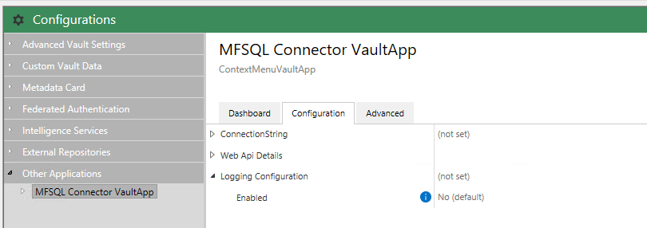
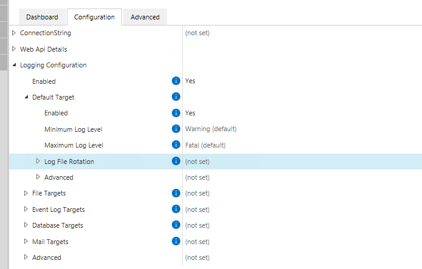
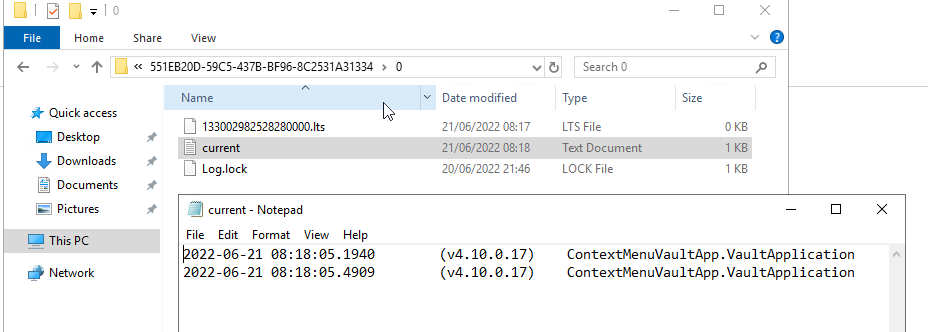

========================================
Enabling and configuring the VAF logging
========================================

Release 4.10.30.74 of the Connector allows for the deployment of advanced logging for the VAF operations.  This is very useful
for monitoring and tracking of issues in the Context Menu operations.

The following steps highlights to most basic steps for setting up to logging.  There are additional features in the VAF logging capability not covered in
this guide. It is however, part of the new release of the VAF framework and can be utilized.

To access the setup, expand the Logging Configuration in the MFSQL Connector VaultApp under Other Applications in the Configurations of M-Files admin.
By default the logging is not enabled.

|Image1|

Enable logging to expand the additional options. As a minimum, Enable the Default Target.  This will allow for the log to be placed
on the M-Files server in the Applogs sub folder for the vault under the M-Files\\Server Vault directory.
For example: C:\\Program Files\\M-Files\\Server Vaults\\VaultName\\Applogs\\GUID\\GUID\\0

|Image2|

If nothing else is configured then the logging will only show if fatal errors have been encountered.

For debugging set the Minimum Log level to Trace. This will show the full logging for the operation.

Restart the vault for the log setup to be activated. An example of the initial log is shown below.

|Image3|

