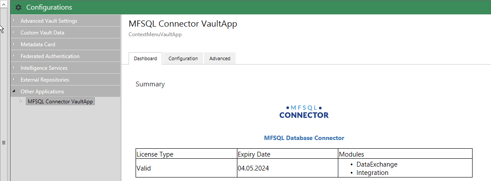
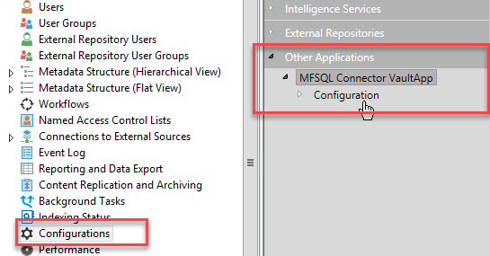
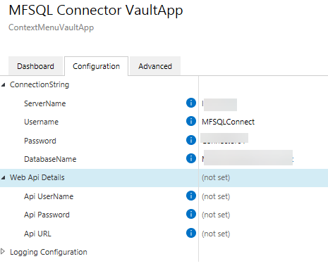
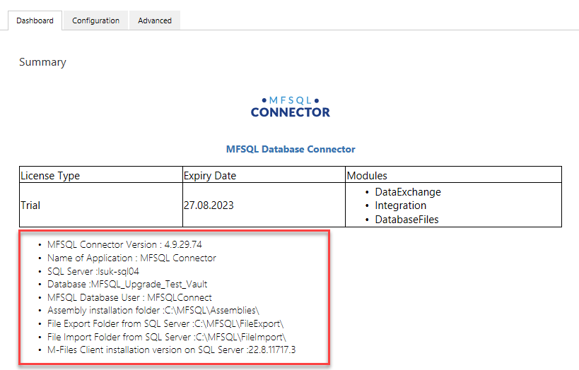

Installing the Context Menu
===========================

The Context Menu functionality enables actioning a SQL Procedure from within M-Files:

-  User selected action from a menu
-  User selected context sensitive action from a menu
-  Triggered by a workflow change
-  Triggered by an event handler

This guide deals with the installation and configuration of the context menu
for versions 4.10.30.74 onwards.  Configuration of versions between 4.3.9.48 and 4.9.29.73  is similar, but does not include logging and Web Services. The configuration and setup prior to 4.3.9.48 version is not compatible with the new setup of context menu.

Version 4.10.30.74 introduced VAF Multi server mode, task scheduling and logging to the context menu with significant changes to the configuration and use of the context menu. It also includes the setup of the Web API service for cloud installations.

This chapter is concerned with the basic configuration and enablement of the context menu functionality. The use and deployment of different alternatives for this functionality is in :doc:`/mfsql-data-exchange-and-reporting-connector/using-the-context-menu/index`
The steps to enable the context menu include:

#. Installing the Connector package
#. Setup of the SQL Connection
#. Access security to the context menu
#. Enabling Logging

Installation
------------

The installation folder contains the content package and vault applications required by the Context Menu.

The installation package will automatically install these components,
however, these components can be installed manually.  Follow the M-Files
documentation for instructions on performing content package imports and
application installations.

Restart the vault after installation of the applications.

The configuration must be done after MFSQL Connector package has been installed on both M-Files Server and SQL Server.  The context menu functionality is dependent on the following elements installed when the package is run.  The remainder of this section deals with various aspects of the configuration and setup.

Configuration and Setup
------------------------

The configuration of the context menu has several steps:

 Configure the settings in the Configurations tab for the vault using M-Files Admin.  The connector settings is in the Other Applications section.

|image2|

The first step is to ensure that the license is installed.  See section :doc:`/getting-started/configuration-and-setup/licensing-management/index` for help on installing the license.
If correctly installed, the configuration dashboard should show the modules licensed and if the license is valid.

|image1|

The following steps are only necessary if your application of the Connector includes the Context Menu functionality. It is not necessary to be setup if no Connector related operations is triggered from within the Client Desktop.

Setup the connection string.  See section `Configuration of connection string`_ for further details.  When using the functionality with a cloud vault, it is necessary to deploy the Web API Service to allow access from the cloud to the MFSQL Server. Refer to :doc:`/getting-started/cloud-and-hosted-installation/install-webapi/index`

The configuration for an on premise installation should include all the database connections elements and the Web API settings should be empty.

|image3|

After configuring the connection string correctly, the configurator will connect to the settings table and show key settings in the dashboard.

|image4|

Enable logging. see section :doc:`/getting-started/configuration-and-setup/enabling-vaf-logging/index` to configure and test the log.  The section :doc:`/mfsql-integration-connector/using-and-managing-logs/logging-in-custom-procedures/index` has more detail on using logging in procedures.

next step is to review the current use of context menu functionality or decide on the deployment of the context menu for new functionality.

Refer to :doc:`/mfsql-data-exchange-and-reporting-connector/using-the-context-menu/index` on more information on the deployment of the context menu.

The blog :doc:`/blogs/update-to-VAF-4-10/index` has more details on the steps to take to convert existing procedures to the requirements of the new version.

Testing the procedures and monitoring the processing of transactions is explained in more details in the section 

Tables and procedures
~~~~~~~~~~~~~~~~~~~~~

The following context menu related tables and procedures are installed when the MFSQL
Connector is deployed:

-  MFContextMenu:  This table contains the menu items displayed in
   the Context Menu. Note that this is an empty table. The menu items is
   added as part of your deployment.
-  MFProcessBatch: This table log processing and assign a record for a processes or series of processes
-  MFProcessBatchDetail: This table logs the steps for a process defined in MFProcessBatch.
-  spMFGetContextMenu: This system procedure is used to by the vault
   application to action the items defined in the Context Menu.

Example custom procedures
~~~~~~~~~~~~~~~~~~~~~~~~~

The context menu main purpose is to trigger a SQL procedure from M-Files. This procedure could per

User group
~~~~~~~~~~

Vault Application (VAF)
~~~~~~~~~~~~~~~~~~~~~~~

The Context Menu is dependent on the following Vault Application and UIX
Application

-  ContextMenuVaultApp - Vault application of licensing and Context menu handling
-  MFSQLContextMenuUIX - MFSQL Connector Vault App

Web service
~~~~~~~~~~~

The installation and application of the Web API is optional. The Web API allows for the communication between M-Files and SQL server to be entirely secure web services based without the need for using ODBC. This is specifically targeted for installations where the M-Files server is not in the same network as the SQL server, such as M-Files in the cloud.

The installation of the context menu provides the framework to operate
the context menu. The individual menu items and procedures to execute is
described in the deployment of the context as set out in :doc:`/mfsql-data-exchange-and-reporting-connector/using-the-context-menu/index`.

Log files
~~~~~~~~~

SQL Connection configuration
~~~~~~~~~~~~~~~~~~~~~~~~~~~~~

The operations for the context menu is dependent on access to SQL using either an ODBC connection or a Web API connection. Check the configuration of
 the :doc:`/getting-started/cloud-and-hosted-installation/install-webapi/index`

Configuration of connection string
----------------------------------

**Configuration method**

The configuration of the connection string to access SQL from
M-Files has changed from Release 4.3.9.48.

This instruction refers only to the new connection string
configuration.

Only a user with M-Files Server System Administrator credentials can
make changes to the configuration of the connection string.

Access the configuration using the **Configurations** option in the
vault administration window.

Select **Other Applications** and expand.

Select **MFSQL Connector Vault App**. This will show the
configuration on the right.

Select **Configuration** tab. Then select the **ConnectionString**

**Nothing is showing**

Nothing will show when the user is not system administrator

Update the Servername, Username Password and databasename. 

-  The servername must include the instance and port if applicable.  
-  The default user name is MFSQLConnect.  This is a SQL Authentication
   user and is created with all the required authentication during
   installation. Another user can be used. However, the user must be
   added to the MFSQLConnect_db role in the database to operate
   seamlessly.
-  The default password for MFSQLConnect is Connector01.  Change the
   password in SQL.  Remember to update the password in the
   Configurator.
-  The database is the MFSQL Connector database for the specific vault
   created during first installation of the Connector.
-  The APIURL (from version 4.6.15.56) is only applicable when the Web API is used.  Leave blank if WEB API is not used. Refer to WEBAPI instructions to compile the API Url

Update the settings

-  The settings is only relevant if the Contect Menu functionality is used to action a SQL procedure from within M-Files.
-  Update the Maximum Queue Concurrency if tasks need to be processed concurrently. This integer value specifies the type of the queue to process the Context Menu actions. A value of one (1) defines the queue to use sequential processing: all actions will be executed one by one in the order they were actioned. A value greater than one (1) defines the queue to use concurrent processing: the maximum number of multiple actions to be processed concurrently. The default value is one (1).  The most common setting is (10). 

.. Note:: Increasing the concurrency does not mean that the number of actions processed within a given time will increase – on the contrary, it could even decrease and potentially have a negative effect on the server.

-  Update the Queue Polling Interval. This timespan value represents the duration of time or elapsed time measured as a positive number of hours, minutes, seconds, and fractions of a second (hh:mm:ss.fff) that can pass between the polling intervals of the Context Menu actions in the queue. The default value is one second (00:00:01.000). 

.. Note:: Decreasing the timespan does not mean that the number of actions processed within a given time will increase – on the contrary, it could even decrease and potentially have a negative effect on the server.

Take vault offline and back online to activate any changes to the configuration or settings

Select **Dashboard** tab to validate the connection.

Context Menu Access
~~~~~~~~~~~~~~~~~~~

Showing the action button to select the context menu is dependent on the
users or usergroups specified in the ContextMenu Usergroup.

Individual actions are shown in the context menu for users / user groups
set in the MFContextMenu table MFUserGroupID column.

The default installation set 'ContextMenu' as the user group. 
The users or usergroups for this group must be set for the context menu to be accessible.

Update M-Files client settings
~~~~~~~~~~~~~~~~~~~~~~~~~~~~~~

#. Log into M-Files to get access to the context menu.
#. Validate that the following action menu is available in the task
   bar:

Context Menu
------------

When testing the MFSQL Connector Context after initial installation the
following should be displayed:

Configuration
-------------

The next steps to prepare or use the context menu are explained in detail in :doc:`/mfsql-data-exchange-and-reporting-connector/using-the-context-menu/index`

#. Insert records in MFContextMenu table to control the menu
#. Create procedures to control the actions: 
#. Update workflow state actions to call state action procedures.
#. Prepare user messages if required.

