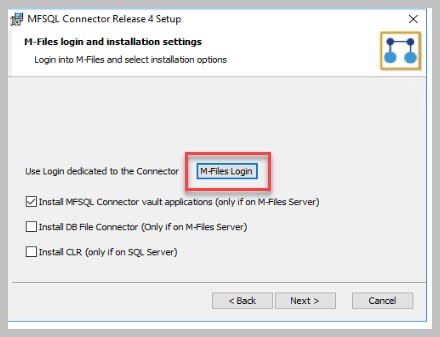
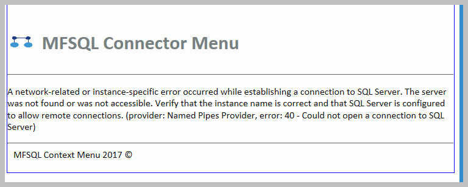

Common installation errors and resolutions
==========================================

The following errors or issues may be experienced during the installation process

VaultConnectionTest fails
~~~~~~~~~~~~~~~~~~~~~~~~~

Unable to make a connection with error: Could not find procedure ‘dbo.spMFDecrypt’

|image1|

This error arise when a upgrade or installation could not find the M-Files installation version or the procedure spMFUpdateAssemblies was executed without specifying the parameter but could not find the assembly folders.

|image2|

The error will happen when the CLR procedures are missing. Inspecting the listing of procedures in SSMS explorer will show that the CLR procedures are missing.
Listing with CLR procedures.  The CLR procedures have a ‘lock’ icon as shown below.

|image4|

Listing where CLR procedures are missing

|image3|

Run the procedure spMFUpdateAssemblies with the parameter specifying the correct M-Files version

|image5|

The results should not show any errors.  If it still showing an error then refer to the section on trapping connection errors.

Unable to log into M-Files
~~~~~~~~~~~~~~~~~~~~~~~~~~

Probable causes:

- Corrupt / old connection remnant on server
- Unable to connect to M-Files using the login credentials

Solution:

 - Check the error log (see screenshot)
 - Delete content of the c:\_\users\_[loginuser]\_\AppData\_\MFSQL Vault Install folder
 - Alternatively one can delete the VaultSettings.xml file in the this folder
 - check the settings to log into the correct M-Files Server

|img1|

Example of error

|img2|

Watch the video

.. raw:: html

    <iframe width="560" height="315" src="https://www.youtube.com/embed/WVsB6MQ6cgg" frameborder="0" allow="accelerometer; autoplay; encrypted-media; gyroscope; picture-in-picture" allowfullscreen></iframe>

Unable to connect to vault
~~~~~~~~~~~~~~~~~~~~~~~~~~

Probable causes:

 - The settings for connecting to the vault is incorrect or could not be installed
 - The server security settings does not allow powershell scripts
 - The M-Files password changed

Solution:

 - Update settings using spMFSettingsForVaultUpdate

|img3|

Exec spMFSyncronizeMetadata produces an error / email
~~~~~~~~~~~~~~~~~~~~~~~~~~~~~~~~~~~~~~~~~~~~~~~~~~~~~

Probable causes:

- The licensing is not valid / or has not been activated

Solution:

- Install the license for MFSQL Connector and log into the vault using a desktop client

|img4|

Network connection error on login to the vault for the first time
~~~~~~~~~~~~~~~~~~~~~~~~~~~~~~~~~~~~~~~~~~~~~~~~~~~~~~~~~~~~~~~~~

Probable causes:

 - The connection string is invalid
 - The SQL licensing has not taken place and the connector will not operate.

Solution:

 - search for 'connectionstring' in the vault and update the connection string.
 - Log out of vault
 - Uninstall the MFSQL Connector vault application in M-Files, reinstall, and relicense
 - Log back into vault

|img5|

MFSQL Connector context menu error
~~~~~~~~~~~~~~~~~~~~~~~~~~~~~~~~~~

Probable causes:

- The connection string is invalid

Solution:

 - search for 'connectionstring' in the vault and update the connection string
 - log out and log back into vault.

|img6|

EmailProfile Error
~~~~~~~~~~~~~~~~~~

Probable causes:

- When procedures are executed  with an error the message appears
- Note that this error also indicates that there was an error

Solution:

 - Install Database Mail and set the profile name to 'MailProfile'
 - Check MFLog table for error messages

|img7|

MFLog shows error for invalid license
~~~~~~~~~~~~~~~~~~~~~~~~~~~~~~~~~~~~~

Probable causes:

 - Indicates the license has an issue

Solution:

 - Check that license has been added to the vault application
 - Check Configurations / other applications / MFSQL Connector VaultApp Dashboard to see if it loading properly.  If it iscorrect, then uninstall and manually re-install the vault application from the installation files.

.. |image1| image:: 2021-03-04_03-58-59.png
.. |image2| image:: 2021-03-04_04-00-31.png

.. |image4| image:: 2021-03-04_04-02-31.png
.. |image5| image:: 2021-03-04_04-04-10.png

.. |img4| image:: img_7.jpg
.. |img5| image:: img_8.jpg

.. |img7| image:: img_10.jpg
