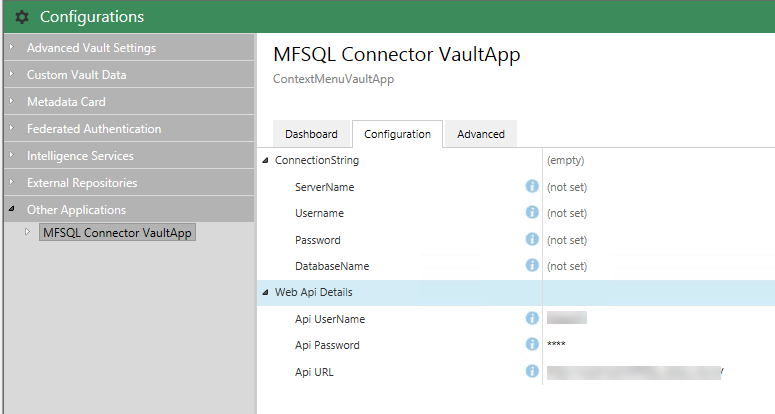

======================
Installing the Web API
======================

Purpose
-------

The purpose of the Web API is to provide an alternative method of connecting M-Files with the SQL Server. On premise installation is likely to use an ODBC connection to allow a user to trigger context menu actions in M-Files for processing on the SQL Server. However M-Files Cloud deployments and other scenarios where the M-Files Server is not in the same network as SQL Server can use secure https web services calls to trigger the same operations on the remote SQL server.

The transaction calls from M-Files to SQL does not include any metadata. It only instructs SQL to perform a store procedure which will in turn use standard M-Files connections protocols to exchange the metadata between M-Files and SQL.

This method is dependent on installing MFSQL Connector version 4.8.22.62 or later in the MFSQL Server.  The Vault Application should be 4.8.0.0 or later.

This section describes the installation of the Web API.

Architecture
------------

When a context menu call is made through the MFSQLConnectorVaultApp application, it will check to see if the API url is blank. If it is not blank, it will use the url to pass through the specific call using an encryted message string to the designated website. The website will convert the call and pass it through the database connection string to the SQL server and MFSQL Connector database. The calls that can be made using this method are restricted to the pre-designed context menu calls which includes:

-  Menu action to call a store procedure or another web link
-  Menu action for a specific object to pass through the context of the object and call a store procedure
-  Workflow action to pass through the context of the object and call a store procedure
-  Event handler action to pass through the context of the object and call a store procedure.

The Web API requires a IIS 7 or later Web Server to be installed on.  This Web Server must have ODBC access to the SQL Server where MFSQL Connector is installed.

Configurator
------------

The API Url tag in the MFSQL Connector database configuration determines if the Web API method or the ODBC method is being used. If the API Url is empty, then the ODBC method will be used, else it will use the Url to establish a connection to the SQL Server. When the url is used the ODBC configuration can be omitted.

The following image show an example of the configuration

|Image1|

When the url is correct and is pointing to a valid website which can access the database the configurator will show the database setup details

|Image2|

Website
-------

The website to receive web services calls from M-Files, is provided as a separate installation package available on request to support@lamininsolutions.com. Note that each website is configured for a specific MFSQL Connector database and a separate instance must be installed in IIS for each vault to be connected to the specific vault MFSQL Database.

Install the package on the Web Server.
Simply copy to website and deploy it as in a IIS web server.

Location of the website source
|Image4|

Validate the database connection in the website to point to the MFSQL Connector database. Note that the installation package will automatically configure the website connection string for the database. 

Example of the database connection 
|Image5|

Each vault will require a separate website. 

The website can be configued to use a SSL certificate and can be deployed as a separate applicastion within the default website or a separate website. Update the DNS and ports to allow the url to be accessible from the M-Files Server.

Testing the website
-------------------

The website is not intended to have a user interface. Postman can be used to validate calls to the website. The website installation should be completed before postman is used to check the url.

Open postman and configure a login to the website.
-  the url for the login consist of http:// (or https:// depending on the SSL setup of the website) + the fully qualified website url + /api/Account/UserLogin
-  add the username and password as per the illustration below as Json in the Body section.  The actual username and password is blurred in the picture. Kindly contact us for this detail to allow you to complete the test.
-  on success the Status will show as 200 OK
-  in the Body tab of the result the internally generated authentication code will show. 

|Image8|
This test is sufficient to show that the url is correctly configured to access the website.

|Image9|

Context Menu configuration
--------------------------

There is no need for any additional configuration for the context menu actions to use the Web API. On adding the API Url the vault application will switch from using the ODBC connection to the Web services.

.. |image2| image:: img_2.png
.. |image3| image:: img_3.png
.. |image4| image:: img_4.png
.. |image5| image:: img_5.png
.. |image6| image:: img_6.png
.. |image7| image:: img_7.png
.. |image8| image:: img_8.png

