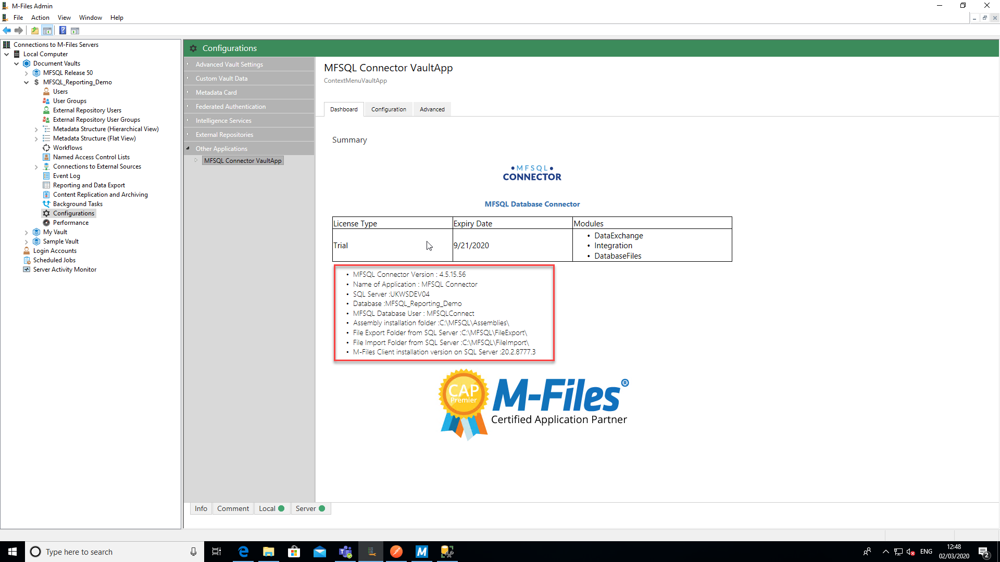
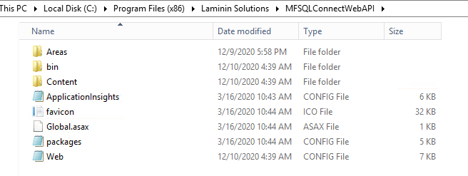
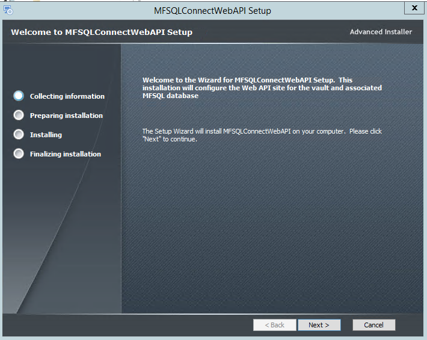
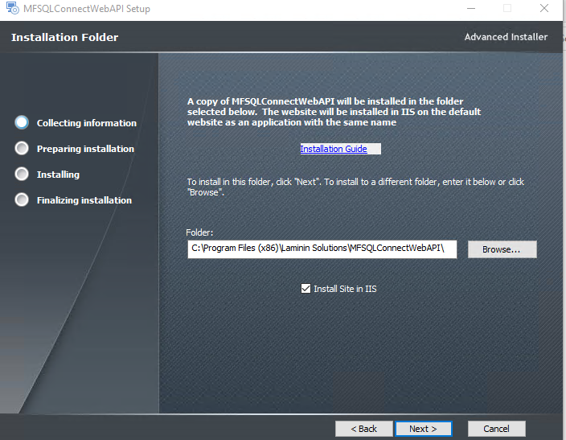
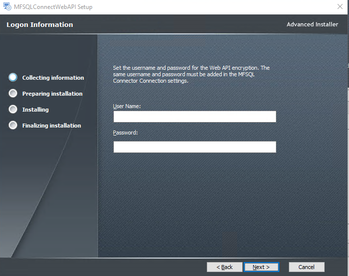
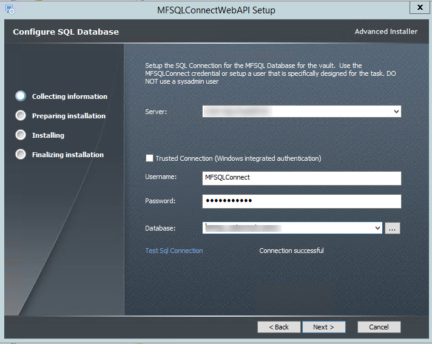
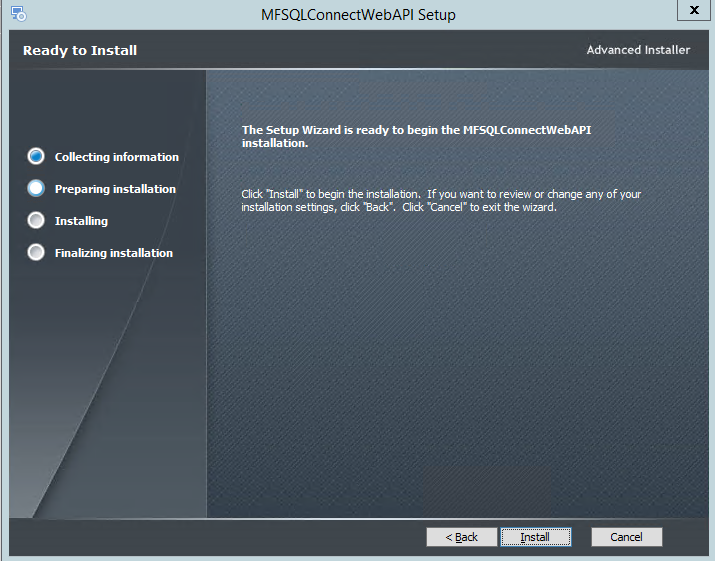
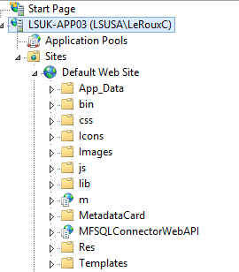
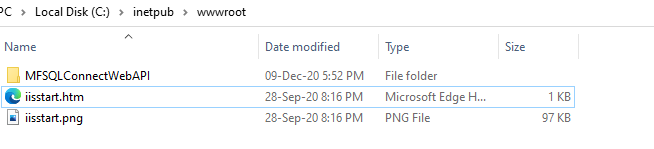
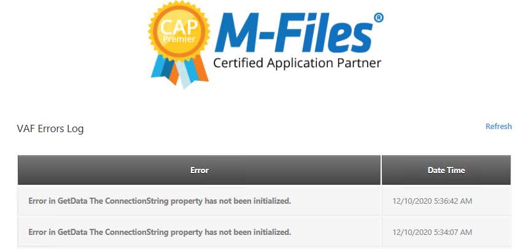

======================
Installing the Web API
======================

Purpose
-------

The purpose of the Web API is to provide an alternative method of connecting M-Files with the SQL Server. On premise installation is likely to use an ODBC connection to allow a user to trigger context menu actions in M-Files for processing on the SQL Server. However M-Files Cloud deployments and other scenarios where the M-Files Server is not in the same network as SQL Server can use secure https web services calls to trigger the same operations on the remote SQL server.

The transaction calls from M-Files to SQL does not include any metadata. It only instructs SQL to perform a store procedure which will in turn use standard M-Files connections protocols to exchange the metadata between M-Files and SQL.

This method is dependent on installing MFSQL Connector version 4.8.22.62 or later in the MFSQL Server.  The Vault Application should be 4.8.1.0 or later.

This section describes the installation of the Web API.

Architecture
------------

When a context menu call is made through the MFSQLConnectorVaultApp application, it will check to see if the API url in the Configurations/Configuration/Web API Details is blank. If it is not blank, it will use the url to pass through the specific call using an encryted message string to the designated website. The website will convert the call and pass it through the database connection string to the SQL server and MFSQL Connector database. The calls that can be made using this method are restricted to the pre-designed context menu calls which includes:

-  Menu action to call a store procedure or another web link
-  Menu action for a specific object to pass through the context of the object and call a store procedure
-  Workflow action to pass through the context of the object and call a store procedure
-  Event handler action to pass through the context of the object and call a store procedure.

The Web API requires a web server with IIS 7 or later.  This Web Server must have ODBC access to the SQL Server where MFSQL Connector is installed.

In summary the steps for installation are:
#. Install the website for the MFSQL Web Api
#. Configure M-Files in Configurations
#. Setup or modify MFContextMenu
#. Test using M-Files desktop

Website
-------

The MFSQL WEB API website for the web services calls from M-Files, is provided as a separate installation package available on request to support@lamininsolutions.com. Note that each website is configured for a specific MFSQL Connector database and a separate instance must be installed in IIS for each vault to be connected to the specific vault MFSQL Database.

The site files for the Web API is also provided in the installation folder to allow for manual setup of the API and deployment of multiple vault connections to Connector databases.

Install the package **MFSQLConnectorWebAPI** on the Web Server. The installation package will run through a number of important steps

Execute the package
|Image10|

The copy of the site will be on the installation folder selected in the step.  To prevent to default installation of the site in IIS, uncheck the selection box.
|Image11|

The user name and password for the authentication between M-Files and the Web API is entered in the next step.  Note that the same user name and password will also be entered into the M-Files Configuration
|Image12|

In the next step the connection from the Web Server is validated. The credentials in this section is the MFSQL Connector database access credentials. The Connector installation create a user with all the required authentication by default. We recommend using MFSQLConnect user. If the password in SQL is changed for this user, then it must also be changed in the Web API.
|Image13|

The next step is to complete the installation in IIS as a web application in the default web site.  The installation will not work if there are no default web site already available in IIS. Any other web deployment scenarios can be achieved by performing a manual install.
The default application pool will be selected if it is available.

|Image14|

The naming of the site is predetermined as MFSQLConnectWebAPI.  Naming can be changed, as long as the same name is used in the other parts of the configuration.

|Image16|

The site files will be installed in the IISRoot folder.

|Image17|

The website can be configured to use a SSL certificate and can be deployed as a separate application within the default website or a separate website. Update the DNS and ports to allow the url to be accessible from the M-Files Server.

Manual install
--------------

You may prefer to install the Web API in your webserver.  This may also be required when multiple vaults need to be connected to multiple MFSQL databases.  The native installation files is installed in the installation folder. By unchecking the IIS installation box during the installation process, IIS will not skipped in your Web Server technician can perform a manual Installation

The website files for manual installation is available in the installation folder.

|Image4|

The following elements must be modified in the web.config file to allow the API to connect with a specific vault and database.

..code-block:: xml_document

      <connectionStrings>
      <add name="Constr" connectionString="Data Source=AMRUTAVPC;Initial Catalog=MFSQLRelease56;Persist Security Info=True;User ID=MFSQLConnect;Password=Connector01" providerName="System.Data.SqlClient" />
      </connectionStrings>
      <appSettings>
      <add key="Username" value="Laminin" />
      <add key="Password" value="Solution" />
      </appSettings>

The connection string must point to the Connector database for the vault.  The default user name and password for accessing the Connector should be used.  If a different user and or password is used, then this entry must be adapted to respond to a change in settings in SQL.
The connectionstring Username and password should exist in the MFSQL Connector database.  By default the ''MFSQLConnect'' SQL Authentication user is installed during the installation of the Connector.  Reference :doc:`/the-connector-framework/security/index` for more detail.

The ''appSettings'' username and password is used to encrypt the web connection between M-Files and the Web Server.  The same username and password must be used in the configuration of M-Files.

Removing or reinstalling the packages
-------------------------------------

Before re-installing it is recommended to delete the Website ''MFSQLConnectWebAPI'' in IIS and delete the folder with the same name in IISRoot folder.

Configuration of M-files
------------------------

Use M-Files admin and the ''Configurations'' tab complete the installation in M-Files.

The Web API details in the configuration tab of the MFSQL Connector Vault Application must be completed.
|Image1|

There is no need to complete any details in the connectionstring.
The API username and password must match the details used in the Web Site.
The API URL section is only visible to M-Files System Administrator.  In the case of a cloud vault, this will be completed by M-Files Support.

Validate the database connection in the website is point to the MFSQL Connector database when the correct details are returned to the dashboard
|Image2|

Right click and Configurations in the Vault Setup and select refresh to up the Configurator after a change has been made to activate the new details.

Testing
-------

The best test to validate that the Web API is executing a call from M-Files to the Connector is to activate an action in the context menu.

Follow the :doc:`/getting-started/first-time-installation/installing-the-context-menu/index` instruction to prepare an action to execute.

The table :doc:`/tables/tbMFContextMenu` will show the date and time when the action was received and executed from M-Files.

Error trapping
--------------

When the settings details are not shown, an error will be displayed in the configurator error log.  The most likely error is an error in the connection string.
|Image18|

.. |image1| image:: img_1.png

.. |image7| image:: img_7.png
.. |image8| image:: img_8.png
.. |image9| image:: img_9.png

