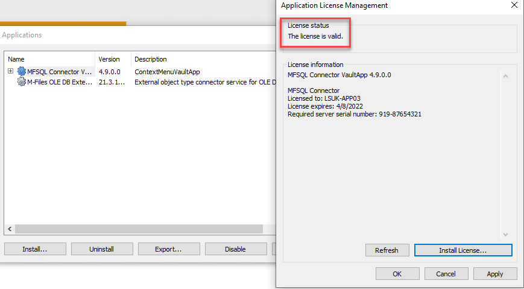
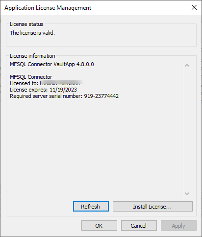
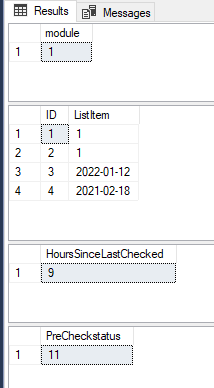
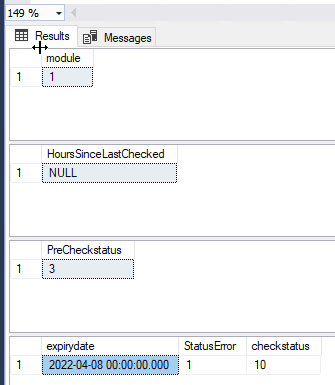
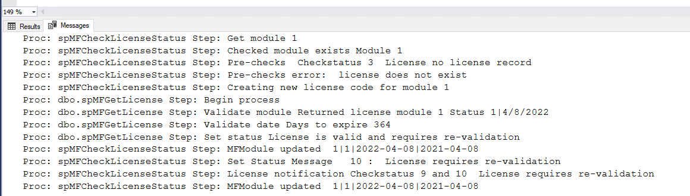

Licensing Management
====================

License management use M-Files licensing method for vault applications. A separate license file
(.lic file) is issued for a specific type of license.

Application licenses
--------------------

Separate license files are required for:

- MFSQL Connector VaultApp: MFSQL Connector (Data Exchange and Integration)
- SQLDatabaseConnector: MFSQL Database File Connector

License types
-------------

- Trial license:
   - 30 days only.
   - Expires on license end date.
- Subscription:
   - 1 year maximum.
   - Expires on license end date.
   - License is issued for a specific M-Files license.
   - License is issued for specific modules and is subject to the order of the license.
   - Only valid with designated M-Files server.
   - Separate license files are issued for Database File Connector and MFSQL Connector
- NFR license:
   Issued in terms of reseller agreement.

Installing the license
----------------------

The license file is installed using M-Files Admin.  Using the Applications window in M-Files Admin for the target vault, select the appropriate application for the license to be installed.
|Image0|

Click on License and browse to the license file.  Validate the license details and accept.
|Image1|

Expiry notification
-------------------

Release 4.4.13.53 introduced a email notification when the license expires within 30 days. The notification relies on the database mail setup for error management.

.. warning::

   The will expiry on the license end date.  Renew the license before the expiry date.

Check license validity
----------------------

If the license is invalid, it will show the reasons on the license record.
|Image5|

To troubleshoot a license issue, start with manually checking the license validity with :doc:`/procedures/spMFCheckLicenseStatus`

.. code:: sql

    EXEC dbo.spMFCheckLicenseStatus
    @Debug = 1

The result should look similar to the image below. If not, then email your result to support@lamininsolutions.com
|Image2|

Update expired or due to expire license
---------------------------------------

Contact us if the license is due to expire before the due date to prevent an outage of service.  On receipt, apply the new license using M-Files Admin and the Applications window.
|Image3|

The license must be applied to each vault with a MFSQL Connector connection.

Check the configurator to validate that the license has been pulled through.  If not, restart the vault.
|Image4|

Finally, check in SQL if the license is validated with :doc:`/procedures/spMFConnectionTest`

Licensing trouble shooting
--------------------------

If the license is not validated then follow the next steps to identify a potential cause:

Check your email for any errors reporting. If you do not have DatabaseMail setup, then check the error log for more information on the error.
|Image6|

.. code:: sql

    SELECT TOP 5 ErrorMessage, CreateDate FROM MFlog ORDER BY logid desc

Run the license check with parameter to reset the license and show debug.

.. code:: sql

    EXEC dbo.spMFCheckLicenseStatus
    @IsLicenseUpdate = 1,
    @debug = 1

Check both the results and messages tabs in SSMS for further information

If the expiry date is not filled in, or is incorrect then report it to support.
|Image7|

Check the messages for any obvious reasons that can be fixed.
|Image8|

Send screenshots of the result to support if still not resolved.

.. |image3| image:: img_3.png
.. |image4| image:: img_4.png
.. |image5| image:: img_5.png
.. |image6| image:: img_6.png

