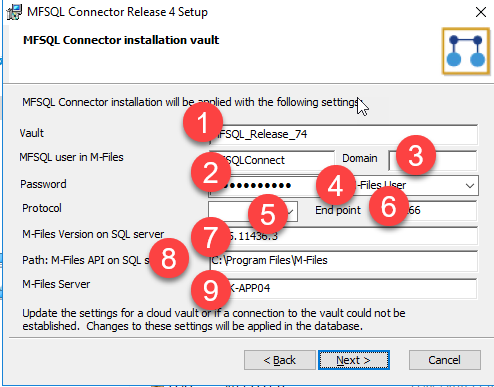

Manual installation using scripts
=================================

In special use cases in may be required to install or upgrade MFSQL Connector manually.

Manual installation may be necessary in the following scenarios:
  -  The installation is targeted for a M-Files Cloud installation
  -  Security policy on the SQL Server prevents Powershell scripts from running on the server.
  -  Security policy on the SQL Server prevents the MFSQL Connector package to run on the server.
  -  The scripts to be installed on the SQL Server must be separately validated by a DBA and executed independently from the package installation.

The following steps must be completed for each vault. The details of each step follows below:
  #. Run the installation package for the latest version on a workstation.
  #. Install the VAF (vault applications) and configurations on the M-Files server
  #. Install the scripts on the SQL server
  #. Run the startup procedures on the SQL Server

Install package on workstation
------------------------------

      -  The installation package of the Connector allows for creating the installation package on a workstation and then to use the components of the installation package ready to be copied to the servers.
      -  M-Files Desktop must be installed on the workstation prior to commencing with the package installation.
      -  Ensure that M-Files Desktop is also installed on the SQL Server and make a note of the version number.
      -  Download the latest package from the Website.  The latest published release is available from the `Laminin Solutions website <https://lamininsolutions.com/download-mfsql-connector/>`_
      -  The installation will not perform any operations on the M-Files Server or SQL Server.
      -  The installation files will be place in the installation folders on the workstation

        -  C:\\Program Files (x86)\\Laminin Solutions\\MFSQL Connector Release 4\\[Database Name]
        -  C:\\MFSQL\\Assemblies

      -  Run the installation on the workstation with the selections outlined below.

The installation folder selected in step 1 below will include the files for the manual installations

|image1|

Select options 1 and 2 below for all workstation installations irrespective of installing on premise or in the cloud.

|image2|

Complete the vault connection setup for the steps below:
  #. Vault name as per the M-Files Admin module
  #. The name of the dedicated user for MFSQL Connector operations in the vault. Fill in the Domain if a windows user applies.
  #. Select the protocol and add the port for the vault.
  #. Enter the M-Files version number on the SQL Server, for example 21.9.10629.5 The version is available by hovering over the M-Files logo on the server.  Take care not to confuse the workstation version and the SQL server version.
  #. Enter the path of the installation of M-Files on the SQL server
  #. Enter the DNS address for the M-Files Server.

|image3|

The following image illustrated a completed form for a cloud Vault

|image4|

In the next window the credentials for the MFSQL Connector SQL Server and database are entered.
  #. Enter the name of the SQL server.  Add the instance and port if applicable
  #. It is not required to enter any credentials.  No attempt will be made to access the server.
  #. Enter the existing MFSQL Connector database, or a new name if it does not yet exist.

Note that the database will not be created at this stage and the information is not validated.  When incorrect information is provided then the installation must be re-run for the correct information.

|image5|

Select install to complete the generation of the installation files.

|image6|

Relevant Installation Files
---------------------------

Copy the related installation files to the server.  The files in the following folders must be copied to the SQL server
        -  All Assemblies in the folder C:\\MFSQL\\Assemblies on the workstation must be copied to C:\\MFSQL\\Assemblies on the SQL Server
        -  The assemblies should be copied for each upgrade as they may have changed. It is possible to check on the file version of the assemblies to determine if the file have changed.

|image9|

Copy the following folders to the M-Files server.  This is only necessary if MFSQL Connector on the M-Files server is a new install or an upgrade where the VAF version changed.
        -  C:\\Program Files (x86)\\Laminin Solutions\\MFSQL Connector Release 4\\[Database Name]\\Content Package
        -  C:\\Program Files (x86)\\Laminin Solutions\\MFSQL Connector Release 4\\[Database Name]\\Vault Applications\\MFSQL_VAF

|image10|

Manual install MFSQL Connector on the M-Files Server
----------------------------------------------------

The installation on the M-Files Server must always take place in advance of the SQL server when a new installation is performed. In the case of an upgrade, the installation on the M-Files server can be skipped, unless a change in the vault application was made. The version of the vault application is evident indicted in a change of the VAF version or from the :doc:`/version-control/index` page

In a case of a M-Files Cloud installation, the installation must be performed by M-Files Support. Contact us for details of the ticket reference to quote for M-Files Support.

First time installation:
    - Install the content package from C:\\Program Files (x86)\\Laminin Solutions\\MFSQL Connector Release 4\\[Database Name]\\Content Package using the M-Files Admin one time import in Content Replication and Archiving.
    - Install the VAF from C:\\Program Files (x86)\\Laminin Solutions\\MFSQL Connector Release 4\\[Database Name]\\Vault Applications\\MFSQL_VAF
    - Configure the context menu functionality as outlined in :doc:`/getting-started/first-time-installation/installing-the-context-menu/index` , if required
    - Obtain a license from us and install the license.

Upgrade:
   -  The VAF can be installed directly into the vault using the Applications window from the folder C:\\Program Files (x86)\\Laminin Solutions\\MFSQL Connector Release 4\\[Database Name]\\Vault Applications\\MFSQL_VAF

Manual install MFSQL Connector on the SQL Server
-------------------------------------------------

Before commencing, ensure that the latest Assemblies have been copied to the server, and that M-Files Desktop is installed on the server.

Using SSMS from the workstation (or directly on the server), open the following scripts from the folder C:\\Program Files (x86)\\Laminin Solutions\\MFSQL Connector Release 4\\[Database Name]\\Database scripts\\[latest version]\\
    - 10_Setup-[version].sql
    - 20_CLR-[version].sql
    - 30_Data_Exchange-[version].sql
    - 35_Intergation-[version].sql

Execute the 4 scripts in sequence. Each script will show a listing of routines in the message tab.  Note the following:
   -  On a new installation, the database will automatically be created.
   -  Do NOT use the same scripts for multiple MFSQL Connector databases.  The name of the database is imbedded in each script. New scripts must be created for each MFSQL Connector database.
   -  The messages may show 'missing objects'. This is only a warning and can be ignored.

   |image7|

   -  If the execution result shows a failure, scroll down to the section shown in red, make a screenshot and report it to support@lamininsolutions.com.  Stop processing of the remainder of the scripts.

On completion of the 4 scripts, execute the following additional procedures in sequence.
   - To install the assemblies

     If the installation of the assemblies failed, then validate that the following is correct:
       - the correct M-Files Version on the SQL server was used (select * from MFSettings to validate)
       - the Assemblies was copied to the correct path as specified above
       - M-Files desktop was installed to the folder specified in the package creation.

      If any of these settings is incorrect then the package must be re-generated and the entire process must be repeated.

      .. code:: sql

           EXEC spmfupdateassemblies

   - Encrypt the password

     Use the password for the M-Files user dedicated for MFSQL Connector

      .. code:: sql

          EXEC dbo.spMFSettingsForVaultUpdate
          @Password = 'the password of the M-Files user'

   - Validate that the installation is successful

     This procedure will check that license is valid and connection to M-Files can be established. This concludes the manual installation.

      .. code:: sql

          EXEC spmfvaultconnectionTest

      The expected outcome
      
      |image8|

.. |image2| image:: Image2.png

.. |image4| image:: Image4.png

