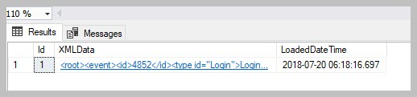

View Files downloaded using the event log
=========================================

This particular use case was focussed on creating a report on when files
where downloaded from M-Files and by whom.

Several MFSQL Connector tables and procedures will come into play:

-  MFEventLog\_OpenXML

-  MFilesEvents

-  spMFGetMfilesLog

The helper example **17.101.Export and use M-Files event log.sql**
available in the installation folder is used as a starting point.

--------------

Step 1.

Get the event log from M-Files. This procedure will download the current
event log into SQL in XML format. Set the @ISClearMFilesLog flag to 1
when the procedure is ready to run in unattended mode and it is included
in an SQL agent job.

.. code:: sql

    EXEC [dbo].[spMFGetMfilesLog] @IsClearMfilesLog = 0, -- bit  select 1 to delete the log in M-Files
                                  @Debug = 0            -- small

The raw XML export result is in MFEventlog\_OpenXML. It is likely that
your SSMS browser will complain when you try to view it. It is also not
very useful to view in this format.

|image0|

Rather use the table MFilesEvents. This table is automatically updated
when spMFGetMfilesLog is executed. The table show a listing of each
event, with the event detail as an XML file in the Events column.

|image1|

All the downloaded files can be isolate by selecting only events where
type is ‘File downloaded’

.. code:: sql

    SELECT * FROM [dbo].[MFilesEvents] AS [mfe] WHERE [type] = 'File downloaded'

An example of a XML record for a file download event is below. the XML
record will be different for each type of event.

.. code:: xml

    <event>
      <id>4314</id>
      <type id="FileAccessed">File downloaded</type>
      <category id="1">FileAccess</category>
      <timestamp>2018-01-27 06:01:59.778000000</timestamp>
      <causedbyuser loginaccount="Admin" />
      <data>
        <objectversion>
          <objver>
            <objtype id="0">Document</objtype>
            <objid>477</objid>
            <version>3</version>
          </objver>
          <extid extidstatus="Internal">477</extid>
          <objectguid>{3FAD8281-5A22-42E6-8438-54997C5B0233}</objectguid>
          <versionguid>{B3C69255-9567-430D-821B-A31DBC4FCFDE}</versionguid>
          <objectflags value="64">
            <objectflag id="64">normal</objectflag>
          </objectflags>
          <originalobjid>
            <vault>{C840BE1A-5B47-4AC0-8EF7-835C166C8E24}</vault>
            <objtype>0</objtype>
            <id>477</id>
          </originalobjid>
          <title>Reseller Agreement - DAT Sports &amp; Entertainment (11/2000)</title>
          <displayid>477</displayid>
        </objectversion>
        <filename>Reseller Agreement - DAT Sports &amp; Entertainment (11_2000).pdf</filename>
      </data>
    </event>

Extracting the XML values into a temporary table and join it with other
tables to prepare the reporting data to show when the user has
downloaded the file. The XML part of the statement will different,
depending on the type of event.

.. code:: sql

    SELECT [me].[ID],
           [me].[Category],
           [me].[Type],
           [me].[CausedByUser],
           [ml].[FullName],
           [ml].[EmailAddress],
           [me].[TimeStamp],
           [me].[Events].[value]('(/event/data/objectversion/title)[1]', 'varchar(100)') AS [NameOrTitle],
           [me].[Events].[value]('(/event/data/filename)[1]', 'varchar(100)') AS [FileName],
           [me].[Events].[value]('(/event/data/objectversion/objver/objtype/@id)[1]', 'varchar(100)') AS [ObjectType_ID],
           [me].[Events].[value]('(/event/data/objectversion/objver/objtype)[1]', 'varchar(100)') AS [ObjectType],
           [me].[Events].[value]('(/event/data/objectversion/objver/objid)[1]', 'varchar(100)') AS [Objid]
    FROM [dbo].[MFilesEvents] [me]
        LEFT JOIN [dbo].[MFLoginAccount] AS [ml]
            ON [ml].[AccountName] = [me].[CausedByUser]
        LEFT JOIN [dbo].[MFUserAccount] AS [mua]
            ON [ml].[MFID] = [mua].[UserID]
    WHERE [me].[Category] IN ( 'FileAccess', 'PublicLink' )
    ORDER BY [me].[TimeStamp] DESC

Various categories and types apply to file download operations. Include
these in the filter of the statement.

+----------------------------------+------------------+
|Type                              |Category          |
+==================================+==================+
|Public link created               |PublicLink        |
|Public link accessed              |PublicLink        |
|File downloaded via public link   |FileAccess        |
|File downloaded                   |FileAccess        |
+----------------------------------+------------------+

Example of extract based on the statement above

|image2|

|image3|

.. |image1| image:: img_2.jpg

