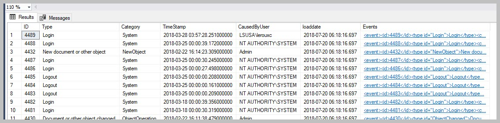

M-Files event log
=================

.. toctree::
   :maxdepth: 4

The Connector includes the ability to export the event log from
M-Files. 

The following MFSQL Connector tables and procedures are used:
  -  :doc:`/procedures/spMFGetMfilesLog` procedure fetches the events from M-Files
  -  :doc:`/tables/MFEventLog_OpenXML` table contains the downloaded event log in XML format
  -  :doc:`/tables/MFilesEvents` table contains details of all the events that have previously been downloaded

The events are analysed using SQL queries for the specific types of
events.

Export the event log
--------------------

Use :doc:`/procedures/spMFGetMfilesLog` procedure to export the events
to :doc:`/tables/MFEventLog_OpenXML` as an XML and insert new event rows in :doc:`/tables/MFilesEvents`

For example:

.. code:: sql

    EXEC [dbo].[spMFGetMfilesLog] @IsClearMfilesLog = 0

Set the @ISClearMFilesLog flag to 1 to delete the events from M-Files.

Update the events regularly using an agent job or powershell utility in the case of SQL express.

The raw XML export result is in MFEventlog\_OpenXML. It is likely that
your SSMS browser will complain when you try to view it. It is also not
very useful to view in this format.

|image0|

The :doc:`/tables/MFilesEvents` table shows a listing of each event, with the event detail as an XML file in the Events column.

|image1|

Review the result
-----------------

Get a listing of the exported events from :doc:`/tables/MFilesEvents`.

.. code:: sql

    SELECT * FROM [dbo].[MFilesEvents] AS [mfe];

Get a summary of all the categories of events

.. code:: sql

    SELECT Category FROM [dbo].[MFilesEvents] AS [mfe]
    Group by Category;

Analyse the events using XML queries
------------------------------------

.. code:: xml

    <event>
      <id>4314</id>
      <type id="FileAccessed">File downloaded</type>
      <category id="1">FileAccess</category>
      <timestamp>2018-01-27 06:01:59.778000000</timestamp>
      <causedbyuser loginaccount="Admin" />
      <data>
        <objectversion>
          <objver>
            <objtype id="0">Document</objtype>
            <objid>477</objid>
            <version>3</version>
          </objver>
          <extid extidstatus="Internal">477</extid>
          <objectguid>{3FAD8281-5A22-42E6-8438-54997C5B0233}</objectguid>
          <versionguid>{B3C69255-9567-430D-821B-A31DBC4FCFDE}</versionguid>
          <objectflags value="64">
            <objectflag id="64">normal</objectflag>
          </objectflags>
          <originalobjid>
            <vault>{C840BE1A-5B47-4AC0-8EF7-835C166C8E24}</vault>
            <objtype>0</objtype>
            <id>477</id>
          </originalobjid>
          <title>Reseller Agreement - DAT Sports &amp; Entertainment (11/2000)</title>
          <displayid>477</displayid>
        </objectversion>
        <filename>Reseller Agreement - DAT Sports &amp; Entertainment (11_2000).pdf</filename>
      </data>
    </event>

Following are sample queries for different types of extracts from the event log.

Combine event data with other tables
~~~~~~~~~~~~~~~~~~~~~~~~~~~~~~~~~~~~

Extracting the XML values into a temporary table and join it with other
tables to prepare the reporting data to show when the user has
downloaded the file. The XML part of the statement will be different,
depending on the type of event.

.. code:: sql

    SELECT [me].[ID],
           [me].[Category],
           [me].[Type],
           [me].[CausedByUser],
           [ml].[FullName],
           [ml].[EmailAddress],
           [me].[TimeStamp],
           [me].[Events].[value]('(/event/data/objectversion/title)[1]', 'varchar(100)') AS [NameOrTitle],
           [me].[Events].[value]('(/event/data/filename)[1]', 'varchar(100)') AS [FileName],
           [me].[Events].[value]('(/event/data/objectversion/objver/objtype/@id)[1]', 'varchar(100)') AS [ObjectType_ID],
           [me].[Events].[value]('(/event/data/objectversion/objver/objtype)[1]', 'varchar(100)') AS [ObjectType],
           [me].[Events].[value]('(/event/data/objectversion/objver/objid)[1]', 'varchar(100)') AS [Objid]
    FROM [dbo].[MFilesEvents] [me]
        LEFT JOIN [dbo].[MFLoginAccount] AS [ml]
            ON [ml].[AccountName] = [me].[CausedByUser]
        LEFT JOIN [dbo].[MFUserAccount] AS [mua]
            ON [ml].[MFID] = [mua].[UserID]
    WHERE [me].[Category] IN ( 'FileAccess', 'PublicLink' )
    ORDER BY [me].[TimeStamp] DESC

Example of extract based on the statement above

|image2|

Objects that is not system objects
~~~~~~~~~~~~~~~~~~~~~~~~~~~~~~~~~~

.. code:: sql

    SELECT [me].[ID]
      ,[me].[Category]
      ,[me].[CausedByUser]
      ,[me].[TimeStamp]
      ,[me].[Events].[value]('(/event/data/objectversion/title)[1]', 'varchar(100)')              AS [NameOrTitle]
      ,[me].[Events].[value]('(/event/data/objectversion/objver/objtype/@id)[1]', 'varchar(100)') AS [ObjectType_ID]
      ,[me].[Events].[value]('(/event/data/objectversion/objver/objtype)[1]', 'varchar(100)')     AS [ObjectType]
      ,[me].[Events].[value]('(/event/data/objectversion/objver/objid)[1]', 'varchar(100)')       AS [Objid]
    FROM [dbo].[MFilesEvents] [me]
    WHERE [me].[Category] <> 'System';

Show files downloaded
~~~~~~~~~~~~~~~~~~~~~

.. code:: sql

    SELECT [me].[ID]
      ,[me].[Category]
      ,[me].[CausedByUser]
      ,[me].[TimeStamp]
      ,[me].[Events].[value]('(/event/data/objectversion/title)[1]', 'varchar(100)')              AS [NameOrTitle]
      ,[me].[Events].[value]('(/event/data/filename)[1]', 'varchar(100)')                         AS [FileName]
      ,[me].[Events].[value]('(/event/data/objectversion/objver/objtype/@id)[1]', 'varchar(100)') AS [ObjectType_ID]
      ,[me].[Events].[value]('(/event/data/objectversion/objver/objtype)[1]', 'varchar(100)')     AS [ObjectType]
      ,[me].[Events].[value]('(/event/data/objectversion/objver/objid)[1]', 'varchar(100)')       AS [Objid]
    FROM [dbo].[MFilesEvents] [me]
    WHERE [me].[Category] = 'FileAccess';

Show public files downloaded
~~~~~~~~~~~~~~~~~~~~~~~~~~~~

.. code:: sql

    SELECT [me].[ID]
      ,[me].[TimeStamp]   AS [Timestamp]
      ,[me].[Events].[value]('(/event/data/objectversion/title)[1]', 'varchar(100)')          AS [NameOrTitle]
      ,[me].[Events].[value]('(/event/data/filename)[1]', 'varchar(100)')                     AS [FileName]
      ,[me].[Events].[value]('(/event/data/ipaddress)[1]', 'varchar(100)')                    AS [IPAddress]
      ,[me].[Events].[value]('(/event/data/objectversion/objver/objtype)[1]', 'varchar(100)') AS [ObjectType]
      ,[me].[Events].[value]('(/event/data/objectversion/objver/objid)[1]', 'varchar(100)')   AS [Objid]
      ,[me].[Events].[value]('(/event/data/objectversion/objver/version)[1]', 'varchar(100)') AS [Version]
      ,[me].[Events]
    FROM [dbo].[MFilesEvents] [me]
    WHERE [me].[Type] = 'File downloaded via public link';

Performance of a process
~~~~~~~~~~~~~~~~~~~~~~~~

.. code:: sql

     WITH [cte]
     AS (SELECT [me].[ID]
          ,[me].[TimeStamp]
          ,[me].[Events].[value]('(/event/data/objectversion/title)[1]', 'varchar(100)')          AS [NameOrTitle]
          ,[me].[Events].[value]('(/event/data/filename)[1]', 'varchar(100)')                     AS [FileName]
          ,[me].[Events].[value]('(/event/data/ipaddress)[1]', 'varchar(100)')                    AS [IPAddress]
          ,[me].[Events].[value]('(/event/data/objectversion/objver/objtype)[1]', 'varchar(100)') AS [ObjectType]
          ,[me].[Events].[value]('(/event/data/objectversion/objver/objid)[1]', 'varchar(100)')   AS [Objid]
          ,[me].[Events].[value]('(/event/data/objectversion/objver/version)[1]', 'varchar(100)') AS [Version]
          ,[me].[Events]
    FROM [dbo].[MFilesEvents] [me]
    WHERE [me].[Category] = 'NewObject')
    ,[CTE2]
    AS (SELECT [cte].[Objid]
          ,[cte].[NameOrTitle]
          ,LEAD([cte].[TimeStamp]) OVER (ORDER BY [cte].[ID]) [ProcessEnd]
          ,LAG([cte].[TimeStamp]) OVER (ORDER BY [cte].[ID])  [ProcessStart]
    FROM [cte])
    SELECT [CTE2].[Objid]
      ,[CTE2].[NameOrTitle]
      ,[CTE2].[ProcessStart]
      ,[CTE2].[ProcessEnd]
     ,DATEDIFF(MILLISECOND,CONVERT(DATETIME, SUBSTRING([CTE2].[ProcessStart],1,22)),CONVERT(DATETIME, SUBSTRING([CTE2].[ProcessEnd],1,22))) AS Diff
    FROM [CTE2];

Show number of object created in a particular timeframe
~~~~~~~~~~~~~~~~~~~~~~~~~~~~~~~~~~~~~~~~~~~~~~~~~~~~~~~

.. code:: sql

    WITH [cte]
    AS (
    SELECT [me].[ID]
          ,CONVERT(DATETIME, SUBSTRING([me].[TimeStamp],1,22)) AS EventDate
          ,[me].[Events].[value]('(/event/data/objectversion/title)[1]', 'varchar(100)')          AS [NameOrTitle]
          ,[me].[Events].[value]('(/event/data/objectversion/objver/objtype)[1]', 'varchar(100)') AS [ObjectType]
          ,[me].[Events].[value]('(/event/data/objectversion/objver/objid)[1]', 'varchar(100)')   AS [Objid]
          ,[me].[Events].[value]('(/event/data/objectversion/objver/version)[1]', 'varchar(100)') AS [Version]
    FROM [dbo].[MFilesEvents] [me]
    WHERE [me].[Category] = 'NewObject')
   SELECT ObjectType, MIN(EventDate) AS fromDate ,MAX(Eventdate) AS ToDate, COUNT(*) AS RecCount FROM [cte]
   GROUP BY ObjectType

Show duration of object operations
~~~~~~~~~~~~~~~~~~~~~~~~~~~~~~~~~~

   .. code:: sql

       ;WITH [cte]
       AS (
       SELECT [me].[ID]
       ,type as EventType
             ,CONVERT(DATETIME, SUBSTRING([me].[TimeStamp],1,22)) AS EventDate
             ,[me].[Events].[value]('(/event/data/objectversion/title)[1]', 'varchar(100)')          AS [NameOrTitle]
             ,[me].[Events].[value]('(/event/data/objectversion/objver/objtype)[1]', 'varchar(100)') AS [ObjectType]
             ,[me].[Events].[value]('(/event/data/objectversion/objver/objid)[1]', 'varchar(100)')   AS [Objid]
             ,[me].[Events].[value]('(/event/data/objectversion/objver/version)[1]', 'varchar(100)') AS [Version]
       FROM [dbo].[MFilesEvents] [me]
       WHERE [me].[Category] = 'ObjectOperation' and  CausedByUser = 'MFSQL' )
       ,[CTE2]
      AS (SELECT [cte].[id]
            ,LEAD([cte].Eventdate) OVER (ORDER BY [cte].[ID]) [ProcessEnd]
            --,LAG([cte].Eventdate) OVER (ORDER BY [cte].[ID])  [LagStart]
      	  ,Eventdate as ProcessStart
      FROM [cte])
      SELECT cte.id, EventType
      ,cte2.ProcessStart, cte2.ProcessEnd
      ,datediff(MILLISECOND, cte2.ProcessStart,cte2.ProcessEnd) ProcessDuration
       FROM [cte]
       inner join cte2
       on cte.id = cte2.id
      where eventdate > '2021-12-08 06:24:35.680' --and cte.ID between 40461735 and 40461740
      --GROUP BY cte.ID, EventType, cte2.ProcessStart, cte2.ProcessEnd
      ;

.. |image0| image:: img_1.jpg

.. |image2| image:: img_3.jpg
