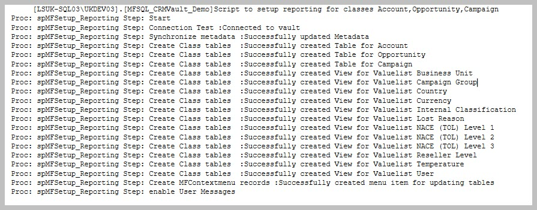
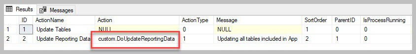

Reporting : Quick start
=======================

Get started with reporting from M-Files in just a few simple steps.

Step 1: Install the MFSQL Connector and complete the license
installation. Refer to :doc:`/getting-started/configuration-and-setup/index`

Step 2: Watch the overview of reporting `Reporting - Getting started <https://m-files.lamininsolutions.com/SharedLinks.aspx?accesskey=f09ccfc6101abc69116618524f2c978ed7ffb69f1b3f7616c5f19164be93309c&VaultGUID=8775C4C3-A206-4CA0-BD0B-C795800F3DF7>`__

Step 3: Prepare the class tables for Reporting for the selected classes to include in reports: Run :doc:`/procedures/spMFSetup_Reporting`.

.. code:: sql

    EXEC [dbo].[spMFSetup_Reporting] @Classes = 'Account, Opportunity, Campaign'
                                    ,@Debug = 0   -- int

Step 4: Use Report designer of your choice (Excel, Power BI, Visual
Studio Report Designer, ChrystalReports etc) to access the data tables
in SQL.

spMF_SetupReporting
-------------------

This procedure will perform a number of operations for each class included in the parameter.

.. Note:: include a maximum of 10 classes at a time. The procedure can be reused for multiple batches of class tables

This routine will perform the following.
  - Validate connection and license
  - Update the metadata structure from M-Files
  - Create the class table
  - Create views for all the valuelist lookups used on the class table
  - Pull the objects from M-Files into the class table
  - Setup the context menu to refresh the data on demand from M-Files

All of these operations can also be configured manually. Review the result in the message tab

|image0|

When done, the menu would have been updated to include an action item to
update all the tables included in the app.

The menu will only display after adding the users who should have access
to it to the ContextMenu and MFSQLConnector user groups.

This procedure will update all the class tables marked as included in
the app since the last change in M-files

The procedure applied for this action item can be reviewed from the
MFContextMenu table. Copy this procedure to a different name to
customise this routine, then update this record with the new name.

|image1|

The tables included in the update can be reviewed in MFClass table

.. code:: sql

     SELECT * FROM [dbo].[MFClass] AS [mc]
      WHERE [mc].[IncludeInApp] IS NOT NULL AND name <> 'User Messages'

The valuelist views created depends on the valuelist references in the
class tables. These views will all be added as custom.vw xxxx views in
SQL. These views are particularly handy when the report is dependant on
a selection list based on one of the lookups.

It is not necessary to create a join when using a lookup value instead
of the id of the lookup in the report. Value is automatically included
in the class table.

