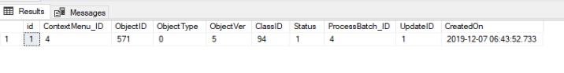
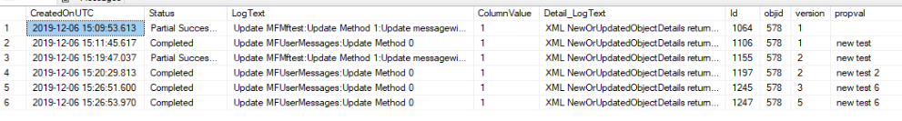
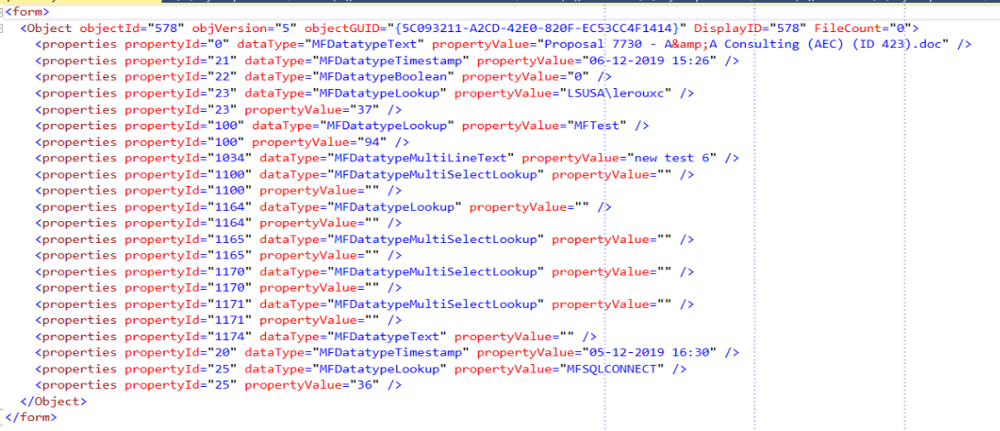
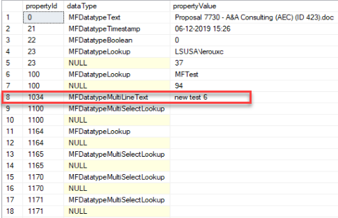

Context Menu Queue
------------------

The functionality to control context menu actions in progress with a queue is added in release 4.4.14.55. This functionality is only available in the integration module.

This feature allows for action call from M-Files to SQL using the context menu actions to be controlled by a process queue.  This feature is particularly important when action types 3 or 5 (asynchronous context sensitive actions) are used with a high volume of throughput (event handlers).

The queue requires special steps to include it in your integration project.

Configuration
-------------

Dependent objects
~~~~~~~~~~~~~~~~~

Release 4.5.14.56 will add new tables and procedures. Use the following script to check if it exists.

.. code:: sql

    select * from sys.objects where name in ('MFContextMenuQueue','spMFUpdateContextMenuQueue')

.. warning::
    The queue processing functionality of the context menu is reliant on using a SQL agent. This feature cannot be deployed with SQL Express editions.

The configuration has the follow key steps

 -  create custom procedure for the action to be performed
 -  configure Context Menu in M-Files to connect with SQL
 -  add rows in the MFContextMenu for the actions
 -  add scripts to the custom procedure for processing the queue
 -  add action script in event handler or workflow action
 -  add agent to process the queue 

Custom procedure for processing update action
~~~~~~~~~~~~~~~~~~~~~~~~~~~~~~~~~~~~~~~~~~~~~

The first step is to create a SQL procedure to perform the action to be triggered from M-Files. This could include any operation, but it is likely to be, or include triggering the update of the underlying object from M-Files to SQL. This procedure must include specific elements highligted below.  Example Procedure 90.101.Custom.CMMFiles_UpdateSQL is a complete procedure to update the context object using a trigger in M-Files.

**insert into table**
Insert a new row into MFContextMenuQueue before the main process start. Example script snippet

.. code:: sql

    -- Get the class table name

    SELECT @MFTableName = TableName
    FROM dbo.MFClass
    WHERE MFID = @ClassID
      AND IncludeInApp > 0;

    --Insert rows in MFContextMenuQueue to capture action from MF

    BEGIN TRY

    DECLARE @updateCycle INT

    SET @SQLQuery = N'UPDATE ' + QUOTENAME(@MFTableName) + N'
    SET process_id = 0
    WHERE objid = @ObjectID';
    EXEC sys.sp_executesql @SQLQuery, N'@ObjectID int', @ObjectID;

    SELECT @ContextMenuLog_ID = MIN(mcmq.id)
    FROM dbo.MFContextMenuQueue AS mcmq
    WHERE mcmq.ObjectID = @ObjectID
          AND mcmq.ObjectType = @ObjectType;
    IF @ContextMenuLog_ID > 0

    SELECT @updateCycle = UpdateCycle FROM dbo.MFContextMenuQueue AS mcmq WHERE id = @ContextMenuLog_ID

    BEGIN
        UPDATE mcmq
        SET mcmq.Status = 0, @updateCycle = @updateCycle + 1
        FROM dbo.MFContextMenuQueue AS mcmq
        WHERE mcmq.ObjectID = @ObjectID
              AND mcmq.ObjectType = @ObjectType
              AND @ObjectVer <= mcmq.ObjectVer;

        DELETE FROM dbo.MFContextMenuQueue
        WHERE ObjectID = @ObjectID
              AND ObjectType = @ObjectType
              AND ObjectVer <> ISNULL(@ObjectVer, 0)
              AND id <> @ContextMenuLog_ID;

    END;
    ELSE
    BEGIN
        INSERT INTO dbo.MFContextMenuQueue
        (
            ContextMenu_ID,
            ObjectID,
            ObjectType,
            ObjectVer,
            ClassID,
            Status,
            UpdateCycle,
            ProcessBatch_ID,
            UpdateID,
            CreatedOn
        )
        VALUES
        (@ID, @ObjectID, @ObjectType, @ObjectVer, @ClassID, 0, 1, @ProcessBatch_ID, NULL, @StartTime);
        SET @ContextMenuLog_ID = @@IDENTITY;

    END;

    END TRY
    BEGIN CATCH

    SET @DebugText = N'FAILED ';
    SET @DefaultDebugText = @DefaultDebugText + @DebugText;

    IF @Debug > 0
    BEGIN
        RAISERROR(@DefaultDebugText, 16, 1, @ProcedureName, @ProcedureStep);
    END;

    END CATCH;

**check result of update**
Get the version of the object that has been update.  Place this script snippet just after using MFUpdateTable with updatemethod 1

.. code:: sql

    --validate that update has taken place
    DECLARE @VersionUpdated INT;
    SELECT @VersionUpdated = muh.NewOrUpdatedObjectDetails.value('(/form/Object/@objVersion)[1]', 'int')
    FROM dbo.MFUpdateHistory AS muh
    WHERE muh.Id = @Update_ID;

    --update queue with result
    BEGIN TRAN;
    UPDATE mcl
    SET mcl.UpdateID = @Update_ID,
        mcl.ObjectVer = @VersionUpdated,
        mcl.ProcessBatch_ID = @ProcessBatch_ID,
    mcl.updateCycle = mcl.UpdateCycle + 1
    mcl.Status = CASE
                         WHEN ISNULL(@ObjectVer, 0) <= @VersionUpdated THEN
                             1
                         ELSE
                             -1
                     END
    FROM dbo.MFContextMenuQueue mcl
    WHERE mcl.id = @ContextMenuLog_ID;
    COMMIT;

Setup MFContextMenu
~~~~~~~~~~~~~~~~~~~

To trigger the custom procedure from M-Files an entry is required in the table MFContextMenu. Refer to :doc:`/mfsql-data-exchange-and-reporting-connector/using-the-context-menu/index` to create or update this table.

Use the following scripts setup a class table and action item in MFContextMenu

**create class table**
using the setup_reporting procedure will perform a number of operations, including adding entries to MFContextMenu

.. code:: sql

    exec spMFSetup_reporting 'ClassName'

**add row for action type 5**

.. code:: sql

    EXEC dbo.spMFContextMenuActionItem @ActionName = N'Updateprop_EventHandler',       -- nvarchar(100)
                                   @ProcedureName = N'Custom.CMMFILES_UpdateSQL',    -- nvarchar(100)
                                   @Description = N'Volume test',      -- nvarchar(200)
                                   @RelatedMenu = N'Update Tables',      -- nvarchar(100)
                                   @IsRemove = NULL,        -- bit
                                   @IsObjectContext = 1, -- bit
                                   @IsWeblink = NULL,       -- bit
                                   @IsAsynchronous = 1,  -- bit
                                   @IsStateAction = 1,   -- bit
                                   @PriorAction = null,      -- nvarchar(100)
                                   @UserGroup = N'ContextMenu',        -- nvarchar(100)
                                   @Debug = 0               -- int

 The following script will list all action types 3 and 5 and show if the related procedure have a Context Menu Queue component.
 
.. code:: sql

    SELECT cm.ActionName,
       cm.Action,
       cm.ActionType,
       cm.ISAsync,
       ug.Name AS usergroup,
       so.name AS Mapped_procedure,
       sm.definition,
       CASE
           WHEN sm.definition LIKE ('%MFContextMenuQueue%') THEN
               'MFContextMenuQueue Applied'
           ELSE
               'Procedure not setup'
       END AS Valid_Procedure
       FROM dbo.MFContextMenu cm
    LEFT JOIN dbo.MFvwUserGroup ug
        ON cm.UserGroupID = ug.UserGroupID
    LEFT JOIN sys.objects so
        ON cm.Action = 'custom.' + so.name
    LEFT JOIN sys.sql_modules sm
        ON so.object_id = sm.object_id
    WHERE cm.ActionType IN ( 3, 5 );

|image0|
Example of a valid result

Setup the action in M-Files
~~~~~~~~~~~~~~~~~~~~~~~~~~~

Actions are triggered in M-Files based on the application of the context menu in the Vault.  Consult :doc:`/getting-started/first-time-installation/installing-the-context-menu/index` to install the context menu functionality.

Following is an example script for an afterCheckInChanges event handler action. Note that the action name must correlate with the action name in MFContectMenu

.. code:: vbscript

    Option Explicit
    Dim oProperties : Set oProperties = Vault.ObjectPropertyOperations.GetProperties(ObjVer)
    Dim ClassID
    ClassID= Vault.ObjectPropertyoperations.GetProperty(ObjVer, 100).value.GetLookupID
    Dim LastModifiedUserID
    LastModifiedUserID = Vault.ObjectPropertyoperations.GetProperty(ObjVer, 23).value.GetLookupID
    Dim VendorClassID : VendorClassID = 94
    Dim MFSQLConnectUserID : MFSQLConnectUserID = 36
    If (VendorClassID = ClassID and LastModifiedUserID <> MFSQLConnectUserID) Then
    Dim strInput
    strInput = "{""ObjectID""  : "&ObjVer.ID &", ""ObjectType""  : "&ObjVer.Type &", ""Objectver""  : "&ObjVer.Version&",""ClassID""  : "&ClassID&", ""ActionName""  : ""Updateprop_EventHandler"", ""ActionTypeID"": ""5""}"
    Dim strOutput
    strOutput = Vault.ExtensionMethodOperations.ExecuteVaultExtensionMethod("PerformActionMethod", strInput)
   'Err.Raise MfScriptCancel, strOutput
    End If

Event handlers
~~~~~~~~~~~~~~

Use the AfterCheckinChanges event handler for the updating SQL from M-Files. A separate event handler - AfterCreateNewObject - must be used to catch the creation of new objects if required.  The same procedure can be applied for creation events.

Adding SQL Agent
~~~~~~~~~~~~~~~~

The final step of the configation is to setup an agent that can trigger the spMFUpdateContextMenuQueue procedure.  This procedure will check for any unprocessed items in the queue and process all the open items.  The frequency of the updates should be considered in the light of the type of operation that is being supported, but is quite feasible to be set to 1 minute intervals.  Be aware that this could have a performance impact.

Every time the SQL agent runs it will process the oldest unprocessed queue item and will retry the item 5 times. This is controlled by the agent step and checking the update cycle. 

Consider having a control procedure to start and stop the agent to avoid it running in the background if updates using the event handler is only occasaional.

Sample code for the step in the SQL agent is below

.. code:: sql

    Declare @id int, @UpdateCycle int
    SELECT @id=min(sq.id), @UpdateCycle = MAX(isnull(UpdateCycle,0)) FROM MFContextMenuQueue sq WHERE sq.Status <> 1
    IF @ID > 0 and @UpdateCycle < 6
    BEGIN
    EXEC dbo.spMFUpdateContextMenuQueue @id
    END

Testing
-------
On the completion of the configuration, test the setup by making a change to the class object.

MFContectMenuQueue should show the result

.. code:: sql

    SELECT * FROM dbo.MFContextMenuQueue AS mcmq

|image1|

The status = 1 in the above example implies that the record was that the version of the object in M-Files after checkin is the same as the version of the object in the class table after update.

Status 0 implies that the action has been received from M-Files but no processing took place.
Status -1 implies that the action has been received from M-Files but after processing, the versions are different.

The following script will show the results for updating a specific property from the underlying log tables.  Note that the propval in this example will report the 8th property in the XML record.  The next script will highlight how to get the row number of the property

.. code:: sql

    SELECT pb.CreatedOnUTC,
       pb.Status,
       pb.LogText,
       pbd.ColumnValue,
       uh.Id,
       uh.ObjectVerDetails.value('(/form/objVers/@objectID)[1]', 'varchar(100)') AS objid,
       uh.ObjectVerDetails.value('(/form/objVers/@version)[1]', 'varchar(100)') AS version,
       uh.NewOrUpdatedObjectDetails.value('(/form/Object/properties/@propertyValue)[8]', 'varchar(100)') AS propval
    FROM dbo.MFProcessBatch pb
    INNER JOIN dbo.MFProcessBatchDetail pbd
        ON pb.ProcessBatch_ID = pbd.ProcessBatch_ID
    LEFT JOIN dbo.MFUpdateHistory uh
        ON uh.Id = pbd.Update_ID
    WHERE pbd.ColumnName = 'NewOrUpdatedObjectDetails' AND  uh.ObjectVerDetails.value('(/form/objVers/@objectID)[1]', 'varchar(100)') = 578

The image show all the instances where the specific object has been processed and the property value and version for the specific update.
|image2|

The following script wlll allow you to identify the row number of the property being monitored (as in row 8 in the above example.) Inspect the xml record for one of the updates that has taken place.

.. code:: sql

    SELECT NewOrUpdatedObjectDetails
    FROM dbo.MFUpdateHistory uh 
    WHERE uh.id =1247 

|image3|

Alternatively use a script to list the properties in sequence.

.. code:: sql

    DECLARE @props XML
    DECLARE @Hdoc INT
    SELECT @props =NewOrUpdatedObjectDetails
    FROM dbo.MFUpdateHistory uh 
    WHERE uh.id =1247
    EXEC sp_xml_preparedocument @hdoc OUTPUT ,@props
    SelECT * FROM OPENXML(  @hdoc ,'/form/Object/properties',1)
    WITH
    (propertyId INT, dataType VARCHAR(100), propertyValue VARCHAR(100))
    EXEC sp_xml_removedocument @Hdoc

Troubleshooting
---------------

**no entry in MFContextMenuQueue**

-  check that the correct actionname is included in the event handler script
-  validate that the insert statement has been included in the custom procedure
-  check MFContextMenu table to validate that the event is reaching SQL

**nothing is reaching SQL**

-  check cross referencing of MFContextMenu with the event handler scripts and the SQL procedure
-  check connnection in the M-Files Configurator

**the queue is not being processed**

-  check that the agent is running

**deletions are not being processed**

-  validate the separate event handler, custom procedure and entry in MFContextMenu

**created objects is not being processed**

-  a sepearate event handler must point to the same procedure and MFcontextMenu item as the update procedure

|image4|

.. |image0| image:: image0.png

