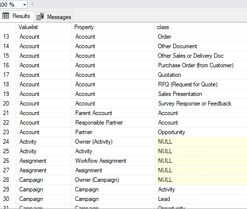

Exploring metadata
==================

Extended columns in Metadata structure view
-------------------------------------------

The view MFvwMetadataStructure is a powerful tool to analyse the
relationships between different parts of the metadata structure of the
vault.

Managing updates to valuelists depends on if a valuelist has been
elevated to a full object type or not. When a valuelist is elevated the
controlling table changes from MFValuelist and MFValuelistItems to a
class table.

The column IsObjectType in the view will show if a valuelist has been
elevated or not.

Using this view as part of the design process, especially of a complex
vault, could be very handy It can also be used as a control measure to
validate metadata design changes that could impact on a integration
project.

Exploring Valuelists with MFvwMetadataStructure
-----------------------------------------------

When developing a solution it is notoriously complex to get to grips
with all the dimensions and relations of the use of valuelists and
valuelist items to ensure that the data is properly aligned, prepared,
or inserted. The special view MFvwMetadataStrcuture is especially
helpful to the developer in this process as it offers exploration
capabilities that is much easier to use that the M-Files Administration
Panels.

The following listing will show each valuelist, its associated
properties, and the classes where it has been used. If the class is
null, then the property has not been used on a metadata card

.. code:: sql

    SELECT Valuelist, [mfms].[Property], class FROM [dbo].[MFvwMetadataStructure] AS [mfms]
    WHERE IsObjectType = 0

|image0|

Switching the same listing to include only valuelists as ObjectTypes
will show how properties have been used related to an object type and
the classes in the object type. In the following listing the Account
object type has several properties associated with it, and some
properties are used on multiple classes.

.. code:: sql

    SELECT Valuelist, [mfms].[Property], class FROM [dbo].[MFvwMetadataStructure] AS [mfms]
    WHERE IsObjectType = 1

|image1|

This view have other columns and use cases for exploring the application
of valuelists including Aliases, MFID, Internal ID, Owners and the
relation to other objects.

The underlying tables for this view and how these table related to each
other can be explored by inspecting the view it self.

.. |image0| image:: img_1.png

