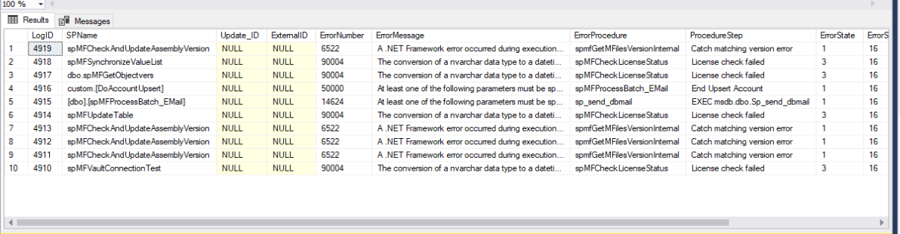

User Messages
=============

User messages can be generated in a variety of different ways, depending
on the type of message and user requirements.

The following types of messages can be used:

 -  Access error message in MFLog
 -  Get error messages to email
 -  Access process logging
 -  Adding a process message to an individual object
 -  Get process messages in M-Files
 -  Add custom message in the MFUserMessage table
 -  Show process results in context menu action
 -  Process custom messages by email

Each of these types of messages requires a configuration and setup

Examples and setup of messaging
~~~~~~~~~~~~~~~~~~~~~~~~~~~~~~~

Access error message in MFLog
-----------------------------

System failure messages are logged in the MFLog table and automatically sent by email to the support email address specified in MFSettings. The notification is conditional on database mail being setup in the system.

.. code:: sql

     Select top 10 * from MFLog order by logid desc

|Image0|

Get error messages to email
---------------------------

Step 1: Install and setup databasemail on the server. Note the default mailprofile is set to 'MailProfile', however this can be changed.
Step 2: Update MFSettings with mail profile and email address of recipients, separated by ';'.

.. code:: sql

    exec spMFSettingsForDBUpdate @SupportEmailAccount = 'support@lamininsolutions.com', @EmailProfile = 'MailProfile'

On each MFSQL SQL Error a message will be sent to the email address.

|Image1|

Access process logging
----------------------

Logging of a range of different events takes place in the background. Refer to :doc:`/mfsql-integration-connector/using-and-managing-logs/index` for more detail

Adding a process message to an individual object
------------------------------------------------

In some use cases it is desireable to provide feedback on the meatacard of an object for the Connector process. A good example is where an object is changed by a background process and a specific object is updated.

Two properties is automatically added to the vault on installation:

#. MFSQL Message
#. MFSQL Process Batch

These properties are not automatically added when class table is created.  They can either manually be added to the metadata card or added in SQL to the class table

.. code:: sql

    ALTER TABLE dbo.MFCustomer
    ADD mfsql_Message NVARCHAR(4000), mfsql_Process_batch INT

All that is remaining is to update these properties to every custom procedure to set an appropriate message for *MFSQL_Message* and add the processbatch_id to *MFSQL_process_batch* to reference back to the specific process that updated the object.

Adding values to these properties are illustated by the example procedure *90.105.custom.DoCMAsyncAction*

|Image3|

Get standard process messages in M-Files
----------------------------------------

Core process messages are send to the MFUserMessages table and shown in M-Files in the User Messages View. Showing the messages in M-Files is dependent on configuration settings.

The installation of the content package installs the following
objects related the user messages:

-  the User Message Class table with properties 
-  a view for the user messages
-  Messages workflow to archive the user messages.

This table contains messages emanating from the MFProcessBatch Table
intended for user consumption. 

The following core processes will generate a message for the MFUserMessages table.

#. spMFUpdateTable
#. spMFAliasInsert
#. spMFCreateAllLookups
#. spMFDeleteAdHocProperty
#. spMFDeleteObjectList
#. spMFDropAndUpdateMetadata
#. spMFGetHistory
#. spMFSynchronizeFilesToMFiles
#. spMFSynchronizeMetadata
#. spMFTableAudit
#. spMFUpdateMFilestoSQL

By default the Connector will not insert user messages.  To enable user messages in the MFUserMessage table the MFSettings table must be updated.

.. code:: sql

    EXEC dbo.spMFSettingsForDBUpdate @UserMessageEnabled = '1'

Example of process message in M-Files
|Image2|

The messages can be access with the User Messages view that is automatically added.

Add custom message in the MFUserMessage table
---------------------------------------------

The Connector includes a mechanism to generate and trigger user
messages.  This is built into the `process batch
logging <https://doc.lamininsolutions.com/mfsql-connector/mfsql-integration-connector/using-and-managing-logs/index.html>`_
When an entry is made in the MFProcessBatch with a LogType of 'Message' 
a trigger will update an entry in the
MFUserMessages table using the spMFResultMessageForUI procedure.

Example of script to trigger a message in the MFUserMessage table

 .. code:: sql

          SET @Msg = 'Session: ' + CAST(@SessionIDOut AS VARCHAR(5))
         IF @UpdateRequired > 0
         SET @Msg = @Msg + ' | Update Required: '+ CAST(@UpdateRequired AS VARCHAR(5));
         IF @LaterInMF > 0
         SET @Msg = @Msg + ' | MF Updates : ' + CAST(@LaterInMF AS VARCHAR(5));
         IF @Process_id_1 > 0
         SET @Msg = @Msg + ' | SQL Updates : ' + CAST(@Process_id_1 AS VARCHAR(5));
         IF @Process_id_1 > 0
         SET @Msg = @Msg + ' | SQL New : ' + CAST(@NewSQL AS VARCHAR(5));

         Set @logText = @Msg

         EXEC [dbo].[spMFProcessBatch_Upsert] @ProcessBatch_ID = @ProcessBatch_ID OUTPUT
         ,@ProcessType = @ProcessType
         ,@LogType = N'Message'
         ,@LogText = @LogText
         ,@LogStatus = @LogStatus
         ,@debug = @Debug;

Show process results in context menu action
-------------------------------------------

The context menu allows for a feedback message on completion of an action selected in the context menu. The message is only produced for synchronous actions. Refer to :doc:`/mfsql-data-exchange-and-reporting-connector/using-the-context-menu/index` for more detail.

Process custom messages by Email
--------------------------------

custom email messages can be sent as part of the processing of a procedure.
This functionality make use of the :doc:`/tables/tbMFProcessBatch` and :doc:`/tables/tbMFProcessBatchDetail` logs.  The process batch and process batch detail is generated using :doc:`/procedures/spMFProcessBatch_Upsert` and :doc:`/procedures/spMFProcessBatchDetail_Insert`
The results in these logs can be processed as a email message with spMFProcessBatch_Email

There are two types of emails:
 # Summary email
   The summary email is based on the Process Batch row entry.

|image4|

 # Detail email
   The detail email is based on the Process Batch Detail of the process batch.

|image5|

