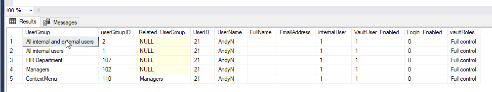
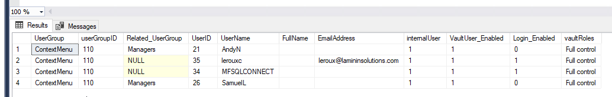
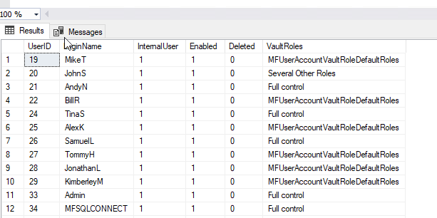

Users in Usergroups
===================

The Connector includes functionality to extract a listing of users by user group.  This functionality is introduced in version 4.10.32.76 and depends on running spMFDropandUpdateMetadata @IsStructureOnly = 0 before using the procedure for the first time.

A new column VaultRoles is updated in the MFUserAccount table when spMFDropandUpdateMetadata is run. This column show which users have full control, default roles or special roles in the vault.

|image3|

Running the procedure spmfUsersByUsergroup will create a global temporary table ##spMFUsersByUserGroup to list the users by usergroup.  This listing will also include the users for one level deep of usergroups within usergroups.  For instance if a user is a member of usergroup B and User group A has as members some other users and Usergroup B then the listing will show the users of usergroup B in the listing of the users of usergroup A.

Step 1: Execute spMFDropandUpdateMetadata (only necessary if changes has taken place to users or usersgroups)

Step 2: Execute spmfUsersByUsergroup

.. code:: sql

    exec spmfUsersByUsergroup 

Step 3: Use views on the table ##spMFUsersByUserGroup to analyse the results

.. code:: sql

    select * from ##spMFUsersByUserGroup

In the following example the script shows the user groups that Andy is a member of, including being a member of the ContextMenu user group by virtue of being a member of the Managers user group

.. code:: sql

    select * from ##spMFUsersByUserGroup where userName = 'AndyN'

|image1|

On the other hand, selecting the users by user group shows all the users for ContextMenu, including the usergroups in ContextMenu

.. code:: sql

    select * from ##spMFUsersByUserGroup where userGRoup = 'Managers'

|image2|

