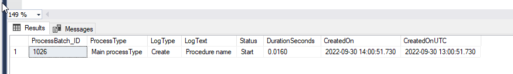
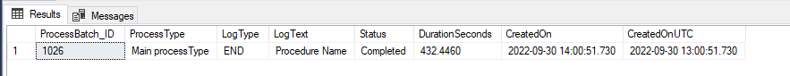
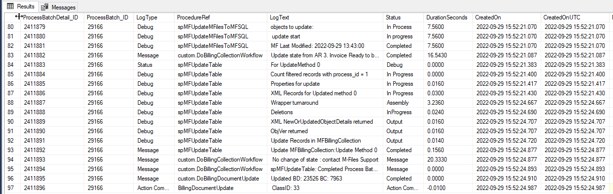

Logging in custom procedures
============================

The logging tables MFprocessBatch and MFProcessBatchDetail are widely used for logging the Connector standard procedures.

These tables can also be used, in conjunction with the logging of the standard procedures to include operations in custom procedures. This is particularly relevant when a custom procedures controls many different operations.

ProcessBatch
------------

It is good practice to use the same ProcessBatch_ID for all the sub processes in a procedure. This is achieved by creating a new ProcessBatch_ID early on in the procedure, and then to pass through this id to all standard and custom procedures that is called by the custom procedure.  This will ensure that all the detail steps will be grouped together with a single ProcessBatch_ID.

Call :doc:`/procedures/spMFProcessBatch_Upsert/`. When @ProcessBatch_ID is null, and is set to OUTPUT, the procedure will create a new log entry in the MFProcessBatch table and output a new ProcessBatch_ID.  The script below is and example of a classical call to start logging.

.. code:: sql

    EXEC [dbo].[spMFProcessBatch_Upsert]
               @ProcessBatch_ID = @ProcessBatch_ID OUTPUT
              ,@ProcessType = 'Main Process description'
              ,@LogType = 'Create'
              ,@LogText = 'Procedure name'
              ,@LogStatus = 'Start'
              ,@debug = 0

The log entry in the table is as follows

|image1|

Call this procedure again at the end of the custom procedure to close the processbatch log and allow for the duration of the entire process to be calculated and updated in the MFProcessBatch table.
It is important to remember to remove the OUTPUT and to pass in the processBatch_ID of the custom procedure and the set the logstatus to 'Completed'. This triggers the duration calculation.

.. code:: sql

    EXEC [dbo].[spMFProcessBatch_Upsert]
               @ProcessBatch_ID = @ProcessBatch_ID
              ,@ProcessType = 'END'
              ,@LogText = 'Procedure Name'
              ,@LogStatus = 'Completed'
              ,@debug = 0

The log entry overwrites the previous entry for the processbatch_id and the final entry for the process is as follows

|image2|

The following script will show the last 5 entries in the MFProcessBatch table. One can see if the process completed successfully and the total duration of the entire process in seconds.

.. code:: sql

    Select top 5 * from MFProcessBatch order by ProcessBatch_ID desc

ProcessBatchDetail
------------------

The :doc:`/tables/tbMFProcessBatchDetail/` allows for logging sub process steps and is used in conjunction with MFProcessBatch.  By obtaining and then passing through the processbatch_id into the processbatchdetail one can tie all the sub processes together.

It is good practice to add a processbatchdetail entry in the MFProcessBatchDetail table and key stages of processing.  By adding a log entry, one can monitor or backtrack on the different steps in a larger process.  The custom log entries will form part of the standard procedure log entries and provide valuable insight in the process at different stages. At a minimum a log entry should be made at the start and end of long running sub processes and to highlight the outcome of key steps in the process. This is accomplished with the :doc:`/procedures/spMFProcessBatchDetail_Insert`.

Copy the following snippet into your custom procedure where ever a sub process must be logged. Read more in die documentation of :doc:`/procedures/spMFProcessBatchDetail_Insert` about the use of the different parameters.

.. code:: sql

       SET @ProcedureStep = '';
       SET @LogTypeDetail = 'Status';
       SET @LogStatusDetail = '';
       SET @LogTextDetail = ''
       SET @LogColumnName = '';
       SET @LogColumnValue = '';

       EXECUTE @return_value = [dbo].[spMFProcessBatchDetail_Insert]
        @ProcessBatch_ID = @ProcessBatch_ID
      , @LogType = @LogTypeDetail
      , @LogText = @LogTextDetail
      , @LogStatus = @LogStatusDetail
      , @StartTime = @StartTime
      , @MFTableName = @MFTableName
      , @Validation_ID = @Validation_ID
      , @ColumnName = @LogColumnName
      , @ColumnValue = @LogColumnValue
      , @Update_ID = @Update_ID
      , @LogProcedureName = @ProcedureName
      , @LogProcedureStep = @ProcedureStep
      , @debug = @debug

An example of a custom process and standard procedure logs is shown below.

|image3|

To list the log entries:

.. code:: sql

      Select top 100 * from MFProcessBatchDetail order by ProcessBatch_ID desc

