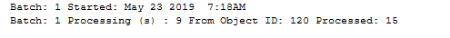

Working with Object Version
===========================

The spMFTableAudit procedure gets the Object Version (Object ID,
Version, Object Type and Guid) and update the result in the
MFAuditHistory table. The procedure can be deployed in many different
scenarios.

The Audit History table is included to assist with the tracking of
objects and updates between M-Files and SQL.  This is useful when errors
or omissions need to be investigated.

This table can also be used to determine which objects had a change of
version and therefore requires updating.

There are two primary procedures for using this functionality

-  :doc:`/procedures/spMFTableAudit`
-  :doc:`/procedures/spMFTableAuditInBatches`

Procedures that automatically update MFAuditHistory include:

-  :doc:`/procedures/spMFUpdateItemByItem`
-  :doc:`/procedures/spMFUpdateMFilesToSQL'
-  :doc:`/procedures/spMFClassTableStats`

Getting object version detail in batches
----------------------------------------

The procedure :doc:`/procedures/spMFTableAudit` has
been in operation for some time. This procedure extracts the object
version (object id, version, object guid and object type).

Using the :doc:`/procedures/spMFTableAuditInBatches`
will allow you to execute the spmfTableAudit procedure in batches. This
is used in cases where the number of objects in the class table exceeds
100 000.

.. code:: sql

    EXEC [dbo].[spMFTableAuditinBatches] @MFTableName = 'MFCustomer' 
                                        ,@FromObjid = 120  
                                        ,@ToObjid = 130  
                                        ,@WithStats = 1 
                                        ,@Debug = 0  

|image0|

Get object version for specific object or objects
-------------------------------------------------

The :doc;`/procedures/spMFAuditTable`
associated MFTableAuditHistory has been redesigned. The
MFTableAuditHistory table is changed to only show the latest result and
no longer inserts new records for every processing cycle. This
improvement had a major performance improvement on some processing.

It is now possible to use this procedure for specific objects or range
of objects. It is therefor possible to determine the update status of an
object and allow then to only update objects that have changed. This is
particularly relevant for large tables.

refer to :doc:`/tables/MFAuditHistory` table for more information on the audit log entries.

