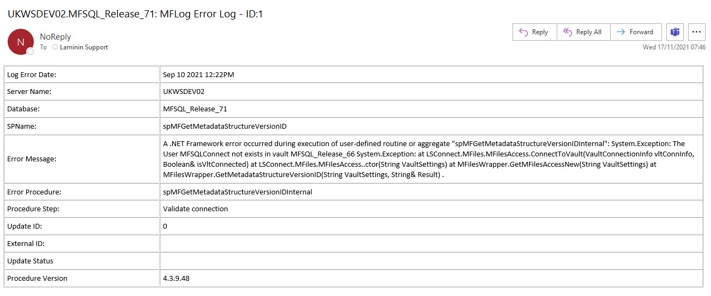

==================
spMFLogError_EMail
==================

Return
  - 1 = Success
  - -1 = Error

Parameters
  @LogID
    id of error log (MFLog) to include in email
  @DebugFlag
    - Default = 0
    - 1 = Standard Debug Mode

Purpose
=======

To email MFLog error row, using a pre-formatted layout, to email address(es) specified in the MFSettings table with name SupportEmailRecipient.  

Example of error message: |image1|

The sending of the email is triggered on every entry in the MFLog table.

Warnings
========

The emails will only be sent if Database Mail has been setup and configured.

Examples
========

.. code:: sql

     EXEC spMFLogError_EMail 
              @Logid = 1
			  ,@DebugFlag = 1  

Changelog
=========

==========  =========  ========================================================
Date        Author     Description
----------  ---------  --------------------------------------------------------
2016-08-22  LC         Change name of procedure
2016-08-22  LC         Change settings index
2017-07-25	LC         Add deployed version to email
2018-11-22	LC         Add database to subject line
2021-11-17  LC         Increase email address field to 255 characters  

==========  =========  ========================================================

