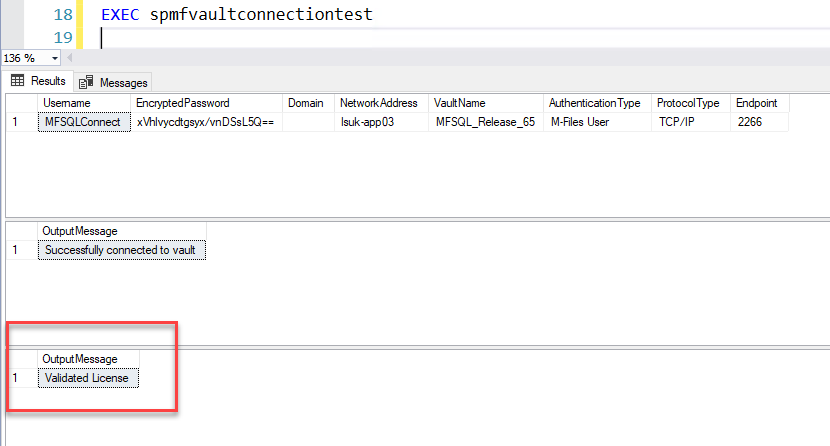

Licensing
=========

MFSQL Connector is a subscription licensed product paid annually in advance.  Each license is tied to the M-Files Server serial number, modules, and the expiry date.

The license is activated with a license file (.lic extension).

It will stop operating when the current date is greater than the expiry date or the M-Files Serial number has changed.

The system will through and error when a procedure or function is used that is not included in the scope of licensed module.

The license can be renewed ahead of the expiry date to avoid running out
by contacting your reseller or `support <mailto:support@lamininsolutions.com>`__.

License validity check
~~~~~~~~~~~~~~~~~~~~~~

The license validity check is performed once a day.  A notification is trigger daily when the license is 30 days or less from the expiry date.

The notification will be emailed if MFSQL Connector error log emails has been activated. The notifications are also updated in the MFLog table.

`/procedures/spMFVaultConnectionTest` includes a license validity check.

|Image0|

The license check can also be performed with `/procedures/spMFCheckLicenseStatus`.  The expected return value to be validated is 1.  Using @Debug = 1 will show more details about the license check.

The table '/tables/MFModule' is used to track the license and when it last performed a check

Updating the license
~~~~~~~~~~~~~~~~~~~~

After the license has been updated, `/procedures/spMFCheckLicenseStatus` must be executed to force
check the license and cancel the expiry notification.

Set the parameter @IsLicenseUpdate = 1 when running this procedure.

